# 1. 引言与系统概述

## 1.1 问题背景与动机

在大学校园的日常生活中，我们发现有两大问题极大影响了校园生活的便捷性：**校园二手资源流通效率低下** 与 **校园信息及服务入口高度分散**，于是我们设计了这款校园二手交易平台，同时集成了校园信息服务入口，来提升校园生活的便利性。

现有主流电商平台（如闲鱼）虽让功能完备，但其设计逻辑基于社会化的跨区域交易，并不适配我们校园生活中的交易场景。首先，低价值二手物品（如教材、宿舍用品）在高额物流成本面前几乎丧失交易价值，而体积大的重物（如洗衣机、鞋柜）的物流成本甚至可能超过物品本身价值，导致毕业季大量可以被交易和二次利用的物品被直接丢弃，造成严重的浪费。其次，陌生人之间的线上交易缺乏适用于校园环境的信任机制，交易流程和时间太长，难以满足校园内即时性、近距离的交易需求（如午后奶茶代购或考前资料流转）。最后，传统平台的复杂操作流程对于仅需要简单校内流转的场景而言过于笨重，这会降低学生的使用意愿。同时传统平台上过于繁杂的信息也对校园场景下的二手交易无益，大部分学生可能会更关注校园场景下的特定交易物品，如某门课的教材，这些物品的信息通常在传统平台上难以找到。

与此同时，校园信息传递与生活服务同样存在碎片化痛点。重要通知依赖微信群聊进行传递，信息极易被淹没，停水停电、考试安排、活动通知等关键信息可能通过不同的群聊发布；而水费缴纳、网费充值、教务系统查询等服务入口分散于不同平台与小程序之间，学生需要在多个应用间反复切换与搜索，操作路径冗长且繁琐，在日常生活中非常不方便。

基于以上问题，我们提出了我们的解决方案：一个校园场景下，融合了二手交易、通知聚合与生活服务导航的平台，以低成本、高信任、高效率的方式方便学生间的物品流转和信息传递。这就是我们的软件： **Campus-Mart** —— 一款面向在校学生的校园综合服务平台。

## 1.2 系统概述

### 1.2.1 系统定位与用途

**Campus-Mart** 是一款面向高校校园的 Android 端综合服务平台，其核心定位是构建一个可信、高效、零物流成本的校园内部二手交易生态，并同步整合校园通知推送与常用生活服务快捷入口。我们的系统通过校内身份认证机制（学校邮箱或学号验证）确保用户群主要为学生，同时依托校园实现面对面交付，从而消除传统电商的物流成本与陌生人信任壁垒。同时，鉴于校园物品的信息可能比较复杂，我们还设计了强大的搜索机制，来方便商品信息``1loo`1 AQ1`  S啊额外 ˛AS我去1·的检索。

系统的目标用户涵盖两类主体：

- **在校学生**：作为平台的主要参与者，可能是买家或者卖家，同时是校园通知的接收者，以及校园生活服务的使用者；
- **校园管理员**（如辅导员、宿舍管理员）：作为官方信息的发布者，利用平台进行精准、直达的通知推送，提升管理效率。

### 1.2.2 主要功能

系统围绕三大核心模块构建，各模块功能如下：

#### （1）二手交易模块

- **商品管理**：用户可发布、编辑及下架个人闲置物品，支持图片上传、价格设定与详细描述；商品列表支持滚动浏览和分页加载。商品收藏和点赞功能，用户可以查看自己收藏的商品。
- **智能搜索**：基于中文分词（Jieba）与倒排索引技术实现关键词全文检索，支持中英文混合查询，可以用英文搜索中文发布的商品，或者用中文搜索英文发布的商品。同时还实现了AI 图像打标功能（CLIP 模型），实现文本搜图，防止卖家对商品的表述不全，或文字仅描述出售信息（如价格，交易地点）未描述商品详细信息导致搜索不到的场景，提升检索效率。
- **即时通讯**：基于 WebSocket 协议实现买家与卖家之间的实时在线聊天，支持文本消息收发与持久化存储，并配合实时推送确保消息触达。
- **订单与支付**：买家向卖家下单后，由系统生成订单并维护，订单包括已创建/待支付、已支付（PAID）、已结算/已完成、已取消及已退款等状态。支持通过支付宝进行订单支付并将金额托管到平台，买家点击确认收货后，金额存入平台钱包，卖家可以从平台钱包提现。若买家没成功支付订单，订单可以自动超时取消。形成“买家付款 → 平台托管 → 线下交付 → 买家确认 → 卖家收款→ 卖家提现”的交易流程，并提供订单记录，确保资金流转安全与可追溯。

#### （2）校园服务模块

- **通知推送**：与校园管理方协作，可以推送重要公告（包括发送人，时间，标题，内容等信息），并可以看到历史通知，解决微信群信息碎片化与易遗漏的问题。
- **服务入口聚合**：整合水费缴纳、网费充值、教务系统等高频校园服务入口，支持一键跳转至对应外部平台，避免学生在多个应用间反复切换。

#### （3）用户与认证模块

- **身份认证**：要求用户在注册时提供学校邮箱或学号完成身份核验，从保障交易双方的身份真实性与校园封闭性。
- **个人中心**：可以通过个人中心查看用户交易历史、已发布商品、已收藏商品、订单状态等个人信息。

### 1.2.3 运行场景

**Campus-Mart** 的运行场景主要为 **单一高校校园内部**，我们的设计主要参考以下场景：

- **交易场景**：买家浏览商品，通过关键词或图片搜索找到所需商品（教材/宿舍用品/奶茶代买/或者校园生活所需的一切），与卖家通过消息发送功能约定交易地点（如食堂、宿舍楼、教学楼），线下完成物品交易后，买家在 App 内确认收货，资金由托管账户释放至卖家。全程无需任何第三方物流介入。
- **通知场景**：宿舍管理员或班级管理者通过管理后台通知，系统自动推送至全体学生账户，学生可在通知中心查看详情与历史记录，避免微信群消息被淹没。
- **服务场景**：学生需要缴纳宿舍水费，无需在微信中搜索分散的小程序，直接在 Campus-Mart 中点击对应图标，一键跳转至学校官方缴费平台完成支付。

系统采用 **客户端-服务器架构**：前端为基于 Android SDK 开发的 Native App；后端基于微服务架构（Java / Go / Python 混合语言栈）部署于云服务器，通过 Nginx 网关与 Nacos 服务治理对外提供 RESTful API 与 WebSocket 长连接服务；数据层采用 MySQL 作为主存储，Redis 作为热点数据缓存，Minio 作为图片对象存储，消息队列（RabbitMQ）支撑事件驱动的索引更新与超时订单处理。

# 2. 系统设计

## 2.1 系统设计目标

我们的软件，在系统设计上主要希望可以做到以下几点：

- 做出界面清晰、功能明确、交互友好、UI 较美观的 Android 移动端软件。
- 覆盖校园生活服务跳转、校园通知发送与接收，以及商品浏览、发布、搜索、聊天、订单、支付和钱包等主要功能。
- 按不同功能拆分后端服务，减少模块之间的耦合，方便开发协作和后续扩展。
- 在设计上考虑性能和响应速度，把搜索、AI 打标、支付通知、结算等耗时或后续任务放到后台异步处理，减少用户等待，同时要加入适当的多层缓存设计。
- 保持系统可维护、容易改进，让每个服务职责清楚，后续新增功能、替换模块或优化某个服务时影响范围更小。
- 买卖双方聊天实现实时通信，保证聊天消息可以及时送达。
- 后端服务和基础设施组件使用 Docker 容器部署，便于本地运行、联调和演示，也方便后续部署到阿里云 ECS。

## 2.2 总体架构（移动端 / 服务端）

我们的系统整体分为 Android 移动端、接入层（反向代理，路由，鉴权）、业务服务层（微服务架构）和基础设施层（数据库，图片存储，异步通信服务，Redis缓存）。Android 客户端通过 Gateway 访问对应后端服务，后端服务再根据需要访问数据库、对象存储、消息队列、Nacos 注册中心等基础组件。

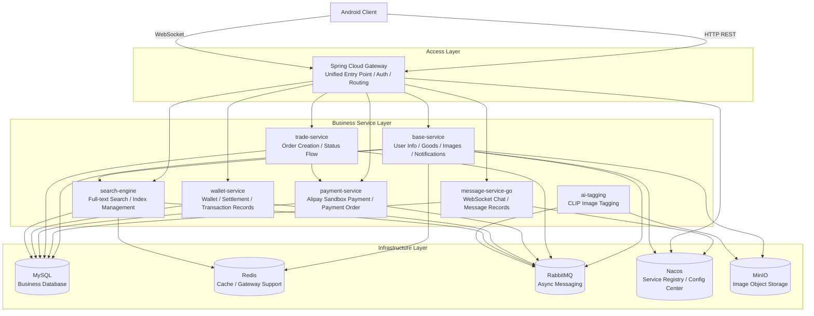


我们的分层设计使移动端不需要感知后端内部服务拆分，只需要访问统一入口；后端服务则可以根据功能的不同灵活的编写和改进。

## 2.3 移动端和服务端通信方式

移动端主要通过两种方式与服务端通信：

- **HTTP restful api**：用于登录注册、商品浏览、商品发布、订单支付、钱包查询、通知查询等基于请求响应形式交互的功能。
- **WebSocket**：用于买家和卖家之间的实时聊天。

Android 客户端统一访问 Gateway。Gateway 负责接收请求、校验用户身份，并根据路径把请求转发到具体服务。这样可以减少客户端配置复杂度，后续后端服务有所变动只需要改Gateway的配置即可，可拓展性强。

在认证方面，用户登录后，服务端会返回一个封装了用户信息的 JWT token。后续请求客户端会携带 token 访问 Gateway，由 Gateway 统一完成鉴权，并将用户信息传递给下游服务。

## 2.4 后端微服务架构总览

后端采用混合技术栈的微服务架构，这可以方便进行团队开发，同时可拓展性和可更改性较强，服务间的耦合度低，也利于部署。基础业务服务用 Java语言，消息、交易、支付、钱包和搜索等服务基于 Golang ，AI 图片打标服务由于运用了 PyTorch 框架，用Python语言编写。

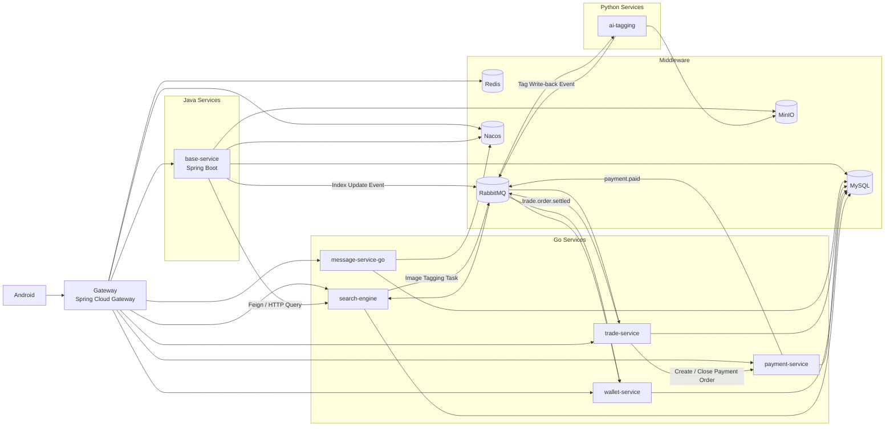


该架构把同步请求、实时通信和异步任务分开处理：对用户直接等待结果，强时效性的同步请求走 HTTP，需要服务端实时推送消息给客户端的聊天走 WebSocket 协议，耗时长或需要多个服务参与（如AI打标服务，需要将图片嵌入到低维向量空间，非常耗时）的后台动作通过 RabbitMQ 异步完成。

### 2.4.1 数据库设计 ER 图

这是数据库表之间的关系图。当前数据库大部分关系通过字段和代码逻辑维护，不一定是靠数据库外键，因此这里画的是在实际使用中的关系。

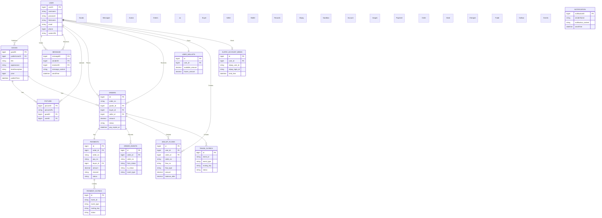


## 2.5 后端服务与组件职责

### 2.5.1 Gateway

- **主要功能和职责**：移动端访问后端的统一入口，负责请求转发、权限校验、登录状态校验和用户信息解析。这样移动端不需要关心后端有多少个服务，只需要访问统一入口。
- **与其他服务的关系**：Gateway 会把消息、订单、支付、钱包、搜索和基础业务请求分别转发到对应服务。它和 Nacos 配合完成服务发现。

### 2.5.2 base-service

- **主要功能和职责**：它负责基础业务，包括登录注册、用户信息、商品浏览、商品发布和修改、图片上传、头像上传、通知查询等。用户、商品等数据主要存在 MySQL 中，图片和头像等文件存放在 MinIO，并通过Redis缓存商品详情、收藏商品列表等高频访问数据，提高服务端性能。
- **与其他服务的关系**：商品搜索时，`base-service` 会用 OpenFeign 来同步调用 `search-engine` 获取搜索结果；商品发生变化时，它会通知 RabbitMQ 发送消息给搜索服务来更新索引。

### 2.5.3 message-service-go

- **主要功能和职责**：它负责聊天相关能力，包括 WebSocket 连接管理、消息收发、消息保存、聊天记录查询和最近会话查询。把消息服务单独拆出来，可以避免长连接业务影响普通 HTTP 业务。
- **与其他服务的关系**：客户端通常通过 Gateway 连接消息服务，Gateway 先完成用户校验，再把请求转给消息服务。消息服务会把聊天消息保存到 MySQL，查询最近会话时也会用到 MySQL 数据库中的用户信息和头像地址信息。

### 2.5.4 trade-service

- **主要功能和职责**：这个服务主要负责订单和交易状态流转，包括创建订单、查询买家和卖家订单、取消订单、处理支付超时、确认收货等。订单从待支付到已支付、已完成的状态主要由它维护。
- **与其他服务的关系**：创建订单时，`trade-service` 会通过 HTTP 同步调用 `payment-service` 创建支付单。订单取消或超时时，`trade-service` 也会通过 HTTP 调用支付服务关闭支付单。支付成功后，`payment-service` 通过 RabbitMQ 消息队列通知 `trade-service` 更新订单状态；买家确认收货后，`trade-service` 再通过 RabbitMQ 通知 `wallet-service` 给卖家结算。

### 2.5.5 payment-service

- **主要功能和职责**：当前项目通过支付宝沙箱模拟买家付款。这个服务主要负责支付相关能力，包括支付宝沙箱账号绑定、支付单创建、支付参数生成、支付回调处理和支付单关闭。
- **与其他服务的关系**：`trade-service` 创建订单后会请求 `payment-service` 创建支付单，订单取消或超时时也会请求它关闭支付单。支付成功后，`payment-service` 会通知 `trade-service` 更新订单状态，也会通知 `wallet-service` 记录平台钱包的金额变化。

### 2.5.6 wallet-service

- **主要功能和职责**：这个服务负责用户钱包、钱包流水、平台钱包入账、卖家收入结算和模拟提现。支付成功后资金先进入平台托管，买家确认收货后再结算到卖家钱包。
- **与其他服务的关系**：移动端通过 Gateway 查询钱包、流水或发起提现。`payment-service` 会在支付成功后通知它记录托管资金，`trade-service` 会在订单完成后通知它给卖家结算。

### 2.5.7 search-engine

- **主要功能和职责**：这个服务主要负责商品搜索能力，包括关键词检索、索引管理、分词、排序和搜索结果返回。以及调用阿里云翻译api在分词进行翻译，实现中文搜索英文商品，或者英文搜索中文商品。
- **与其他服务的关系**：`base-service` 会调用 `search-engine` 查询商品，也会在商品变化时通知它更新索引。`search-engine` 还会和 `ai-tagging` 配合，把商品图片交给 AI 打标，再把生成的标签用于搜索。

### 2.5.8 ai-tagging

- **主要功能和职责**：它负责商品图片的 AI 语义打标，根据图片内容生成若干标签，用来补充商品标题和描述之外的搜索信息。
- **与其他服务的关系**：`search-engine` 会把需要识别的商品图片交给 `ai-tagging`，`ai-tagging` 打标完成后再把结果返回给搜索服务用于更新索引。图片文件来自 MinIO 中存放的商品图片。

## 2.6 基础设施组件

- **MySQL**：存储用户、商品、消息、订单、支付、钱包等核心业务数据。
- **RabbitMQ**：承载异步任务和跨服务事件，例如索引更新、AI 打标、支付成功和订单结算。
- **MinIO**：存储商品图片、头像等对象文件。
- **Redis**：作为缓存和网关相关基础组件，后续可扩展用于热点数据缓存和限流。
- **Nacos**：用于服务注册和服务治理，便于 Gateway 和服务之间进行发现与管理。

## 2.7 后端服务通信方式

后端通信方式可以概括为三类：

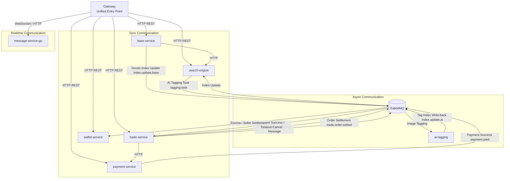


- **同步通信**：对于用户操作后需要立即返回结果的场景。移动端用 HTTP 同步访问 `base-service`、`trade-service`、`payment-service`、`wallet-service`、`search-engine` 和 `message-service-go` 的 HTTP 接口，例如商品查询、订单创建、支付发起、钱包查询、搜索查询和聊天记录查询。服务之间也有通过 HTTP 进行同步调用，例如 `base-service` 通过 OpenFeign 调用 `search-engine` 查询搜索结果，`trade-service` 通过 HTTP 调用 `payment-service` 创建或关闭支付单。
- **WebSocket 通信**：用于聊天这种需要服务端实时推送消息到客户端的场景。移动端通过 Gateway 建立和 `message-service-go` 建立 WebSocket 连接，`message-service-go` 负责维护在线连接，并把新消息实时推送给发送方和接收方。
- **异步通信**：用于用户不需要一直等待的后台动作，主要通过 RabbitMQ 解耦服务。`base-service` 在商品变化后通知 `search-engine` 更新索引；`search-engine` 把需要识别的图片交给 `ai-tagging` 打标，`ai-tagging` 再把标签结果交回搜索服务；`payment-service` 在支付成功后通知 `trade-service` 更新订单状态，同时通知 `wallet-service` 记录平台钱包变化；`trade-service` 在订单完成后通知 `wallet-service` 给卖家结算，也会通过异步方式处理支付超时取消。

## 2.8 关键设计思路

### 2.8.1 选择 Android 作为客户端

我们的项目选择 Android 作为客户端，主要是因为校园二手交易在手机上完成比较方便，而且如果使用网页端端话用户不方便使用。用户发布商品时需要选图、上传图片，聊天时也需要比较及时的交互，这些都和手机端场景比较贴合。而且原生 Android 可以直接使用系统相册、文件选择、图片压缩、网络状态、本地存储和页面跳转等能力，比较适合实现商品发布、聊天和个人中心这些功能。Android 也提供了强大的开发生态，开发难度较低，成本也较低，符合我们的现状。通过 Android Studio 和 Java 即可完成安卓软件的开发。

### 2.8.2 后端选择微服务架构

我们的后端选择使用微服务架构，主要是因为 CampusMart 里不同功能差别比较大。用户和商品相关的功能主要是普通业务数据处理，聊天需要用 WebSocket 协议，搜索需要索引和分词，AI 打标依赖 Python 模型生态，订单、支付和钱包又涉及交易状态和资金流转。如果全部放在一个服务里，代码会越来越混杂，调试和部署时也容易互相影响。

拆分以后，每类能力可以使用更合适的实现方式：`base-service` 负责基础业务，`message-service-go` 处理聊天长连接，`search-engine` 负责索引检索，`ai-tagging` 负责图片打标，订单、支付和钱包服务分别处理交易链路中的不同部分。这样系统结构更清楚，每个服务的职责也更明确。后续如果要优化搜索、替换 AI 模型或扩展支付能力，只需要围绕对应服务修改，不需要大范围改动其他模块。

微服务架构也有利于团队开发和分布式部署。我们负责后端的同学可以分别负责移动端、基础业务、消息、搜索、AI、订单、支付和钱包等模块，开发时相互影响较小。部署时，不同服务也可以按需要启动、扩容或迁移到不同机器上，比如可以根据任务量大时，搜索服务、AI 打标服务和消息消费者可以单独扩展，从而提高系统的可扩展性。

虽然微服务也会带来服务通信、部署和问题排查上的复杂度。通过用 Gateway 提供统一入口，用 Docker Compose 实现统一容器和依赖管理，通过 RabbitMQ 处理异步任务，并把关键订单状态集中在订单服务中维护，让整体复杂度处在一个可控的状态。

### 2.8.3 统一入口

系统使用 Gateway 作为统一入口，主要是为了让移动端只访问一个后端地址。路由转发和登录校验都放在 Gateway 处理，客户端不需要记录各个服务的地址，这样更新维护部署都比较方便，只需要改 GateWay 的配置就可以了。

这样做也能减少后端调整对客户端的影响。比如订单服务、支付服务、钱包服务或搜索服务的部署方式发生变化时，只要 Gateway 的路由保持一致，移动端基本不需要改动。后续如果要增加限流、日志、监控或统一错误处理，也可以优先放在 Gateway 层处理。

### 2.8.4 按不同功能拆分服务

我们将基础业务、消息、搜索、订单、支付、钱包和 AI 打标拆成不同服务。这样每个模块可以围绕自己的功能展开，可以让代码边界更清楚，易于编写，也能减少单个服务过大的问题。

拆分时主要按不同的功能内容来划分：用户、商品、图片和通知放在 `base-service`；聊天需要管理在线连接，所以单独放在 `message-service-go`；搜索放在 `search-engine`；AI打标需要python环境，拆分成 `ai-tagging`；订单、支付、钱包分别对应交易状态、支付过程和资金流水，因此拆成三个服务来处理。

### 2.8.5 同步与异步结合

对于用户需要马上看到结果的操作，我们使用同步的 HTTP 请求，例如查询商品、创建订单、生成支付参数等。对于耗时、可以稍后完成，或者失败后可以重试的动作，则使用 RabbitMQ 异步处理。

比如商品发布后，用户不需要等待 AI 图片打标完成才看到发布结果，所以索引更新和图片打标放到后台处理。支付成功、订单结算这类后续动作也通过消息通知相关服务完成，避免一个请求里连续调用太多服务。我们只在确实需要立即返回结果的场景中使用同步调用。

### 2.8.6 交易资金链路拆分

订单、支付和钱包分别由独立服务负责。订单服务维护交易状态，支付服务处理支付过程，钱包服务处理平台钱包、卖家结算和提现。这样资金相关逻辑不会全部挤在一个服务里，后续如果需要扩展退款、提现或账务记录，也会更清楚。

这种拆分也能让每个服务的职责更明确。订单服务负责订单取消、支付或确认收货；支付服务负责支付单和支付宝沙箱回调；钱包服务负责余额和流水。三个服务通过同步调用和消息通知配合完成完整交易流程。

### 2.8.7 开发搜索引擎服务

我们单独开发搜索引擎服务，主要是为了让搜索能力更贴合校园二手交易场景。二手商品的标题和描述往往不够规范，同一类商品可能会用中文、英文、缩写或口语化表达，所以搜索服务需要支持更灵活的分词、翻译和混合搜索能力。

搜索服务可以根据项目需要定制翻译逻辑，把中文和英文关键词进行扩展，也可以结合商品标题、描述和图片 AI 标签做混合搜索。AI 图片打标可以补充用户没有写清楚的商品信息，让搜索不只依赖文字内容。把这些能力放在独立搜索服务中，商品服务只需要处理商品数据，搜索服务负责把商品变成更容易被检索到的数据。

# 3. 实现

## 3.1 移动端实现

### 3.1.1 技术栈

移动端主要使用原生 Android Java 实现，所用技术栈如下：

- 编程语言：Java
- RecyclerView / ConstraintLayout：用于展示商品列表、聊天列表等滚动内容，并组织页面布局。
- OkHttp：用于发起登录、商品、订单、支付等的 HTTP 请求。
- Gson：序列化和反序列化json。
- Picasso / Glide：用于通过url加载商品图片、头像等存储在服务端的图片。
- SharedPreferences：用于保存登录 token、用户 ID、头像等信息。
- OkHttp WebSocket：用于和消息服务建立聊天长连接。

配置文件（Android/app/src/main/res/values/config.xml）中的 `base_url` 指向服务器的 Gateway，移动端不会直接访问各个后端微服务，如果服务端的地址有所变化，只需更改 `base_url` 或者 Gateway 配置文件。

### 3.1.2 目录结构

移动端代码主要分为以下几类：

```text
Android/app/src/main/java/com/example/campusmart/
  Activity                页面与业务交互入口
  fragment/               首页、商品列表、消息、通知、个人中心等 Tab 页面
  adapter/                RecyclerView 的适配器
  entity/                 请求或本地业务实体
  vo/                     后端返回的对象
  result/                 统一 Result 响应封装
  common/page/            分页对象封装
```

主要页面包括：

- `LoginActivity`：登录并保存 token 与用户信息。
- `RegisterActivity`：用户注册。
- `HomeActivity`：主界面容器。
- `ProductListFragment`：商品列表、滚动分页、搜索。
- `DetailInfoActivity`：商品发布和图片上传。
- `GoodsDetailActivity`：商品详情展示。
- `MessageFragment`：最近聊天列表。
- `ChatActivity`：聊天历史加载与 WebSocket 实时消息。
- `PersonalInfoActivity`、`MyGoodsActivity`：个人信息和我的商品。

### 3.1.3 移动端接口调用方式

移动端、使用 OkHttp 构造请求。登录成功后，服务端返回的 token 会存入到 `SharedPreferences`，后续请求会通过 `access-token` 或 `Authorization` 请求头携带这个 token。

一些接口调用如下：


| 功能     | 移动端入口                 | 后端接口                                      |
| ------ | --------------------- | ----------------------------------------- |
| 登录     | `LoginActivity`       | `POST /app/login`                         |
| 获取用户信息 | `LoginActivity`       | `GET /app/info`                           |
| 商品分页   | `ProductListFragment` | `GET /app/goods/page`                     |
| 商品搜索   | `ProductListFragment` | `POST /api/query`                         |
| 商品发布   | `DetailInfoActivity`  | `POST /app/goods/add`                     |
| 商品图片上传 | `DetailInfoActivity`  | `POST /app/goods/file/uploadGoodsPicture` |
| 聊天记录   | `ChatActivity`        | `GET /app/messages/list`                  |
| 实时聊天   | `ChatActivity`        | `WebSocket /ws`                           |


### 3.1.4 一些主要功能流程的实现

#### 登录流程

`LoginActivity` 负责登录流程：

1. 用户输入用户名和密码。
2. 移动端向 `/app/login` 发送 JSON 请求。
3. 后端返回 JWT token。
4. 移动端携带 token 调用 `/app/info` 获取用户资料。
5. token 和用户信息写入 `SharedPreferences`。
6. 跳转到 `HomeActivity`。

登录与后续鉴权流程如下：

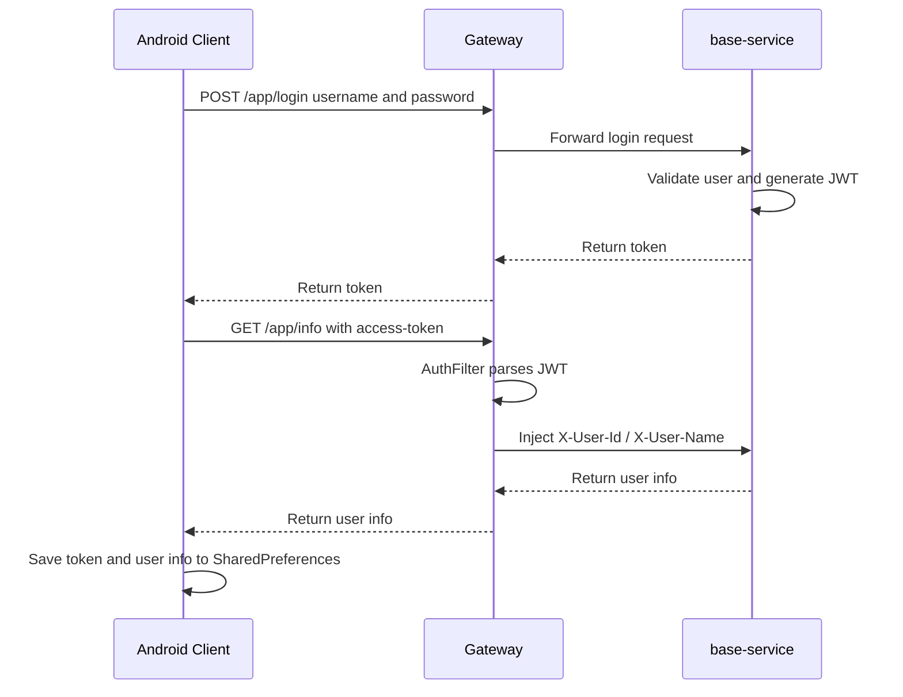


#### 商品浏览与搜索流程

商品展示页面我们使用了 `RecyclerView` + `GridLayoutManager` 展示商品卡片，并通过滚动监听实现商品列表的分页加载。商品图片通过 Picasso 或 Glide 从服务端返回的图片 URL 加载，网络请求由 OkHttp 发起，返回的 JSON 再通过 Gson 转成 `GoodsVo` 等对象。

普通商品列表调用：

```text
GET /app/goods/page?current={page}&size={size}
```

搜索时，移动端直接构造搜索请求：

```json
{
  "query": "搜索关键词",
  "page": 1,
  "limit": 10,
  "order": "desc",
  "scoreExp": ""
}
```

并调用：

```text
POST /api/query?database=campusmart
```

搜索结果会转换为 `GoodsVo`，再映射到 `ProductAdapter.Product` 用于界面展示。这样移动端只负责展示和交互，复杂的分词、翻译、索引查询和排序逻辑都交给后端搜索服务完成。

#### 商品发布流程

商品发布由 `DetailInfoActivity` 实现。我们使用了 Android 原生的文件选择能力读取本地图片，使用 OkHttp 先提交商品基础信息，再通过上传图片的接口上传图片：

1. 用户在商品发布页填写标题、成色、价格、描述等基础信息。
2. 用户从相册选择商品图片。
3. 移动端先调用 `/app/goods/add` 创建商品记录，获得 `goodID`。
4. 移动端压缩图片后，以 multipart 形式上传到 `/app/goods/file/uploadGoodsPicture`。
5. 服务端保存图片并触发搜索索引更新。

商品基础信息和图片上传分两个请求上传，先确定商品 ID，再建立图片与商品的关联。移动端只需要处理表单提交和图片上传，图片保存、对象存储和索引更新都由后端继续处理。

商品发布在移动端和服务端之间的流程如下：

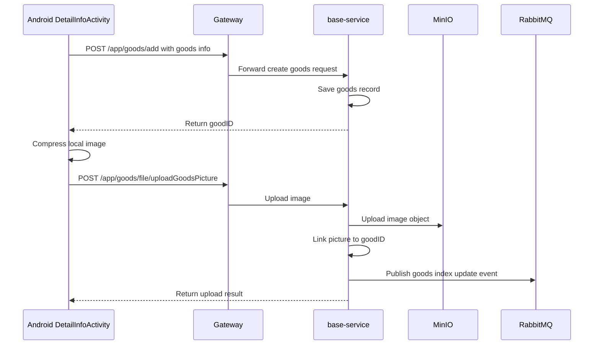


#### 即时聊天流程

`ChatActivity` 同时使用 HTTP 和 WebSocket。进入聊天页面的时，先用 OkHttp 先通过 HTTP 请求拉取消息记录；然后建立 WebSocket 连接，建立连接后，OkHttp WebSocket 负责实时发送和接收消息；如果有新收到消息后更新 `RecyclerView` 展示：

1. 进入聊天页时调用 `/app/messages/list` 拉取历史消息。
2. 根据配置文件中的 `base_url` 生成 `ws://` 或 `wss://` 地址。
3. 连接 `/ws?userId={userId}&token={token}`。
4. 发送消息时将 `Message` 对象序列化为 JSON，通过 WebSocket 发送。
5. 收到服务端推送后，判断消息是否属于当前会话，再更新 RecyclerView。

## 3.2 Gateway 实现

### 3.2.1 技术栈

Gateway 位于 `server/gateway/`。

- 编程语言：Java
- Spring Boot：用于启动和管理 Gateway 应用。
- Spring Cloud Gateway：用于统一接入、路由转发和过滤器处理。
- Spring Cloud LoadBalancer：用于配合服务发现进行服务调用。
- Nacos Discovery：用于发现后端的服务发现。
- JJWT：用于解析和校验登录 token。

### 3.2.2 目录结构

```text
server/gateway/
  src/main/java/org/example/campusmart/gateway/
    GatewayApplication.java
    filter/
      AuthFilter.java
```

### 3.2.3 主要职责

Gateway 是所有后端 HTTP 和 WebSocket 请求的入口，主要实现以下功能：

- 路由转发：按请求路径，把请求转发到对应的服务。
- JWT 鉴权：读取 `Authorization` 或 `access-token`，解析 token。
- 用户上下文传递：解析 `X-User-Id`、`X-User-Name`、`access-token` 等用户信息，并注入到下游请求。
- 白名单控制：登录、注册和支付回调等接口允许跳过普通鉴权。

### 3.2.4 关键实现

`AuthFilter` 中实现了 Spring Cloud Gateway 的 `GlobalFilter`，所有进入网关的请求都会先经过这个过滤器。这个过滤器用 JJWT 解析 token，用 Spring Cloud Gateway 修改请求头，再把用户信息继续传给下游服务，流程如下：

1. 获取请求路径。
2. 如果是白名单 API 或者 WebSocket 连接，则直接放行。
3. 如果不是上述连接，则从请求头读取 token。
4. 使用 JWT 的 secret 解析 token。
5. 将用户 ID 和用户名写入请求头。
6. 转发给下游服务。

这样的全局过滤器可以统一实现鉴权逻辑，各个服务无需重复编写，只需要从请求头中读取用户 ID 就可以知道当前请求属于哪个用户。Gateway还通过路由配置把不同路径的请求转发到对应服务，后续如果服务实例变多，也可以结合 Nacos 和 LoadBalancer 做服务发现和转发。

## 3.3 base-service 实现

### 3.3.1 技术栈

`base-service` 位于 `server/base-service/`，是基础业务服务。

- 编程语言： Java
- Spring Boot：用于启动服务和管理依赖配置。
- Spring MVC：用于提供登录、商品、图片、通知等 HTTP 接口。
- MyBatis-Plus：用于简化实体和数据库表之间的增删改查。
- MySQL：用于存储用户、商品、图片、通知等核心数据。
- MinIO Java SDK：用于上传头像和商品图片到 MiniIO 对象存储服务。
- RabbitMQ：用于发布商品索引更新等异步任务。
- OpenFeign：用于同步调用搜索服务接口。
- Nacos Discovery：用于服务注册和发现。
- Knife4j / OpenAPI：用于接口文档展示和调试。

### 3.3.2 模块结构

```text
server/base-service/
  common/              通用结果、异常、JWT、MinIO 配置等
  model/               用户、商品、图片、消息、通知等实体
  web/
    controller/        REST API 控制器
    service/           业务服务接口
    service/impl/      业务服务实现
    mapper/            MyBatis Mapper
    resources/mapper/  XML SQL 映射
```

### 3.3.3 接口定义

基础服务主要接口如下：


| 模块  | 接口                                        | 说明           |
| --- | ----------------------------------------- | ------------ |
| 认证  | `POST /app/login`                         | 登录并返回 JWT    |
| 认证  | `POST /app/register`                      | 注册用户         |
| 认证  | `GET /app/info`                           | 获取当前登录用户信息   |
| 商品  | `GET /app/goods/page`                     | 分页查询商品       |
| 商品  | `GET /app/goods/search`                   | 商品搜索，优先走搜索服务 |
| 商品  | `GET /app/goods/selectById`               | 查询商品详情       |
| 商品  | `POST /app/goods/add`                     | 添加商品         |
| 商品  | `PUT /app/goods/update`                   | 更新商品         |
| 商品  | `PUT /app/goods/deleteById`               | 删除商品         |
| 文件  | `POST /app/goods/file/uploadGoodsPicture` | 上传商品图片       |
| 文件  | `POST /app/goods/file/uploadAvatar`       | 上传头像         |


### 3.3.4 主要业务实现

#### 用户注册与登录

`UserServiceImpl` 实现用户注册和登录功能。Controller 通过 Spring MVC 接收请求，Service 处理注册和登录规则，Mapper 通过 MyBatis-Plus 访问 MySQL：

- 注册时先根据用户名检查是否重复。
- 为新用户生成默认昵称（User开头+随机数）和默认签名。
- 读取默认头像文件并上传到 MinIO。
- 登录时校验用户名和密码。
- 登录成功后使用 `JwtUtil.createToken` 生成 token。

用户数据最终写入 MySQL，默认头像通过 MinIO Java SDK 上传到对象存储。登录成功后返回的 JWT 会被移动端保存，后续请求由 Gateway 校验，后续用户可以通过修改用户信息的接口更新个人信息。

#### 商品管理

`GoodsController` 提供商品的 CRUD 接口。使用 Spring MVC 处理请求参数和统一响应，数据访问层使用 MyBatis-Plus 查询 MySQL。商品分页查询会联查商品表、用户表和图片表，返回适合移动端展示的 `GoodsVo`。

商品新增和修改后，会调用 RabbitMQ 投递索引更新消息。这里使用消息队列的原因是索引更新不需要阻塞用户发布商品的请求。商品删除后，会调用搜索服务删除索引，避免搜索结果中继续出现已删除商品。

#### 图片上传

`PictureServiceImpl` 使用 MinIO Java SDK 实现图片上传。移动端上传图片文件后，Spring MVC 接收文件，服务端把图片保存到 MinIO，并关联对象名和商品或用户，流程如下：

- 检查 MinIO 中， bucket 是否存在。
- 不存在时创建 bucket，并设置公开读策略。
- 以日期目录 + UUID + 原文件名生成对象名。
- 调用 `putObject` 写入 MinIO。
- 返回文件对象名，并保存到 MySQL 数据库。

#### 搜索服务集成

base-service 中，将对搜索服务的调用的封装在 `SearchEngineService` 中。商品搜索场景需要立即返回结果，因此使用 OpenFeign 同步调用 `search-engine`；商品发布或修改后的索引更新可以稍后完成，因此使用 RabbitMQ 异步发送任务，封装的搜索能力如下：

- `searchGoods`：调用 `search-engine` 查询搜索结果。
- `buildIndexDocument`：将商品、图片、用户信息组装成索引文档。
- `publishIndexUpdate`：将索引任务发送到 RabbitMQ。
- `removeIndex`：同步调用搜索服务删除索引。

索引文档中会包含商品 ID、标题、描述、图片 URL、发布者昵称、头像等字段，这样搜索结果就可以直接展示。这样搜索服务返回结果后，移动端不需要再额外从 MySQL 中查询商品基础详情。

## 3.4 message-service-go 实现

### 3.4.1 技术栈

`message-service-go` 位于 `server/message-service-go/`。

- 编程语言：Golang
- Gin：用于提供聊天记录、最近会话等 HTTP 接口。
- Gorilla WebSocket：用于建立和维护聊天长连接。
- GORM：用于封装消息数据的数据库读写。
- MySQL：用于保存聊天消息和查询最近会话需要的数据。
- Nacos Go SDK：用于将消息服务注册到服务发现组件。

### 3.4.2 目录结构

```text
server/message-service-go/
  controller/       HTTP 消息接口
  model/            消息模型
  repository/       数据访问
  service/          消息业务逻辑
  websocket/        WebSocket Hub 和连接读写
  router/           路由注册
  config/           配置加载
  main.go           服务启动入口
```

### 3.4.3 接口定义


| 接口                         | 类型        | 说明            |
| -------------------------- | --------- | ------------- |
| `GET /app/messages/list`   | HTTP      | 查询两名用户之间的聊天记录 |
| `GET /app/messages/recent` | HTTP      | 查询最近聊天列表      |
| `GET /ws`                  | WebSocket | 建立实时聊天连接      |


### 3.4.4 关键实现

WebSocket Hub 是消息服务的核心。HTTP 部分用 Gin 框架实现，历史消息和最近会话功能通过 GORM 查询 MySQL；实时聊天部分由 Gorilla WebSocket 处理连接读写。Hub 内部维护一下对象或channel：

- `clients map[int64]map[*client]struct{}`：用户 ID 到连接集合的映射。
- `register`：连接注册通道。
- `unregister`：连接注销通道。
- `deliver`：服务端向某用户投递消息的通道。

客户端连接后，服务会将连接注册到对应用户 ID 下。发送消息时，服务先校验发送人和连接用户是否一致，再通过 GORM 把消息写入 MySQL，最后把消息推送给发送者和接收者在线连接。

这样设计就可以支持同一用户多个手机在线，也不需要直接在业务处理函数中操作所有连接。如果接收方暂时不在线，消息也已经保存在 MySQL 中，用户下次进入聊天页时就可以通过 HTTP 接口重新加载。

## 3.5 search-engine 实现

### 3.5.1 技术栈

`search-engine` 位于 `server/search-engine/`。

- Golang：用于实现搜索服务主体逻辑和并发查询。
- Gin：用于提供搜索查询、索引新增、索引删除等 HTTP 接口。
- LevelDB：用于保存文档数据、正排索引和倒排索引。
- Jieba 分词（`jiebago`）：用于中文分词和关键词提取。
- RabbitMQ：用于接收商品索引更新任务，并向 AI 打标服务发送图片打标任务。
- Redis：用于缓存翻译结果，减少重复调用外部翻译服务。
- go-cache：用于进程内缓存高频翻译结果。
- 阿里云机器翻译 SDK：用于做对中英文关键词的翻译，支持中英文混合搜索。

### 3.5.2 目录结构

```text
server/search-engine/
  internal/web/          HTTP 接口、路由、中间件
  internal/searcher/     搜索引擎核心，分词、索引、排序、分页
  internal/queue/        RabbitMQ 消费者和生产者
  internal/redis/        Redis 客户端
  internal/core/         初始化逻辑
  data/                  词典和索引数据
```

### 3.5.3 接口定义


| 接口                       | 说明        |
| ------------------------ | --------- |
| `POST /api/query`        | 搜索查询      |
| `POST /api/index`        | 添加或更新单条索引 |
| `POST /api/index/batch`  | 批量添加索引    |
| `POST /api/index/remove` | 删除索引      |


### 3.5.4 正倒排索引实现

搜索引擎核心结构是 `Engine`。Gin 负责接收基于 HTTP 协议的搜索和索引请求，检索逻辑放在 `internal/searcher/` 中。搜索引擎中索引数据使用 LevelDB 进行持久化存储，服务重启后索引也不回丢失：

- `docStorages`：保存文档原文。
- `positiveIndexStorages`：保存文档 ID 到关键词列表的映射。
- `invertedIndexStorages`：保存关键词到文档 ID 列表的映射。
- `Tokenizer`：负责文本分词。
- `Shard`：通过分片降低单个存储实例压力。

添加索引时，搜索服务会把商品文字和 AI 标签通过分词器变成可检索的关键词：

1. 读取商品标题、描述和 AI 标签。
2. 使用 Jieba 分词器对文本进行分词。
3. 标签也作为关键词加入索引。
4. 写入正排索引，用于根据文档 ID 找回文档和关键词。
5. 写入倒排索引，用于根据关键词快速找到文档 ID。

搜索时，服务会先用 Jieba 拆分中文关键词，再结合阿里云机器翻译 SDK 做中英文之间的翻译。翻译结果会优先查 go-cache 和 Redis，减少外部 API 调用。整体步骤如下：

1. 接收用户输入的查询词，可能包含中文、英文或中英文混合内容。
2. 对查询词做清洗，把所有字母转成小写并去掉无关标点。
3. 从查询词中提取英文单词，同时保留中文部分。
4. 对中文部分使用 Jieba 分词器的搜索模式进行分词，得到中文关键词。
5. 尝试将中文关键词翻译成英文，对英文关键词翻译成中文。
6. 翻译前先查询 go-cache，如果本地缓存没有，再查 Redis；两个缓存都没有命中时，才调用阿里云翻译 SDK， 调用翻译 SDK 后更新本地缓存和 Redis。
7. 将原始关键词、分词结果和翻译结果合并，并去掉重复词。
8. 根据合并后的关键词并发查询倒排索引，找到可能匹配的商品文档 ID。
9. 对多个关键词命中的结果进行合并和计分，命中次数更多、匹配更充分的商品排序更靠前。
10. 根据分页参数读取当前页对应的文档数据，并返回给调用方。

### 3.5.5 RabbitMQ 集成

`IndexConsumer` 通过 RabbitMQ 消费索引更新任务，并调用索引服务更新搜索数据。搜索服务如果发现索引文档中包含图片 URL ，就会通过 `TaggingProducer` 向 AI 打标服务发送图片打标任务。这样商品发布后可以先完成基础文本索引，图片标签稍后完成AI打标后再补充进索引中，由于AI打标耗时较长，这样设计可以提高响应速度。

## 3.6 ai-tagging 实现

### 3.6.1 技术栈

`ai-tagging` 位于 `server/ai-tagging/`。

- 编程语言：Python
- FastAPI：用于提供图片打标接口和健康检查接口。
- Uvicorn：用于运行 FastAPI 服务。
- Transformers：用于加载和使用 CLIP 模型及处理器。
- PyTorch / TorchVision：用于执行模型推理和张量计算。
- Pillow：用于读取和处理图片。
- aiohttp：用于根据图片 URL 异步下载图片。
- Pika：用于连接 RabbitMQ，消费打标任务并发布索引更新任务。
- CLIP 模型：用于计算图片和候选标签之间的相似度。

### 3.6.2 目录结构

```text
server/ai-tagging/
  internal/app/
    api/          FastAPI 路由
    models/       CLIP 模型封装
    services/     图片加载和打标逻辑
    schemas/      请求与响应模型
    config.py     配置
  internal/queue/
    consumer/     RabbitMQ 打标任务消费者
    producer/     索引更新生产者
    config.py     RabbitMQ 配置
```

### 3.6.3 接口定义


| 接口              | 说明            |
| --------------- | ------------- |
| `POST /api/tag` | 根据图片 URL 返回标签 |
| `GET /health`   | 健康检查，返回模型状态   |


### 3.6.4 关键实现

`TaggingService` 负责打标逻辑。FastAPI 启动时会初始化服务对象，Transformers 负责加载 CLIP 模型，PyTorch 负责实际推理，Pillow 和 aiohttp 负责把远程图片读取成模型可以处理的输入：

- 启动时读取存储了预设好的商品标签文件。
- 在线程池中加载 CLIP 模型。
- 根据图片 URL 下载图片。
- 编码图片和候选标签文本，将标签文本和图片都嵌入到低维向量空间中。
- 计算相似度，取 top-k 标签。

`TaggingConsumer` 负责异步打标链路。它使用 Pika 连接 RabbitMQ，收到搜索服务发来的图片任务后调用 `TaggingService` 生成标签，再把带标签的索引任务发回搜索服务，调用流程如下：

1. `TaggingConsumer` 消费 RabbitMQ 中的图片打标任务。
2. 根据任务中的 `imageURL` 调用 `TaggingService`。
3. 将生成的标签写入任务文档。
4. 通过 `IndexProducer` 将带标签的索引更新任务发回搜索服务。

## 3.7 trade-service 实现

### 3.7.1 技术栈

`trade-service` 位于 `server/trade-service/`。

- 编程语言： Golang
- Gin：用于提供创建订单、查询订单、取消订单、确认收货等 HTTP 接口。
- GORM：用于订单数据、状态事件和 outbox 的数据库操作。
- MySQL：用于保存订单、商品关联、订单事件等数据。
- RabbitMQ：用于处理支付成功、支付超时和订单结算等异步事件。
- HTTP Client：用于同步调用支付服务创建或关闭支付单。

### 3.7.2 目录结构

```text
server/trade-service/
  cmd/trade-service/     服务入口
  internal/config/       配置
  internal/handler/      HTTP Handler
  internal/service/      订单业务逻辑
  internal/repository/   数据访问和事务
  internal/model/        订单、事件、Outbox 模型
  internal/client/       payment-service HTTP 客户端
  internal/mq/           RabbitMQ 消费和发布
  internal/router/       路由注册
```

### 3.7.3 接口定义


| 接口                                           | 说明     |
| -------------------------------------------- | ------ |
| `POST /app/orders`                           | 创建订单   |
| `GET /app/orders/{orderId}`                  | 查询订单详情 |
| `GET /app/orders/buyer`                      | 查询买家订单 |
| `GET /app/orders/seller`                     | 查询卖家订单 |
| `POST /app/orders/{orderId}/cancel`          | 取消订单   |
| `POST /app/orders/{orderId}/confirm-receipt` | 确认收货   |


### 3.7.4 订单状态机

订单状态定义在 `model/order.go`：


| 状态          | 含义           |
| ----------- | ------------ |
| `CREATED`   | 订单已创建，等待支付   |
| `PAID`      | 买家已支付        |
| `SETTLED`   | 买家确认收货，订单已结算 |
| `CANCELLED` | 订单取消或超时关闭    |


核心状态流转：

```text
CREATED -> PAID -> SETTLED
CREATED -> CANCELLED
```

### 3.7.5 关键实现

`OrderService` 负责订单业务。外部请求先进入 Gin Handler，业务规则集中在 Service 层，数据库事务和状态更新由 Repository 通过 GORM 操作 MySQL：

- 创建订单时生成订单号和支付过期时间。
- 使用 repository 创建订单并校验商品关系。
- 通过 HTTP Client 调用 `payment-service` 创建支付单。
- 发布支付超时延迟消息。
- 消费支付成功事件后将订单标记为 `PAID`。
- 买家确认收货后将订单标记为 `SETTLED`，并写入 `trade_outbox`。

支付超时通过 RabbitMQ 延迟队列 + 死信交换机实现。订单创建后投递延迟消息，TTL 到期后消息进入超时队列，服务消费后尝试取消仍处于 `CREATED` 状态的订单。支付成功事件也通过 RabbitMQ 进入订单服务，订单服务只根据事件更新自己的订单状态，不直接依赖支付服务修改订单表。

## 3.8 payment-service 实现

### 3.8.1 技术栈

`payment-service` 位于 `server/payment-service/`。

- 编程语言： Golang
- Gin：用于提供支付宝绑定、创建支付单、生成支付参数和回调等 HTTP 接口。
- GORM：用于封装支付单、支付宝绑定和 outbox 的数据库操作。
- MySQL：用于保存支付单、绑定账号和待发布事件。
- RabbitMQ：用于发布支付成功事件，通知订单和钱包服务。
- HMAC-SHA256 模拟签名：用于模拟支付宝沙箱支付参数和回调验签。

### 3.8.2 目录结构

```text
server/payment-service/
  cmd/payment-service/   服务入口
  internal/config/       配置
  internal/handler/      支付和支付宝绑定 Handler
  internal/service/      支付业务逻辑
  internal/repository/   支付单、绑定账户、Outbox 数据访问
  internal/model/        支付单、支付宝绑定、Outbox 模型
  internal/mq/           Outbox Dispatcher
  internal/router/       路由注册
```

### 3.8.3 接口定义


| 接口                                        | 说明          |
| ----------------------------------------- | ----------- |
| `POST /app/alipay/bind/mock`              | 绑定支付宝沙箱账号   |
| `GET /app/alipay/bind`                    | 查询当前用户绑定信息  |
| `DELETE /app/alipay/bind`                 | 解绑银行卡沙箱账号   |
| `GET /internal/alipay/binds/{userId}`     | 内部查询绑定信息    |
| `POST /internal/payments`                 | 内部创建支付单     |
| `POST /internal/payments/{orderId}/close` | 内部关闭支付单     |
| `POST /app/orders/{orderId}/pay/alipay`   | 生成支付宝沙箱支付参数 |
| `POST /app/payments/alipay/notify`        | 支付宝沙箱回调     |


### 3.8.4 支付沙箱实现

当前实现不是直接接入真实支付宝转账，而是模拟支付宝沙箱支付流程。Gin Handler 负责接收移动端和订单服务请求，Service 层处理支付规则，Repository 使用 GORM 读写 MySQL：

- 支付渠道固定为 `ALIPAY_SANDBOX`。
- 用户先绑定模拟支付宝账号。
- 支付单状态包括 `WAIT_PAY`、`SUCCESS`、`CLOSED`。
- 生成 `orderString` 时包含 app id、notify url、订单号、金额、buyer 沙箱账号等参数。
- 使用 HMAC-SHA256 生成 mock 签名。
- 回调时校验交易状态、金额、支付单号和可选签名。
- 支付成功后写入 `payment_outbox`，由 dispatcher 发布 `payment.paid` 事件。

这种实现满足课程项目中的支付演示，同时避免真实支付和真实转账带来的复杂合规问题。支付成功后不是直接同步调用订单和钱包服务，而是通过 RabbitMQ 发布事件，让订单服务和钱包服务分别处理自己的状态变化。

## 3.9 wallet-service 实现

### 3.9.1 技术栈

`wallet-service` 位于 `server/wallet-service/`。

- Go：用于实现钱包服务主体逻辑。
- Gin：用于提供钱包余额、钱包流水和模拟提现等 HTTP 接口。
- GORM：用于封装钱包和流水的数据库事务。
- MySQL：用于保存用户钱包余额和资金流水。
- RabbitMQ：用于消费支付成功和订单结算事件。

### 3.9.2 目录结构

```text
server/wallet-service/
  cmd/wallet-service/    服务入口
  internal/config/       配置
  internal/handler/      钱包 HTTP Handler
  internal/service/      钱包业务逻辑
  internal/repository/   余额与流水事务
  internal/model/        钱包和流水模型
  internal/mq/           RabbitMQ 消费者
  internal/router/       路由注册
```

### 3.9.3 接口定义


| 接口                          | 说明     |
| --------------------------- | ------ |
| `GET /app/wallet`           | 查询钱包余额 |
| `GET /app/wallet/flows`     | 查询钱包流水 |
| `POST /app/wallet/withdraw` | 模拟提现   |


### 3.9.4 关键实现

钱包服务围绕 `user_wallets` 和 `wallet_flows` 两类数据实现。Gin 提供查询和提现接口，Service 层处理余额变化规则，Repository 使用 GORM 事务保证余额和流水同时更新：

- `user_wallets` 保存用户可用余额和冻结余额。
- `wallet_flows` 保存每笔资金变化记录。
- `ESCROW_IN` 表示买家支付后平台托管入账。
- `SELLER_INCOME` 表示确认收货后卖家入账。
- `WITHDRAW_OUT` 表示模拟提现。
- `REFUND_OUT` 预留退款流出。

钱包服务通过 RabbitMQ 消费事件完成资金变化：

- 消费 `payment.paid`：记录平台托管流水。
- 消费 `trade.order.settled`：给卖家钱包增加可用余额，并记录卖家收入流水。

模拟提现目前只在系统内部完成余额扣减和流水记录，不会真的向用户支付宝账户转账。这样设计主要是因为支付宝沙箱只能模拟买家支付，并没有直接提供完整的商家向个人账户打款能力；如果接入真实支付宝商家转账，还需要营业执照、商家账户认证、资金合规审核等条件，超出了我们的课程项目的实现范围。

金额字段使用字符串表示 decimal，避免 float 类型在金额计算中的精度问题。支付成功和订单结算都可能重复投递，所以钱包流水通过唯一约束减少重复流水；后续还需要进一步完善卖家结算重复消费时的余额幂等处理。

## 3.10 中间件与部署实现

### 3.10.1 MySQL

MySQL 保存核心业务数据，包括用户、商品、图片、消息、订单、支付单、钱包、流水和 Outbox。数据库初始化脚本位于：

```text
database generater/campusmart-build-database.sql
```

### 3.10.2 RabbitMQ

RabbitMQ 支撑三类异步链路：

- 商品索引与 AI 打标链路。
- 支付成功、订单结算和钱包变更链路。
- 订单支付超时取消链路。

消息队列使耗时任务和跨服务副作用不阻塞用户请求，也使服务之间可以通过事件保持最终一致。

### 3.10.3 MinIO

MinIO 用于存储头像和商品图片。base-service 上传文件后保存对象名，客户端展示时通过服务端返回的 URL 加载图片。

### 3.10.4 Redis

Redis 主要用于缓存需要频繁访问的数据。搜索服务中，翻译结果会先查本地缓存，再查 Redis，最后才调用外部翻译 API。基础服务中，商品详情页和聊天记录等热点数据或者需要多表联查查询速度慢点数据都会缓存在 Redis 中。

### 3.10.5 Nacos

Nacos 用于服务注册和发现。

### 3.10.6 Docker Compose

统一部署配置位于：

```text
deploy/docker/docker-compose.yml
```

Docker Compose 负责编排 MySQL、Redis、RabbitMQ、Nacos、MinIO、Gateway 和各业务服务，并通过同一个 Docker network 实现容器间访问。

## 3.11 重大技术挑战与实现方案

### 3.11.1 商品上传到 AI 打标再到正倒排索引

这是项目中较复杂的一条链路，涉及到多个服务： Android、base-service、MinIO、RabbitMQ、search-engine 和 ai-tagging。

流程如下：

1. Android 在 `DetailInfoActivity` 中先创建商品，再上传图片。
2. base-service 保存商品数据和图片记录。
3. 图片文件上传到 MinIO，数据库保存对象名。
4. base-service 构建索引文档，包含商品标题、描述、图片、发布者信息等。
5. base-service 发送索引更新任务到 RabbitMQ。
6. search-engine 消费索引任务，先写入文本索引。
7. 如果文档包含 `imageURL`，search-engine 投递 AI 打标任务。
8. ai-tagging 消费任务，下载图片并使用 CLIP 生成标签。
9. ai-tagging 将标签写回索引更新任务。
10. search-engine 再次消费带标签的任务，将标签并入关键词集合，更新正排和倒排索引。

这个链路的最大的技术挑战是：商品发布不能被 AI 推理阻塞（AI推理可能需要几百毫秒），但搜索索引又需要最终包含图片语义。我们最终设计了这样的链路，通过 RabbitMQ 将文本索引和 AI 标签补充拆开，实现了“先可搜索、后增强”的索引更新策略。

该异步链路的示意图如下：

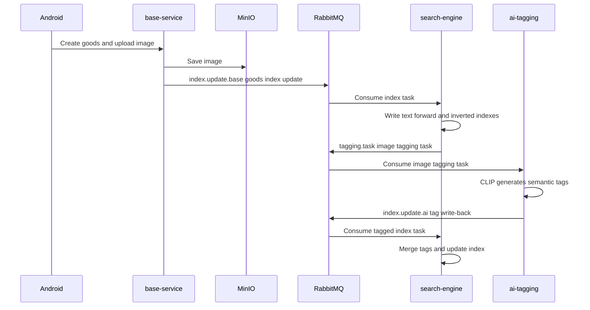


### 3.11.2 搜索、翻译与分词链路

搜索服务要支持中英文混合查询，因此实现中不仅使用 Jieba 中文分词，还加入了中英文翻译。这个策略同时解决了AI打标的标签全部是英文的问题。

查询时的处理流程：

1. 将输入统一转小写并去除标点。
2. 提取英文单词。
3. 对中文部分使用 Jieba 搜索模式分词。
4. 中文词尝试翻译成英文。
5. 英文词尝试翻译成中文。
6. 合并原词和翻译词，并去重。
7. 并发查询倒排索引。
8. 合并结果、计算得分、分页返回。

为了降低外部翻译 API 的调用成本，同时加快查询速度（外部翻译 API 的调用时间可能较长），翻译模块采用三级缓存策略：

- 热词表优先。
- 本地 go-cache 缓存。
- Redis 7 天缓存。
- 缓存未命中时才调用翻译 API。

这个实现提高了搜索召回率，也避免每次搜索都依赖外部服务。

搜索查询内部处理流程如下：

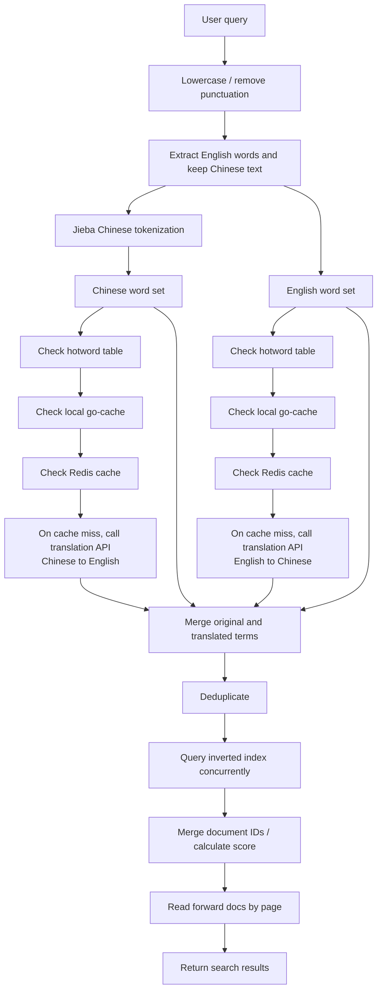


### 3.11.3 订单状态流转

订单状态流转涉及用户操作、支付回调、超时取消和钱包结算，容易出现重复操作和状态不一致问题。

我们的的处理方式是：

- 订单状态由 `trade-service` 统一维护。
- 只有 `CREATED` 订单可以取消或被标记为支付成功。
- 只有 `PAID` 订单可以确认收货并进入 `SETTLED`。
- 支付超时通过 RabbitMQ 延迟队列触发。
- 状态变更记录到 `order_events`。
- 需要通知其他服务的事件先写入 `trade_outbox`，再由后台 dispatcher 发布。

这种设计避免支付服务或钱包服务直接修改订单状态，使订单状态机有单一事实来源。

订单状态机如下（注意，由于支付宝沙箱提供的接口不支持退款，所以退款状态暂未实现）：

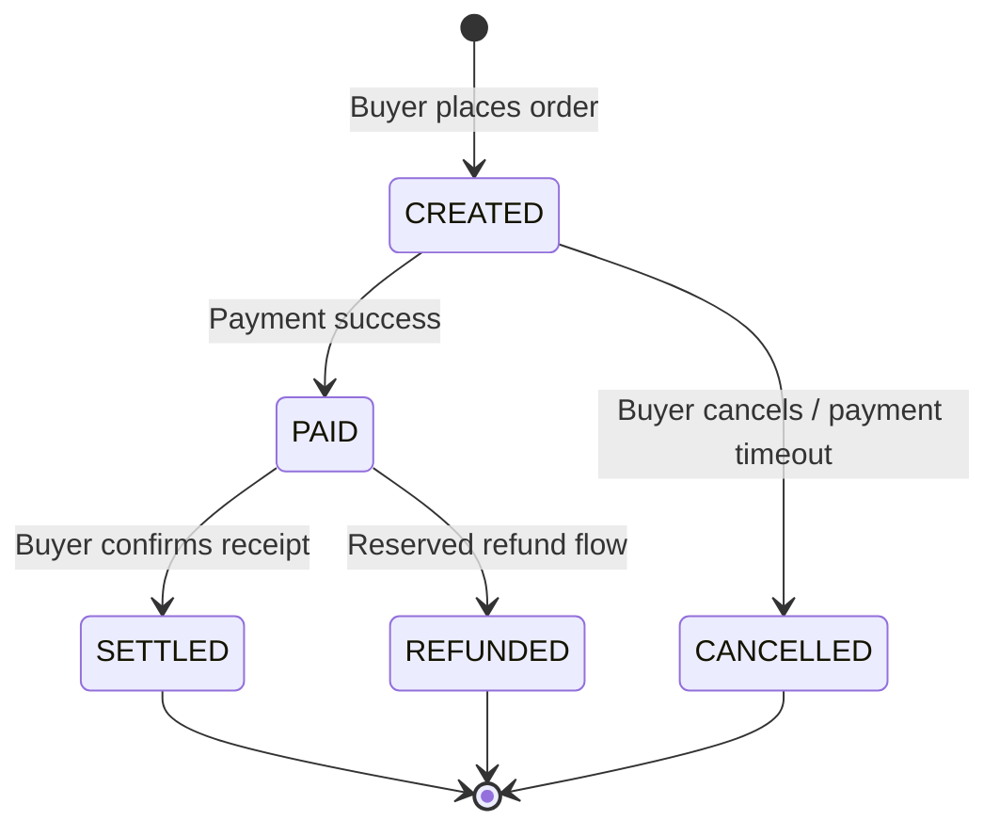


### 3.11.4 支付宝沙箱实现

支付是交易闭环中的关键难点。当前项目通过 `payment-service` 实现支付流程，由于完整的支付宝商家能力需要营业执照以及审批，我们的项目暂时依赖支付宝沙箱接口来展示支付的功能可以实现，以及展示我们的程序设计。并未实现真实的支付宝支付。用支付宝沙箱接口实现的支付的流程如下：

- 用户绑定支付宝沙箱账号。
- 下单后由 trade-service 调用 payment-service 创建支付单。
- 用户发起支付时，payment-service 生成模拟 `orderString`。
- 支付回调进入 `/app/payments/alipay/notify`。
- 回调校验金额、订单号和签名配置。
- 支付单从 `WAIT_PAY` 变为 `SUCCESS`。
- payment-service 写入 `payment_outbox`。
- Outbox dispatcher 发布 `payment.paid`。
- trade-service 消费事件后更新订单状态。
- wallet-service 消费事件后记录托管流水。

我们设计的实现主要把交易流程跑通，而没有直接接入真实资金转账。买家付款这一步使用支付宝沙箱来模拟，表示买家已经把钱付到平台；后面的卖家到账不再走真实支付宝转账，而是由 `wallet-service` 通过平台钱包余额和钱包流水来模拟。这样可以展示“买家付款、平台托管、确认收货、卖家入账、卖家提现”的完整流程。由于调用真实的支付宝能力存在需要真实商户资质、真实转账、资金清算和合规审核等复杂问题，暂时未实现真实的支付宝金额流转。

支付沙箱与订单、钱包的事件协作如下：

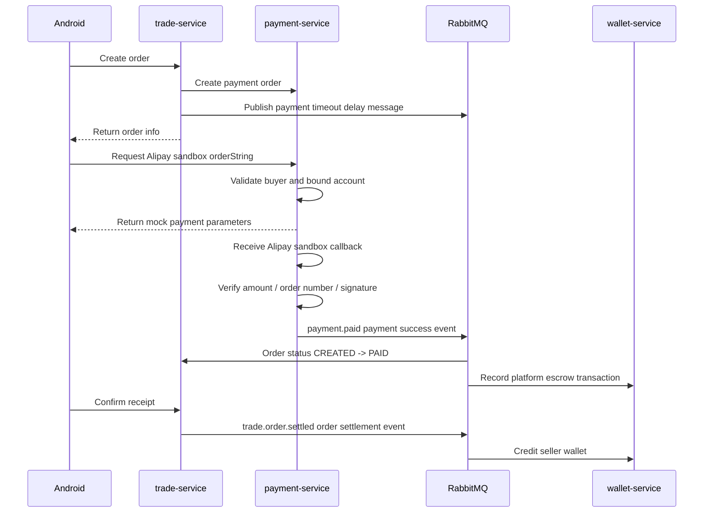


### 3.11.5 即时通讯链路与连接管理

即时通讯链路的挑战不只是在建立 WebSocket 连接，还包括历史消息加载、用户身份校验、消息持久化、在线推送和多端连接管理等问题。项目中的聊天消息由 `message-service-go` 实现。

即时通讯的完整链路如下：

1. Android 端在“最近的聊天”页面 `MessageFragment` 中查询最近会话列表。
2. 用户进入与单个用户的聊天页后，`ChatActivity` 先通过 HTTP 调用 `/app/messages/list` 拉取历史消息。
3. `ChatActivity` 将 `base_url` 转换为 `ws://` 或 `wss://`，并连接 `/ws?userId={userId}&token={token}`。
4. Gateway 负责转发 WebSocket 请求，并在鉴权后向下游透传用户信息。
5. `message-service-go` 校验连接中的用户 ID，并将连接注册到 WebSocket Hub。
6. 用户发送消息时，Android 将 `Message` 对象序列化为 JSON 后通过 WebSocket 发送。
7. 消息服务接收消息后先写入 MySQL，保证聊天记录不会丢失。
8. 消息服务通过 Hub 将消息推送给发送方和接收方的在线连接。
9. 如果接收的用户当前离线，由于消息已保存到数据库，用户下次进入聊天页时会通过历史消息接口加载。

Hub 的连接管理实现包括：

- 每个用户 ID 对应一个连接集合，支持同一用户多端在线。
- 新连接进入 `register` 通道。
- 断开连接进入 `unregister` 通道。
- 投递消息进入 `deliver` 通道。
- 写协程定期发送 ping，检测连接可用性。

这些通道由 Hub 的 `Run` 循环统一消费。`Run` 会持续监听 `register`、`unregister` 和 `deliver` 三个通道：当 `register` 收到新连接时，Hub 会把该连接加入对应用户 ID 的连接集合；当 `unregister` 收到断开的连接时，Hub 会从集合中删除它，如果该用户已经没有在线连接，就清理掉这个用户的连接记录；当 `deliver` 收到待推送消息时，Hub 会找到目标用户的所有在线连接，并把消息写入每个连接自己的 `send` 队列。真正向 WebSocket 客户端写数据的动作不在 Hub 主循环里直接完成，而是由每个连接的写协程从 `send` 队列中取出消息后发送给客户端。这样可以避免某个连接写入变慢时阻塞整个 Hub。

这种实现将“历史消息查询”和“实时消息推送”分开处理：HTTP 负责可靠查询，WebSocket 负责实时触达；数据库负责消息持久化，Hub 负责在线连接分发，从而兼顾实时性和可恢复性。

即时通讯链路如下：

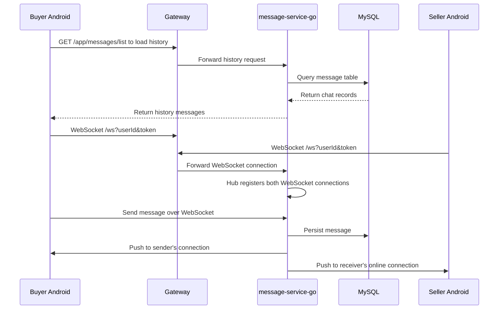


## 3.12 设计原则与模式应用

### 3.12.1 分层架构

我们的后端服务都采用类似的分层架构实现：

```text
Controller / Handler
  -> Service
  -> Repository / Mapper
  -> Model / Entity
```

这样拆分可以让每一层负责的事情更清楚。接口层负责处理请求参数和响应结果，Service 层负责真正的业务规则，Repository 或 Mapper 负责数据库访问，Model 或 Entity 负责描述数据结构。在 Java 的 `base-service` 中，Controller 接收 HTTP 请求并返回统一 `Result`，Service 处理注册、登录、商品发布、图片上传等业务，Mapper 和 XML 负责查数据库。在 Go 服务中，Handler 负责参数解析和响应，Service 负责订单状态、支付回调、钱包流水等核心逻辑，Repository 负责 GORM 事务和表操作。

### 3.12.2 Gateway 统一鉴权

项目把认证逻辑放在 Gateway 中统一处理，业务服务通过请求头获取当前用户信息。这样每个服务不用重复写一套 token 解析逻辑，后续调整鉴权规则时也更集中。

具体实现中，Gateway 的全局过滤器会读取 `Authorization` 或 `access-token`，校验 JWT 后把 `X-User-Id`、`X-User-Name` 和 `access-token` 继续传给下游服务。下游服务只需要使用网关传下来的用户上下文。登录、注册、公开商品列表、搜索和支付回调这类接口不适合走普通用户鉴权，所以通过白名单放行。

这种方式也让系统边界更清楚：移动端只访问 Gateway，后端服务主要在内部网络中互相调用。以后如果要加入限流、黑名单、审计日志或统一错误处理，也可以优先放在 Gateway 层做。

### 3.12.3 事件驱动

搜索索引、AI 打标、支付成功、订单结算等流程都使用事件驱动。简单来说，就是一个服务完成自己的事情后，把“发生了什么”发到 RabbitMQ，其他服务再根据自己的职责继续处理。

项目中的事件包括 `index.update.base`、`tagging.task`、`index.update.ai`、`payment.paid` 和 `trade.order.settled`。例如商品服务发布索引更新事件后，不需要一直等搜索服务和 AI 打标服务全部完成；支付服务发布支付成功事件后，订单服务负责更新订单状态，钱包服务负责记录托管流水。这样可以减少服务之间的同步等待，也能让耗时任务放到后台慢慢处理。

这种设计也方便扩展。比如以后希望支付成功后给用户发送通知，只需要新增一个消费者处理支付成功事件，不需要直接改支付服务的核心流程。

### 3.12.4 Outbox 模式

`payment-service` 和 `trade-service` 使用 Outbox 表保存待发布事件。它解决的是一个常见问题：数据库状态已经更新了，但消息发送到 RabbitMQ 时失败了。

在支付服务中，支付回调确认成功后，不是只依赖当场发送一次 MQ 消息，而是先把 `payment.paid` 事件写入 `payment_outbox`。后台 dispatcher 会定期扫描待发送事件，发布成功后再把 outbox 状态标记为已发送。订单服务确认收货后也会把 `trade.order.settled` 写入 `trade_outbox`，再由后台任务发布。

这样即使 RabbitMQ 临时不可用，待发送事件仍然保存在数据库中。等服务恢复后，后台任务可以继续投递，跨服务流程不会因为一次消息发送失败就中断。

### 3.12.5 状态机

订单和支付都用明确的状态字段控制流程。服务在执行操作前会先检查当前状态，避免重复支付、重复取消、重复确认收货等问题。

当前订单状态包括 `CREATED`、`PAID`、`SETTLED` 和 `CANCELLED`，退款状态属于后续预留能力。订单只能从 `CREATED` 进入 `PAID` 或 `CANCELLED`，只能从 `PAID` 进入 `SETTLED`。当前支付单状态包括 `WAIT_PAY`、`SUCCESS` 和 `CLOSED`。这些状态限制让业务流程有明确边界，不会随意跳转。

状态检查也能提升幂等能力。例如重复的支付成功事件到达时，如果订单已经不是 `CREATED` 状态，服务就不会重复更新；重复确认收货时，只有 `PAID` 状态的订单才能结算，已经 `SETTLED` 的订单不会再次进入结算流程。

### 3.12.6 最终一致性

钱包入账、搜索索引、AI 标签这些动作，不一定要和用户请求同时完成，所以项目通过 RabbitMQ 做最终一致。前台接口可以先返回，后台任务再继续处理。

例如商品发布接口只需要保证商品数据和图片保存成功，搜索索引和 AI 标签可以在后台逐步生成；支付成功后，订单状态和钱包流水通过事件继续推进。只要消费者最终处理成功，系统整体状态就会逐步变一致。

为了配合最终一致性，项目使用了事件持久化、消费者失败重试、状态检查和唯一约束等方式。订单服务通过状态判断避免重复结算，搜索服务可以通过重复索引更新覆盖旧数据，钱包流水也通过订单 ID 和流水类型的唯一约束减少重复流水。后续还需要继续完善卖家结算重复消费时的余额幂等处理。

# 4. 开发流程

## 4.1 开发方法论

我们的项目采用 **瀑布模型（Waterfall Model）** 进行开发。由于使用了 Java/Go/Python 等多语言微服务架构，我们决定在编码前先完成接口设计，以确保不同语言服务之间的接口能够正确对接，避免集成时出现问题。

## 4.2 阶段划分与迭代策略

我们将项目划分为六个严格顺序执行的阶段，按顺序一步步完成。每个阶段开始前，就把需要什么输入、产出什么结果、如何验收都确定下来，后续不再更改。


| 阶段          | 计划周期        | 核心交付物                     |
| ----------- | ----------- | ------------------------- |
| ① 需求分析      | 3/20 – 3/29 | 需求规格说明书、用例图               |
| ② 系统设计      | 3/30 – 4/12 | 架构文档、数据库 E-R 图、接口契约、UI 原型 |
| ③ 实现与编码     | 4/13 – 4/30 | 各微服务源码、Android 客户端源码      |
| ④ 部署与集成     | 5/1 – 5/10  | Docker Compose 编排、云端部署    |
| ⑤ 系统测试与用户反馈 | 5/11 – 5/20 | 测试报告、Bug 清单、用户反馈记录        |
| ⑥ 验收与文档     | 5/21 – 5/31 | 最终报告、用户手册、演示视频            |


## 4.3 里程碑进展与实际调整

实际执行过程中，各阶段花费时间如下：


| 阶段         | 实际周期        | 实际用时 |
| ---------- | ----------- | ---- |
| 需求分析       | 3/20 – 3/27 | 8 天  |
| 系统设计       | 3/28 – 4/9  | 13 天 |
| 实现与编码      | 4/10 – 5/5  | 26 天 |
| 部署与集成      | 5/6 – 5/12  | 7 天  |
| 系统测试与用户反馈  | 5/13 – 5/28 | 16 天 |
| 验收、优化与文档整理 | 5/29 – 5/31 | 3 天  |


### 4.3.1 需求分析与系统设计提前完成

- 由于提案阶段已经深入调研校园场景，用户需求也比较集中明确，需求分析阶段在3月27日完成，比计划提前了2天，需求规格说明书通过评审后确定下来，不再修改。
- 系统设计阶段复用了成熟的微服务架构模式，设计文档于 4 月 9 日提前 3 天完成，接口文档正式确定。这为后续开发理论上争取了约 5 天的缓冲时间。

### 4.3.2 实现阶段因技术难度延长 5 天

然而，进入实现阶段后，我们遇到了很多技术挑战。虽然前面的需求分析和系统设计提前完成，使编码工作从 4 月 10 日开始，但实现阶段最终到 5 月 5 日才基本完成，较原计划结束时间（4 月 30 日）延长 5 天。原因包括：

- **支付宝沙箱与支付链路复杂**：支付模块需要完成沙箱账号绑定、支付单创建、App 支付参数生成、支付回调解析与验签、幂等更新以及支付成功消息同步，链路长且订单与支付状态一致性调试耗时长。
- **搜索与 AI 打标链路较长**：商品索引更新需要经过基础服务发布索引任务、搜索服务转发图片打标任务、Python AI 服务下载图片并调用 CLIP 生成标签，再回写搜索索引；同时 CLIP 本地模型依赖管理复杂，图片打标耗时也影响索引更新性能。
- **功能实现代码量超过预期**：一些看起来比较直接的功能，在实际开发时需要同时处理前端交互、后端接口、数据校验和异常情况，最终需要编写和联调的代码量比最初估计更多。
- **多人协作沟通成本较高**：多名同学同时开发时，对部分需求和接口细节的理解会有差异，需要反复对齐；移动端开发同学也需要先和负责 UI 设计的同学确认页面效果后再实现，沟通花费的时间比较长。

### 4.3.3 测试与用户反馈周期显著延长

由于实现阶段延长，部署与集成实际调整为 5 月 6 日至 5 月 12 日完成；原计划 5 月 11 日至 5 月 20 日的测试阶段，也相应调整为 5 月 13 日至 5 月 28 日。延长原因包括：

- **不同机型兼容问题**：测试时发现不同 Android 机型的屏幕尺寸和系统显示效果不完全一样，部分页面会出现按钮位置偏移、文字换行异常或元素遮挡等问题，需要逐个排查和调整。
- **测试与修复协调耗时较长**：由于项目功能比较多，测试过程中暴露的 Bug 也比较多，需要负责测试的同学和负责开发的同学不断沟通、复现、确认和修复，整体花费的时间比较长。
- **用户反馈迭代较慢**：校内试用后收集到一些关于搜索排序、消息提醒和 UI 交互的反馈，每次修改后都需要重新验证，整体迭代速度比预期慢。

## 4.4 反思与经验教训

### 4.4.1 时间安排需引入缓冲机制

我们获得的核心教训是**要提前预留足够的缓冲时间**。虽然需求和设计阶段提前完成省下了一些时间，但后面遇到的困难，技术实现中的意外问题很快就把这些时间用完了。以后在做时间规划的时候应该在各个阶段之间预留10%-15%的缓冲时间，而不是指望前面省下的时间能自动补上后面的延迟。

### 4.4.2 计划前需全面分析技术难度

项目中遇到的延时主要是对许多技术不熟悉，对技术难度的估计不足。同时代码量和多人协作沟通的时间成本也超出了预期。前期计划时，我们对支付宝沙箱、订单和钱包状态一致性、搜索索引与 AI 标签回写、移动端和后端联调等工作的复杂度估计偏乐观，也没有充分预留跨成员沟通和 UI 确认的时间。以后制定时间表前，应对技术上不熟悉或较复杂的模块先做 1–2 天的快速原型验证在进行详细计划，并把联调和沟通成本也纳入工期估算。

### 4.4.3 必须建立系统化的风险管理机制

在项目的初期未建立风险登记册，也未制定分级应急预案，导致问题发生时只能被动响应。未来做项目计划时应关注一下以下风险：

- **技术风险**：一些技术点实际做起来可能比预想复杂，例如 CLIP 图片打标、不同语言服务之间的调用、支付宝沙箱、阿里云翻译接口等。
- **Bug 风险**：微服务拆分后，一个功能往往会经过多个服务和移动端页面，问题不一定出现在单个模块里。以后应更早进行接口联调和回归测试，对关键接口和核心流程增加自动化测试，避免改完一个地方又影响其他功能。
- **突发情况风险**：项目过程中也可能遇到云服务器问题、第三方接口限制、成员时间冲突等情况。后续应把关键配置、部署方式和核心代码逻辑记录清楚，团队成员之间也要多做知识和思路的分析，避免某个同学临时无法参与时影响整体进度。

# 5. 结果评估

我们的项目基本完成了项目最初设定的目标：做一个面向校园场景的二手交易和生活服务入口。当前系统已经包含 Android 客户端、Gateway、Java 基础业务服务、多个 Go 微服务、Python AI 打标服务，以及 MySQL、RabbitMQ、Redis、Nacos、MinIO 等基础组件。整体上，系统已经能够支撑用户注册登录、商品浏览与发布、图片上传、通知、聊天、搜索、AI 打标、订单、支付和钱包等主要流程。

从功能完成度看，项目已经具备校园二手交易的核心功能。用户可以浏览和搜索商品，发布带图片的商品信息，也可以和卖家进行实时聊天；交易相关部分也实现了订单生成、模拟支付、钱包托管和卖家结算的基本闭环。移动端页面能够串联主要业务流程，后端接口和服务拆分也能支撑这些功能运行。

从架构设计看，系统的主要优点是服务边界比较清楚。Gateway 负责统一入口和身份验证，基础业务、消息、搜索、AI 打标、订单、支付和钱包分别拆成独立服务，减少了单个服务过大的问题。商品发布后通过 RabbitMQ 异步更新搜索索引，AI 打标也放在后台处理；支付成功、订单状态变化和钱包结算同样通过消息队列解耦。这样可以减少服务之间的强依赖，也让后续扩展退款、推荐、风控、后台管理等功能时更容易找到合适的接入位置。

从性能和可扩展性看，项目已经做了一些基础设计。搜索能力被拆成独立服务，避免把分词、索引和排序逻辑都放在基础业务服务里；Redis 和本地缓存可以用于搜索翻译缓存、热点数据缓存和网关相关能力；RabbitMQ 让搜索索引、AI 打标、支付通知和结算通知这些后台任务可以异步执行。后续如果任务量变大，也可以优先从搜索服务、AI 打标服务和消息队列的消息消费者这些位置做扩展。

从部署和可维护性看，项目使用 Docker Compose 统一启动后端服务和基础设施组件，便于本地联调、演示和部署到阿里云 ECS。代码按服务和业务职责拆分，后续定位问题、替换某个模块或新增功能时会更清楚。文档中也对系统架构、接口、通信方式和关键设计进行了说明，便于后续继续维护。

项目也仍然存在一些不足。目前部署方式以单节点为主，虽然已经能在线演示和远程访问，但还没有多节点容灾、自动故障转移和弹性伸缩能力；一旦服务器或关键中间件异常，整体可用性会受到影响。身份认证目前主要是普通账号注册和 JWT 登录，还没有严格接入学校邮箱或学生身份校验。支付链路仍以沙箱和模拟流程为主，主要用于演示买家付款、平台托管和卖家入账的流程；由于真实支付宝商家转账需要营业执照、商家账户认证和资金合规审核等条件，当前没有接入真实支付和真实提现能力，后续仍需要继续完善。监控告警、自动化测试、运营后台、通知管理和异常数据处理也还有继续完善的空间。

总体来看，我们的项目已经较好完成课程项目层面的原型目标，核心业务、搜索、即时通信、异步任务、支付钱包和容器化部署都具备了基础能力。后续如果要进一步接近真实校园上线标准，还需要重点补强高可用部署、真实支付和提现链路、身份认证、监控告警、自动化测试和运营管理能力。

# 6. 结论与未来工作

通过本项目的开发可以看出，一个校园二手交易系统并不只是简单地发布和查看商品。它还需要处理聊天、搜索、图片识别、下单、支付和钱包结算等流程。项目中我们把这些功能拆分到不同服务中，并让手机端统一访问后端，这样整体结构更清楚，也方便后续继续扩展。对于商品索引、AI 打标、支付结果通知等不需要马上完成的任务，系统通过消息队列在后台处理，减少了各模块之间的直接依赖。总体来说，目前系统已经能够完成主要演示流程，也为后续完善留下了比较好的基础。

后续首先需要把支付流程做得更完整。现在项目已经实现了订单、支付宝沙箱支付和钱包托管的基本功能，但还没有接入真正的线上支付环境。未来需要把支付宝沙箱能力替换为真实支付宝支付能力，注册并认证支付宝商户账号，补齐正式支付、支付结果验证、退款、账单核对和真实提现等功能。真实商户转账还涉及营业执照、商家账户认证和资金合规审核，这些也需要在后续继续完善。

第二，可以继续改进部署方式。我们的项目使用 Docker Compose，比较适合本地调试和课堂演示。以后如果希望系统更接近真实上线环境，可以逐步迁移到 Kubernetes，并为各个后端服务加入健康检查、自动重启、滚动更新和日志监控等能力。同时，MySQL、RabbitMQ、Redis、MinIO 等基础组件也需要做好数据备份和持久化，避免服务出错后造成数据丢失。

第三，AI 打标服务可以单独做性能优化和部署优化。图片打标依赖模型推理，对机器配置要求比较高，也是在整个索引和打标链路中耗时最长的一部分。后续可以把 AI 打标服务部署到多台带独立显卡的高性能电脑上，并启动多个服务实例来并行处理打标任务。这样比部署在普通云服务器上更合适，因为很多云服务器的显卡性能不高，运行模型的速度和成本都不理想。

第四，移动端还可以继续打磨。Android 客户端需要更好地适配不同手机屏幕、系统版本和网络情况。商品列表、图片加载和聊天页面可以继续优化加载速度、分页展示和弱网重试。发布商品、切换页面、搜索结果和聊天消息展示也可以加入更自然的加载提示和动画，让用户使用时感觉更流畅。

第五，可以增加一个后台管理平台。这个平台可以给运营人员或校园管理员使用，用来查看热门搜索词、审核和下架商品、管理用户、发布通知、查看异常交易等。这样系统不只服务学生之间的二手交易，也能帮助管理员更好地维护平台秩序。

总体来看，我们的项目已经完成了从需求分析到可运行原型的主要工作。接下来需要做的，是让交易流程更完整、部署更稳定、AI 打标处理更快、移动端体验更顺畅，并补充后台管理能力。只要在现有基础上继续完善，这个系统就可以更接近真实校园场景中的实际使用。