# 1. Introduction and System Overview

## 1.1 Problem Background and Motivation

In the daily life of the university, we found that there are two major problems that greatly affect the convenience of campus life:：**The circulation efficiency of secondary resources on campus is low** and **Campus information and service portals are highly divided**. So we designed this campus second-hand trading platform, and integrated the campus information service entrance to improve the convenience of campus life.

Although the existing mainstream e-commerce platforms (such as Xianyu) are fully functional, their design logic is based on cross-regional transactions outside the campus, which is not suitable for the transaction scene in our campus life. First, low-value second-hand items (such as textbooks and dormitory supplies) almost lose their transaction value in the face of high logistics costs. And the logistics cost of heavy items (such as washing machines, shoe cabinets) can even exceed the value of the items themselves. As a result, a large number of items that can be traded and reused are directly discarded in the graduation season, resulting in serious waste.Secondly, online transactions between strangers lack a trust mechanism suitable for the campus environment, and the transaction process and time are too long to meet the immediate and close transaction needs on campus (such as milk tea purchasing or pre-test information circulation).Finally, the complex operation process of traditional platforms is too bulky for scenarios that only require simple on-campus circulation, which will reduce students' willingness to use. At the same time, too much information on the traditional platform is also not beneficial to the second-hand transaction in the campus scene. Most students may pay more attention to specific transaction items in the campus scene, such as the textbooks of a certain course, and the information of these items is usually difficult to find on the traditional platform.

At the same time, campus information transmission and life service also have fragmentation pain points. Important notifications rely on wechat group chats for transmission, and the information is easy to be overwhelmed. Key information such as water and power outages, examination arrangements, and activity notices may be released through different group chats. Service entrances such as water fee payment, network fee recharge, and educational administration system query are scattered between different platforms and applets. Students need to repeatedly switch and search between multiple applications, which is long and cumbersome, and is very inconvenient in daily life.

Based on the above problems, we propose our solution: a platform that integrates second-hand trading, notification aggregation and life service navigation in the campus scene, which facilitates the circulation of items and information transmission between students in a low-cost, high-trust and high-efficiency way. This is our software: **Campus-Mart** - a comprehensive Campus service platform for students on campus.

## 1.2 System Overview

### 1.2.1 System Location and Purpose

**Campus-Mart** Is an Android-based integrated service platform for college campuses. Its core positioning is to build a credible, efficient, zero logistics cost of campus internal second-hand trading ecology, and integrate campus notification push and common life service shortcut entrance.Our system ensures that the user group is mainly students through the on-campus identity authentication mechanism (school email or student number verification), and realizes face-to-face delivery relying on the campus, so as to eliminate the logistics cost of traditional e-commerce and the barrier of stranger trust. At the same time, in view of the information of campus items may be more complex, we also designed a powerful search mechanism to facilitate the retrieval of commodity information. 

The target users of the system cover two types of subjects:

- **Students on campus**: As the main participants of the platform, they may be buyers or sellers, and are also the recipients of campus notifications and users of campus life services.
- **Campus administrators**: As official information publishers, they use the platform to push precise notifications, which can improve management efficiency.

### 1.2.2 Main Function

The system is built around three core modules, each with the following functions:

#### Second-hand trading module

- **Product management**：Users can publish, edit and delete personal idle items, support image upload, price setting and detailed description; Product lists support scrolling and pagination. With product collection and like functions, users can view their own collection of goods.
- **Intelligent search**：Based on Chinese word segmentation and inverted index technology to achieve keyword full-text retrieval. Support Chinese and English mixed query, you can use English to search Chinese published products, or Chinese to search English published products. At the same time, the AI image marking function (CLIP model) is implemented to realize text search, prevent the seller from incomplete description of the product, or the text only describes the sale information (such as price, transaction location) but does not describe the detailed information of the product, which leads to the search scene, and improve the retrieval efficiency.
- **Instant-time communication**：Based on WebSocket protocol, realize real-time online chat between buyers and sellers, support text message transmission and persistence, and combine with real-time push to ensure message delivery.
- ** Order and Payment**：After a buyer places an order with a seller, the order is generated and maintained by the system. The status of the order includes created/to be PAID, paid, settled/completed, cancelled and refunded. It supports order payment through Alipay and estrusteds the amount to the platform. After the buyer clicks to confirm receipt, the amount is deposited into the platform wallet, and the seller can withdraw cash from the platform wallet. If the buyer fails to pay the order, the order can be cancelled automatically. Form a transaction process of "buyer payment → platform escrow → offline delivery → buyer confirmation → seller collection → seller withdrawal", and provide order records to ensure the safety and traceability of capital flow.

#### Campus service module

- **Notification push**：Collaborate with campus administrators to push important announcements (including sender, time, title, content, etc.), and users can view historical notifications. Solve the problem of information fragmentation in wechat group chats.
- **Service aggregation module**：Integrate water fee payment, network fee recharge, educational administration system query, etc., and support one-click jump to corresponding external platforms. Avoid students from repeatedly switching between multiple applications. 

#### User authentication module

- **Identity verification**：Require users to provide school email or student number when registering to complete identity verification, and ensure the authenticity of the transaction parties and the campus closure.
- **User profile center**：Users can view their transaction history, published products, collected products, order status, and other personal information in the profile center.

### 1.2.3 Running Scenario

**Campus-Mart** is mainly used in single college campuses, and our design mainly references the following scenarios:    

- **Transaction scenario**：The buyer browses the product, finds the required product through keyword or image search, and agrees the transaction location with the seller through the message sending function. After the offline transaction is completed, the buyer confirms the receipt of the goods in the App, and the funds are released to the seller from the estrusted-account. The whole process without any third party logistics intervention.
- ** Notification Scenario ** : Dormitory administrators or class administrators can manage background notifications, and the system will automatically push notifications to all students' accounts. Students can view details and history in the notification Center to avoid drowning wechat group messages.
- ** Service scenario ** : Students need to pay the dormitory water fee. Instead of searching for scattered mini programs in wechat, they can directly click the corresponding icon in Campus-Mart to jump to the official payment platform of the university with one click to complete the payment.

** Client-Server architecture ** : The front-end is a Native App built on top of the Android SDK; The back-end was deployed on the cloud server based on the microservice architecture (Java/Go/Python mixed language stack), and RESTful API and WebSocket long-term connection services were provided through Nginx gateway and Nacos service governance. In the data layer, MySQL was used as the main storage, Redis was used as the hot data cache, Minio was used as the image object storage, and the message queue (RabbitMQ) supported event-driven index update and timeout order processing.

# 2. System Design

## 2.1 System Design Goals

Our software, in system design, mainly hope to achieve the following points:

- Design a clear interface, clear function, user-friendly interaction, and visually appealing Android mobile application with a focus on campus life services.
- Split the back-end services based on different functions to reduce coupling between modules, and facilitate development collaboration and future expansion.
- Design the system with performance and response speed in mind, and place time-consuming or subsequent tasks such as search, AI tagging, payment notification, settlement, etc. in the background for asynchronous processing to reduce user waiting time.
- Keep the system maintainable, easy to improve, and allow for future expansion.
- The chat between the buyer and the seller realizes real-time communication to ensure that the chat message can be delivered in time.
- The back-end services and infrastructure components are deployed as Docker container deployment, which is convenient for local running, debugging, and demonstration, and is also convenient for future deployment to Alibaba Cloud ECS.

## 2.2 Overall Architecture (Mobile End / Server End)

Our system as a whole is divided into Android mobile terminal, access layer (reverse proxy, routing, authentication), business service layer (microservice architecture) and infrastructure layer (database, image storage, asynchronous communication service, Redis cache). The Android client accesses the corresponding back-end service through the Gateway, and the back-end service then accesses the database, object storage, message queue, Nacos registry and other basic components as needed.

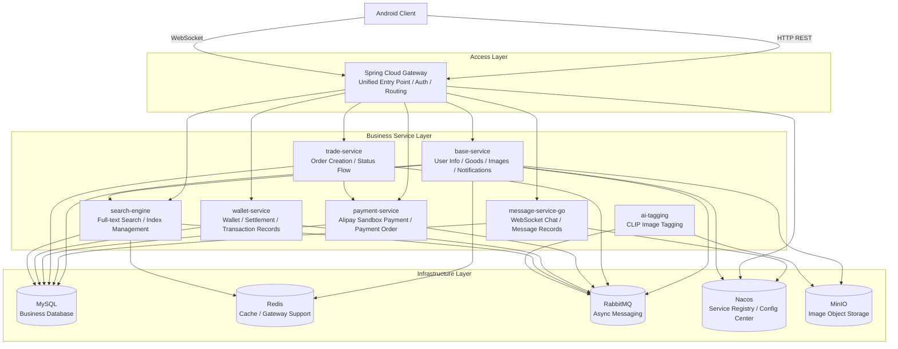


Our layered design makes the mobile terminal do not need to be aware of the backend internal service splitting, only need to access the unified entry. Backend services can be written and improved flexibly according to different functions.

## 2.3 Communication Between Mobile Client and Server

The mobile client communicates with the server in two main ways:

- **HTTP restful api** : Functions for login, product browsing, product publishing, order payment, wallet lookup, notification lookup, and other request-response interactions.
- **WebSocket** : Real-time chat between the buyer and the seller.

Android clients uniformly access the Gateway. The Gateway is responsible for receiving the request, verifying the user's identity, and forwarding the request to the specific service based on the path. In this way, the complexity of client configuration is reduced, and the subsequent changes of back-end services only need to change the Gateway configuration, so the scalability is strong.

For authentication, when a user logs in, the server returns a JWT token that encapsulates the user's information. Subsequently, the client will carry the token to access the Gateway, and the Gateway will authenticate the user's information uniformly and transmit the user's information to the downstream service.

## 2.4 Backend Microservice Architecture Overview

The backend uses a microservice architecture with a mixed technology stack, which is easy for team development, strong scalability and modifiability, and low coupling between services, which is also easy to deploy. The basic business services are in Java, and the messaging, transaction, payment, wallet and search services are based on Golang. The AI image marking service is written in Python language due to the use of PyTorch framework.

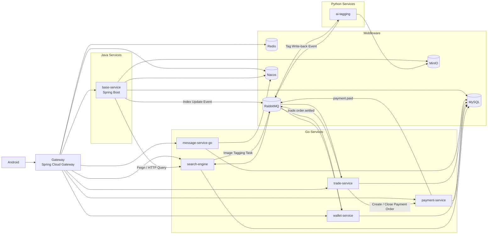


The architecture separates synchronous requests, real-time communication and asynchronous tasks. Synchronous requests with strong timeliness use HTTP, which requires the server to push messages in real time to the client's chat protocol uses WebSocket protocol, and background actions that take a long time or require multiple services to participate are asynchronously completed by RabbitMQ.

### 2.4.1 ER diagram

This is a diagram of the relationship between the database tables. Most of the relationships in current databases are maintained through fields and code logic, not necessarily by database foreign keys, so the relationships drawn here are in real use.

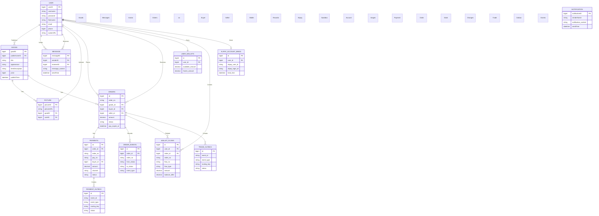


## 2.5 Backend Services and Components Responsibilities

### 2.5.1 Gateway

- ** Main functions & Responsibilities ** : Unified entry point for mobile terminals to access the backend, responsible for request forwarding, permission verification, login status verification and user information parsing. In this way, the mobile side doesn't need to care about how many services there are in the backend, only needs to access the unified entry point.
- ** Relationship to other services ** : The Gateway will forward messages, orders, payments, wallets, searches and basic business requests to the respective services. It cooperates with Nacos for service discovery.

### 2.5.2 Base-service

- ** Main Functions & Responsibilities ** : It is responsible for the basic business, including login and registration, user information, product browsing, product publishing and modification, image uploading, avatar uploading, notification query, etc. The data of users and commodities are mainly stored in MySQL, and the files such as pictures and avatars are stored in MinIO. High-frequency access data such as commodity details and favorite commodity lists are cached through Redis to improve the performance of the server.
- ** Relationship with other services ** : When searching for products, 'base-service' will use OpenFeign to call 'search-engine' synchronously to get the search results; When an item changes, it will notify RabbitMQ to send a message to the search service to update the index.

### 2.5.3 Message-Service-Go

- ** Key Functions & Responsibilities ** : It is responsible for chat related capabilities, including WebSocket connection management, messaging, message saving, chat history lookup, and recent session lookup. By separating out the messaging service, we can avoid the impact of keepalive traffic on normal HTTP traffic.
-** Relationship to other services ** : Clients usually connect to the messaging service through a Gateway, which validates the user and then forwards the request to the messaging service. The messaging service will save the chat messages to MySQL, and the user and avatar address information in the MySQL database will be used to query the most recent session.

### 2.5.4 Trade-Service

-** Key Functions & Responsibilities ** : This service is responsible for order and transaction status flow, including creating orders, checking buyer and seller orders, cancelling orders, handling payment timeouts, confirming receipt, etc. It mainly maintains the status of orders from pending payment to paid and completed.
- ** Relationship with other services ** : When an order is created, the 'trade-service' creates a payment bill by calling 'Payment-service' synchronously over HTTP. The 'trade-service' will also call the payment service over HTTP to close the order when it is cancelled or timed out. Upon successful payment, 'Payment-service' notifies' trade-service 'to update the order status via RabbitMQ message queue; After the buyer confirms the receipt of the goods, the 'trade-service' will notify the 'wallet-service' through RabbitMQ to settle the settlement。

### 2.5.5 Payment-Service

- ** Main Functions & Responsibilities ** : This project simulates buyer payment through Alipay sandbox. This service is mainly responsible for payment related capabilities, including Alipay sandbox account binding, payment ticket creation, payment parameter generation, payment callback processing and payment ticket closure.
- ** Relationship with other services ** : The 'trade-service' will ask the 'Payment-service' to create a payment slip after creating an order, and it will also ask it to close the slip when the order is canceled or timed out. After a successful payment, the 'payment-service' will notify the 'trade-service' to update the order status and the 'wallet-service' to record the change of the amount of the platform wallet.

### 2.5.6 Wallet-Service

- ** Main Functions & Responsibilities ** : This service is responsible for user wallet, wallet flow, platform wallet entry, seller revenue settlement, and mock withdrawal. After the successful payment, the funds first enter the platform escrow, and the buyer confirms the receipt of the goods before settling to the seller's wallet.
- ** Relationship with other services ** : Mobile accesses wallets, flows, or initiates withdrawals via Gateway. The 'payment-service' will notify it to record the escrow funds after the payment is successful, and the 'trade-service' will notify it to settle the seller after the order is completed.

### 2.5.7 Search-Engine

- ** Key Functions & Responsibilities ** : This service is primarily responsible for product search capabilities, including keyword search, index management, tokenization, ranking, and return of search results. As well as calling Ali cloud translation api to translate in the segmentation, realize Chinese search English products, or English search Chinese products.
-** Relationship with other services ** : The 'Base-Service' will call the 'Search-Engine' to query for products and also notify it to update its index when the products change. 'Search-Engine' also works in conjunction with 'AI-Tagging', where the AI will tag product images and use the generated tags for searching.

### 2.5.8 AI-Tagging

-** Main functions & Responsibilities ** : It is responsible for AI semantic tagging of product images, generating several tags based on the content of the image, which can be used to supplement the search information in addition to the product title and description.
- ** Relationship with other services ** : 'Search-Engine' will pass the images of products to 'AI-Tagging', which will then return the results to the search service to update the index. The image files are from the product images stored in MinIO.

## 2.6 基础设施组件

- **MySQL** : Stores core business data such as users, products, messages, orders, payments, wallets, etc.
- **RabbitMQ** : Carries out tasks such as index update, AI tagging, payment success, and order settlement asynchronously.
- **MinIO** : Stores product images, avatars, and other object files.
- **Nacos** : Used for service registration and governance, facilitating communication between services.

## 2.7 Backend service communication mode

Backend communication methods can be summarized into three categories:

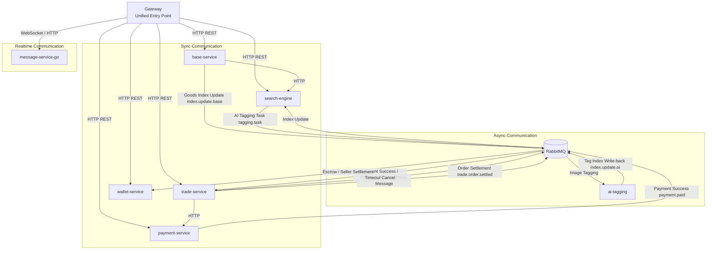


- ** Synchronous communication ** : For situations where results need to be returned immediately after a user action. Mobile uses HTTP to access 'base-service', 'trade-service', 'payment-service', 'wallet-service', 'search-engine' and 'message-service-go' synchronously HTTP interface, such as product queries, order creation, payment initiation, wallet queries, search queries, and chat logs queries. There are also synchronous calls between services over HTTP. For example, 'base-service' calls' search-engine 'via OpenFeign to query search results. The 'trade-service' calls' payment-service 'over HTTP to create or close a payment ticket.
- **WebSocket communication ** : Used for chat where the server needs to push messages to the client in real time. The mobile client establishes a WebSocket connection with 'message-service-go' via Gateway. 'message-service-go' is responsible for maintaining the live connection and pushing new messages to the sender and receiver in real time.
- ** Asynchronous communication ** : Used for background actions where the user doesn't have to wait all the time, mainly decoupling services via RabbitMQ. 'base-service' notits' search-engine 'to update its index when an item changes; The 'search-engine' tags the images, which then send the tagging results back to the search service. The 'payment-service' will notify the 'trade-service' to update the order status after the payment is successful, and the 'wallet-service' will record the wallet changes on the platform. The 'trade-service' notifies the 'wallet-service' when the order is completed and also handles payment timeouts asynchronously.

## 2.8 Key design ideas

### 2.8.1 Choosing Android as the client

We choose Android as the client of our project, mainly because it is convenient for campus second-hand transactions to be completed on mobile phones, and it is not convenient for users to use the web side. When users publish products, they need to select pictures and upload pictures, and they also need timely interaction when chatting, which are more suitable for the mobile terminal scene. And native Android can directly use the system photo album, file selection, image compression, network status, local storage and page jump capabilities, more suitable for the realization of product release, chat and personal center these functions. Android also offers a strong development ecosystem with low difficulty and low cost, which fits our current situation. Android software development can be completed through Android Studio and Java.

### 2.8.2 Choosing microservices architecture for the backend

We chose to use a microservices architecture for our backend mainly because of the wide variety of features in CampusMart. Chat requires WebSocket protocol, search requires indexing and word segmentation, AI marking relies on the Python model ecosystem, and orders, payments, and wallets involve transaction status and money flow. If you put it all together in a single service, the code will become more and more mixed, and debugging and deployment will easily interfere with each other.

This split allows for a more appropriate implementation of each capability: 'base-service' takes care of the basic business, 'message-service-go' handles the chat connection, 'search-engine' handles indexing, 'ai-tagging' handles image tagging, and order, payment, and wallet services handle different parts of the transaction link. In this way, the system structure is clearer and the responsibilities of each service are clearer. In the future, if we want to improve our search, replace our AI model, or extend our payment capabilities, we will only need to make changes around the corresponding service, rather than making extensive changes to other modules.

Microservice architecture also facilitates team development and distributed deployment. Our backend members can be responsible for mobile, basic business, messaging, search, AI, order, payment and wallet modules, etc., with little interaction during development. When deployed, different services can also be started, scaled or migrated to different machines as needed. For example, search service, AI marking service and message consumer can be scaled separately according to the large amount of tasks, so as to improve the scalability of the system.

Microservices also introduce complexity in service communication, deployment, and troubleshooting. The Gateway was used to provide a unified entry point, Docker Compose was used to achieve unified container and dependency management, RabbitMQ was used to process asynchronous tasks, and key order status was centralized in the order service to maintain, so that the overall complexity was in a controllable state.

### 2.8.3 Unified entry point

The system uses Gateway as a unified entry point, mainly to allow mobile terminals to access only one back-end address. Routing forwarding and login verification are handled in the Gateway, and the client does not need to record the address of each service, so it is more convenient to update, maintain and deploy, and only need to change the configuration of the GateWay.

This also reduces the impact of back-end adjustments on the client side. For example, when the deployment of order service, payment service, wallet service or search service changes, as long as the Gateway route remains the same, the mobile terminal will not need to change. Later, if you want to add throttling, logging, monitoring, or unified error handling, you can also prioritize it at the Gateway layer.

### 2.8.4 Service decomposition based on different functions

We split our base business, messaging, search, order, payments, wallet, and AI tagging into different services. This allows each module to focus on its own functionality, which makes code boundaries clearer and easier to write, and reduces the problem of a single service being too large.

The split is mainly divided by different functional content: users, products, images and notifications go in 'base-service'; Chat needs to manage online connections, so put it in 'message-service-go'; search is placed in 'search-engine'; ai tagging requires python, split into 'AI-tagging'; Order, payment and wallet correspond to transaction status, payment process and money flow respectively, so they are separated into three services to deal with.

### 2.8.5 Combination of synchronous and asynchronous combination

We use synchronous HTTP requests for operations where the user needs to see results immediately, such as query-ing products, creating orders, generating payment parameters, and so on. Actions that are time-consuming, can be completed later, or can be retried if they fail, are handled asynchronously using RabbitMQ.

For example, after a product launch, users don't need to wait for AI image tagging to complete before seeing the release results, so the index updates and image tagging are handled in the background. Subsequent actions, such as successful payment and order settlement, are also communicated to the relevant services via messages to avoid calling too many services in a single request. We only use synchronous calls in scenarios where we really need to return an immediate result.

### 2.8.6 Service decomposition of transaction money flow

Orders, payments, and wallets are handled by separate services. The order service maintains the transaction status, the payment service handles the payment process, and the wallet service handles the settlement and withdrawal of the platform wallet and seller. This way your money logic isn't all crammed into one service, and it's much clearer if you need to expand your refund, withdrawal, or account records later on.

This splitting also makes the responsibilities of each service clearer. The order service is responsible for order cancellation, payment or confirmation of receipt. The payment service is responsible for the payment slip and Alipay sandbox callback. The wallet service is responsible for balance and flow. The three services cooperate to complete the transaction process through synchronous invocation and message notification.

### 2.8.7 Development of search engine service

We develop the search engine service separately, mainly to make the search capability more suitable for the campus second-hand transaction scenario. The titles and descriptions of used goods are often not standardized enough, and the same type of goods may be expressed in Chinese, English, abbreviations or colloquial expressions, so search services need to support more flexible word segmentation, translation and hybrid search capabilities.

The search service can customize the translation logic according to the needs of the project, expand the Chinese and English keywords, and also combine the product title, description and image AI tags to do hybrid search. AI image tagging can supplement product information that the user has not written clearly, making the search not only rely on text content. Putting these capabilities in a separate search service, the product service only needs to process the product data, and the search service is responsible for turning the product into data that is easier to retrieve.

# 3. Implementation

## 3.1 Mobile Implementation

### 3.1.1 Technology Stack

The mobile implementation is mainly in native Android Java with the following stack:

- Programming Language: Java
- RecyclerView / ConstraintLayout：Used to display scrolling content such as product lists, chat lists, and organize page layout.
- OkHttp：Used to make HTTP requests for login, product, order, and payment operations.
- Gson：Used to serialize and deserialize JSON.
- Picasso / Glide：Used to load product images, avatars, and other images stored on the server.
- SharedPreferences：Used to save login token, user ID, and avatar information.
- OkHttp WebSocket：Used to establish a long connection with the message service for chat.

Configuration file (Android/app/SRC/main/res/values/config. The XML) of ` base_url ` refers to the Gateway server, mobile client will not have direct access to the back-end service. If the server's address changes, just change the 'base_url' or the Gateway config file.

### 3.1.2 Directory structure

Mobile implementation code mainly includes the following categories:

```text
Android/app/SRC/main/java/com/example/campusmart/
  Activity                Page interaction entry point with business logic
  fragment/               Tab pages for home, product list, message, notification, and personal center
  adapter/                RecyclerView adapter
  entity/                 Local business entities
  vo/                     Backend objects returned
  result/                 Unified Result response wrapper
  common/page/            Pagination object wrapper
```

Main pages include:

- `LoginActivity`：Log in and save the token and user info
- `RegisterActivity`：User registration
- `HomeActivity`：Home page container
- `ProductListFragment`：Product list, pagination, and search
- `DetailInfoActivity`：Product publish and image upload
- `GoodsDetailActivity`：Product detail display
- `MessageFragment`：Recent chat list
- `ChatActivity`：Chat history loading and WebSocket messages
- `PersonalInfoActivity`、`MyGoodsActivity`：Personal information and my goods

### 3.1.3 Call methods of mobile interface

Mobile uses OkHttp to construct requests. After a successful login, the token returned by the server will be stored in the 'SharedPreferences', and subsequent requests will carry this token through the' access-token 'or' Authorization 'header.

Some interface calls are as follows:


| Function     | Mobile entry                 | Backend interface                                      |
| ------ | --------------------- | ----------------------------------------- |
| Login     | `LoginActivity`       | `POST /app/login`                         |
| Get user info | `LoginActivity`       | `GET /app/info`                           |
| Product pagination   | `ProductListFragment` | `GET /app/goods/page`                     |
| Product search   | `ProductListFragment` | `POST /api/query`                         |
| Product publish   | `DetailInfoActivity`  | `POST /app/goods/add`                     |
| Product image upload | `DetailInfoActivity`  | `POST /app/goods/file/uploadGoodsPicture` |
| Chat history   | `ChatActivity`        | `GET /app/messages/list`                  |
| Real-time chat   | `ChatActivity`        | `WebSocket /ws`                           |


### 3.1.4 Some mplementation of main functional processes

#### Login process

`LoginActivity` responsible for login process:

1. User inputs username and password.
2. Mobile sends JSON request to `/app/login`.
3. Backend returns JWT token.
4. Mobile carries token to call `/app/info`。
5. token 和 user info are saved to `SharedPreferences`。
6. Jump to `HomeActivity`。

Login process with subsequent authorization flow:

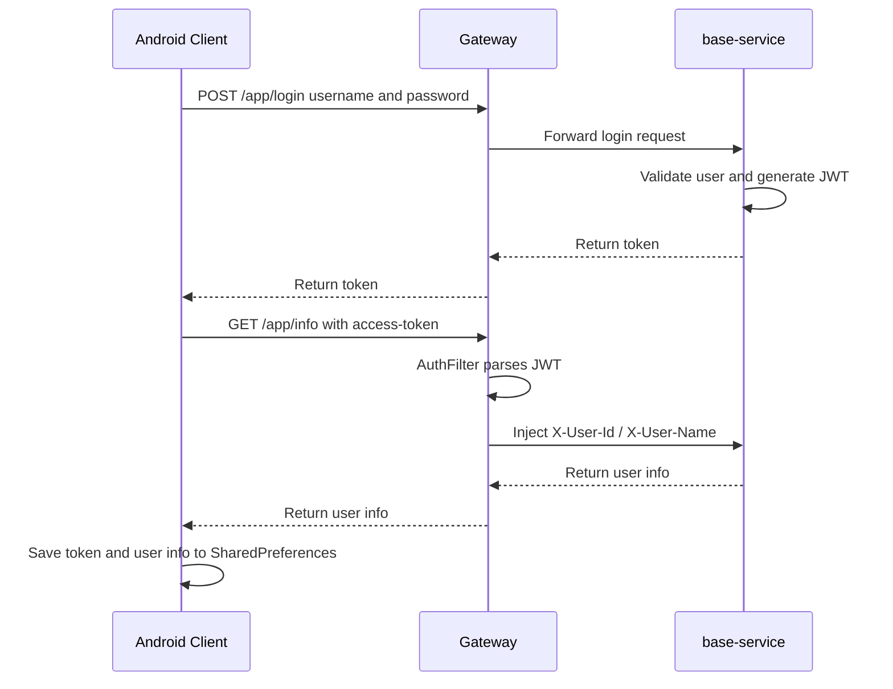


#### Product browsing and search process

The product display page uses' RecyclerView '+' GridLayoutManager 'to display the product cards, and uses a scroll listener to load the product list in pages. Product images are loaded from the image URL returned by the server via Picasso or Glide, the network request is made by OkHttp, and the returned JSON is converted into an object such as' GoodsVo 'via Gson.

Product list call:

```text
GET /app/goods/page?current={page}&size={size}
```

When searching, mobile directly constructs the search request:

```json
{
  "query": "搜索关键词",
  "page": 1,
  "limit": 10,
  "order": "desc",
  "scoreExp": ""
}
```

And call:

```text
POST /api/query?database=campusmart
```

The search results are converted to 'GoodsVo' and mapped to 'ProductAdapter.Product' for display. In this way, the mobile terminal is only responsible for presentation and interaction, and the complex logic of word segmentation, translation, indexing query and ranking is handed over to the back-end search service.

#### Product publish process

Product publish is implemented by 'DetailInfoActivity'. We use Android native file selection ability to read local images, and OkHttp to submit product basic information first, and then upload images via the upload image interface.

1. Users fill in the title, color, price, description and other basic information on the product release page.
2. The user selects the product picture from the album.
3. The mobile app first calls' /app/goods/add 'to create the product record and get' goodID '.
4. After compressing the image, upload it to '/app/goods/file/uploadGoodsPicture' as multipart.
5. The server saves the image and triggers the search index update.

The basic information of the commodity and the image upload are uploaded in two requests. The ID of the commodity is determined first, and then the association between the image and the commodity is established. The mobile app only handles form submission and image uploading, and the backend handles image saving, object storage, and index updates.

The product publishing process between mobile and server is as follows:

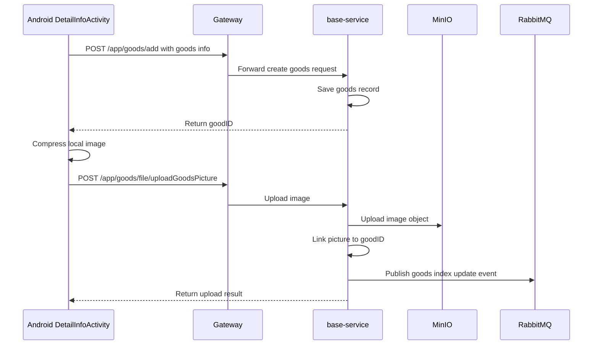


#### Real-time chat process

ChatActivity uses both HTTP and WebSocket. When entering the chat page, we first use OkHttp to fetch the message log through an HTTP request. A WebSocket connection is then established, and once the connection is established, OkHttp WebSocket takes care of sending and receiving messages in real time. Update the 'RecyclerView' display if a new message is received:

1. Call '/app/messages/list' to pull the message history when entering the chat page.
2. Generate a 'ws://' or 'wss://' address based on the 'base_url' in the config file.
3. Connect to '/ws? userId={userId}&token={token} '.
4. When sending a Message, serialize the 'Message' object to JSON and send it over a WebSocket.
5. When receiving a message from the server, check if it belongs to the current session, and then update the 'RecyclerView' display.

## 3.2 Gateway implementation

### 3.2.1 Technology stack

The Gateway is located at 'server/gateway/'.

- Programming Language: Java
- Spring Boot：Used to start and manage Gateway applications.
- Spring Cloud Gateway：It is used for unified access, route forwarding and filter processing.
- Spring Cloud LoadBalancer：Used for service invocation in conjunction with service discovery.
- Nacos Discovery：Service discovery for the discovery backend.
- JJWT：Used for login token verification.

### 3.2.2 Main responsibilities

The Gateway is the entry point for all backend HTTP and WebSocket requests. It does the following:

- Route forwarding: Forward requests to corresponding services based on request paths.
- JWT verification: Read `Authorization` or `access-token` token from request headers.
-User context propagation: Parse user information from headers' X-User-Id ', 'X-User-Name', 'access-token' and other user information and inject it into downstream requests.
- Whitelist control: Interfaces such as login, registration, and payment callbacks allow normal authentication to be skipped.

### 3.2.3 Key implementation

The 'AuthFilter' implements Spring Cloud Gateway's 'GlobalFilter', which is the filter that all requests coming into the gateway pass first. This filter parses the token with a JJWT, modifies the request headers with Spring Cloud Gateway, and then passes the user information downstream as follows:

1. Get the request path.
2. If it's a whitelist API or WebSocket connection, let it go.
3. If it's not the above connection, read the token from the request header.
Parse the token using the JWT's secret.
5. Write the user ID and username to the request header.
6. Forward to downstream services.

Such a global filter allows for a unified implementation of the authentication logic, which does not need to be duplicated by each service; it only needs to read the user ID in the request header to know which user the current request belongs to. Gateway also forwards requests of different paths to corresponding services through routing configuration. In the future, if the number of service instances becomes larger, the gateway can also combine Nacos and LoadBalancer to perform service discovery and forwarding.

## 3.3 Base-service implementation

### 3.3.1 Technology stack

'Base-service' is located at 'server/base-service/' and is the base business service.

- Programming Language: Java
- Spring Boot：Used to start and manage base-service applications.
- Spring MVC：Used to provide HTTP interfaces for login, goods, image, notification, etc.
- MyBatis-Plus：It is used to simplify the search between entities and database tables.
- MySQL：It is used to store core data such as users, products, images, and notifications.
- MinIO Java SDK：Used to upload avatar and product images to MiniIO object storage service.
- RabbitMQ：Used to publish asynchronous tasks such as goods index update.
- OpenFeign：Used to call search service interfaces synchronously.
- Nacos Discovery：Service discovery for the discovery backend.
- Knife4j / OpenAPI：Used to document and debug the API interfaces.

### 3.3.2 Interface definition

The base business service defines the following interfaces:


| Module  | Interface                                    | Description      |
| --- | ----------------------------------------- | ------------ |
| Authentication  | `POST /app/login`                         | Login and return JWT token |
| Authentication  | `POST /app/register`                      | Register user         |
| Authentication  | `GET /app/info`                           | Get current login user info   |
| Goods  | `GET /app/goods/page`                     | Page query goods       |
| Goods  | `GET /app/goods/search`                   | Search goods, prioritize search service |
| Goods  | `GET /app/goods/selectById`               | Query goods details       |
| Goods  | `POST /app/goods/add`                     | Add goods         |
| Goods  | `PUT /app/goods/update`                   | Update goods         |
| Goods  | `PUT /app/goods/deleteById`               | Delete goods         |
| File  | `POST /app/goods/file/uploadGoodsPicture` | Upload goods picture       |
| File  | `POST /app/goods/file/uploadAvatar`       | Upload avatar         |


### 3.3.3 Main business implementation

#### User registration and login

`UserServiceImpl` Realize user registration and login functions. The Controller receives requests via Spring MVC, the Service handles registration and login rules, and the Mapper accesses MySQL via MyBatis-Plus:

- When registering, the user name is checked for duplicates.
- A default nickname is generated for new users, and a default signature is set.
- The default avatar file is read and uploaded to MinIO.
- When logging in, the username and password are validated.
- After successful login, a JWT token is created using `JwtUtil.createToken()` method.

The user data is finally written to MySQL and the default avatar is uploaded to the object store through the MinIO Java SDK. The JWT returned after successful login will be saved by the mobile terminal, and subsequent requests will be verified by the Gateway. Subsequent users can update their personal information through the interface of modifying user information.

#### Product management

`GoodsController` provides CRUD interface for products. Spring MVC is used to handle request parameters and unified responses, and the data access layer uses MyBatis-Plus to query MySQL. The product pagination query will query the product table, user table, and image table, returning `GoodsVo` suitable for mobile display.

When a product is added or modified, RabbitMQ is called to deliver index update messages. The reason for using a message queue is that the index update does not need to block the user's request to publish items. After the item is deleted, the search service is called to delete the index to prevent the deleted item from continuing to appear in the search results.

#### Image upload

`PictureServiceImpl` uses MinIO Java SDK for image uploader. After the mobile terminal uploads the image file, Spring MVC receives the file, and the server saves the image to MinIO, and associates the object name with the product or user. The process is as follows:

- Check if a bucket exists in MinIO.
- Create a bucket if it doesn't exist, and set a public read policy.
- Generate object name from date directory + UUID + original filename.
- Call `putObject` to write to MinIO.
- Return the file object name and save it to a MySQL database.

#### Search service integration

base-service encapsulates the call to the search service in the `SearchEngineService`. The product search scenario requires immediate results, so we use OpenFeign to call `search-engine` synchronously; A product release or modified index update can be done later, so using RabbitMQ to send tasks asynchronously encapsulates the following search capabilities:

- `searchGoods` : Calls `search-engine` to query search results.
- `buildIndexDocument` : assembles products, images, and user information into an index document.
- `publishIndexUpdate` : sends the indexing job to RabbitMQ.
- `removeIndex` : Synchronously calls the search service to remove the index.

The indexed document will include fields such as product ID, title, description, image URL, publisher nickname, avatar, etc., so that search results can be displayed directly. In this way, after the search service returns the results, the mobile terminal does not need to query the basic details of the product from MySQL.

## 3.4 message-service-go implementation

### 3.4.1 Technology stack

`message-service-go` is located at  `server/message-service-go/`。

- Programming Language: Golang
- Gin: Used to provide HTTP interfaces such as chat logs, recent sessions, etc.
- Gorilla WebSocket: Used to establish and maintain chat keepalive connections.
- GORM: Used to encapsulate message data for reading and writing to the database.
- MySQL: This is used to store chat messages and query data needed for recent sessions.
- Nacos Go SDK: Used to register messaging services to the service discovery component.

### 3.4.2 Interface Definition


| Interface                         | Types      | Notes            |
| -------------------------- | --------- | ------------- |
| `GET /app/messages/list`   | HTTP      | Query the chat history between two users |
| `GET /app/messages/recent` | HTTP      | Query the list of recent chats     |
| `GET /ws`                  | WebSocket | Establish a live chat connection     |


### 3.4.3 Key implementation

The WebSocket Hub is the core of the messaging service. Gin framework was used to implement the HTTP part, and GORM was used to query MySQL for history messages and recent session functions. The live chat part is handled by Gorilla WebSocket to read and write connections. The Hub maintains objects or channels internally:

- `clients map[int64]map[*client]struct{}` : A mapping of user ids to connection collections.
- `register` : Connect to the register channel.
- `unregister` : Connect to a logout channel.
- `deliver` : The channel on which the server delivers a message to a user.

When the client connects, the server registers the connection with the corresponding user ID. When sending a message, the server first verifies that the sender and the connection user are the same, then writes the message to MySQL via GORM, and finally pushes the message to the sender and receiver for a live connection.

In this way, the design can support multiple mobile phones online for the same user, and there is no need to directly operate all connections in the business processing function. If the recipient is temporarily offline, the message is stored in MySQL and can be reloaded via the HTTP interface the next time the user enters the chat page.

## 3.5 search engine implementation

### 3.5.1 Technology stack

`search-engine` is located at `server/search-engine/`。

- Golang: Used to implement search service principal logic and concurrent queries.
- Gin: This is used to provide HTTP interfaces for search queries, index additions, and index deletions.
- LevelDB: This holds the document data and the forward and inverted indexes.
- Jieba Word segmentation (' jiebago ') : Used for Chinese word segmentation and keyword extraction.
- RabbitMQ: Used to receive item index update tasks and send image marking tasks to the AI marking service.
- Redis: Used to cache translation results and reduce repeated calls to external translation services.
- go-cache: Used to cache high-frequency translation results in-process.
- Ali Cloud Machine Translation SDK: Used to translate Chinese and English keywords, support Chinese and English mixed search.

### 3.5.2 Interface Definition


| Interface                     | Notes       |
| ------------------------ | --------- |
| `POST /api/query`        | Search queries     |
| `POST /api/index`        | Add or update a single index |
| `POST /api/index/batch`  | Adding indexes in bulk   |
| `POST /api/index/remove` | Dropping an index      |


### 3.5.3 Positive inverted index implementation

The core structure of a search Engine is ` engine `. Gin is responsible for receiving search and indexing requests over HTTP. The search logic is placed in `internal/searcher/`. The index data in the search engine is stored persistently using LevelDB, and the index is not lost after the service is restarted:

- `docStorages` : Holds the original document.
- `positiveIndexStorages` : Holds a mapping of document ids to a list of keywords.
- `invertedIndexStorages` : Holds a mapping of keywords to a list of document ids.
- `Tokenizer` : is responsible for tokenizing text.
- `Shard` : Reduce pressure on a single storage instance by sharding.

When the index is added, the search service turns the product text and AI tags into searchable keywords through the tokenizer:

1. Read product titles, descriptions, and AI tags.
2. Tokenize the text using the Jieba tokenizer.
3. Tags are also added to the index as keywords.
4. Write a forward index to retrieve documents and keywords by document ID.
5. Write an inverted index to quickly find document ids based on keywords.

When searching, the service will first use Jieba to split Chinese keywords, and then combine with Alibaba Cloud machine translation SDK to translate between Chinese and English. Translation results will look up go-cache and Redis first, reducing external API calls. The overall steps are as follows:

1. Receive user input query terms, which may contain Chinese, English or mixed Chinese and English content.
2. Clean up the query by converting all the letters to lowercase and removing irrelevant punctuation.
3. Extract the English words from the query words while keeping the Chinese part.
4. Use the search mode of Jieba tokenizer to segment the Chinese part and get the Chinese keywords.
5. Try to translate Chinese keywords into English and English keywords into Chinese.
6. Query go-cache before translation, if not in local cache, then Redis; When the two caches are not hit, the Alibaba Cloud translation SDK is called, and the local cache and Redis are updated after the translation SDK is called.
7. Merge the original keywords, segmentation results and translation results, and remove duplicate words.
8. Query the inverted index concurrently against the merged keywords to find the product document ids that might match.
9. The results of multiple keyword hits are merged and scored, and the items with more hits and better matches are ranked higher.
10. Read the document data for the current page based on the paging parameter and return it to the caller.

### 3.5.4 RabbitMQ integration

The `IndexConsumer` consumes the index update task via RabbitMQ and calls the index service to update the search data. If the search service finds an indexed document containing an image URL, it will send the image tagging task to the AI tagging service via `TaggingProducer`. In this way, the basic text index can be completed first after the product is released, and the image label can be added to the index after the AI marking is completed later. Since the AI marking takes a long time, this design can improve the response speed.

## 3.6 Implementation of ai-tagging

### 3.6.1 Technology stack

`ai-tagging` is located at `server/ai-tagging/`。

- Programming language: Python
- FastAPI: Used to provide image marking interface and health check interface.
- Uvicorn: for running FastAPI services.
- Transformers: for loading and using CLIP models and processors.
- PyTorch/TorchVision: for performing model inference and tensor computation.
- Pillow: For reading and manipulating images
- aiohttp: Used to download images asynchronously based on their urls.
- Pika: Used to connect to RabbitMQ, consume marking tasks and publish index update tasks.
- CLIP model: Used to calculate the similarity between a picture and a candidate tag.

### 3.6.2 Interface definition


| Interface             | Description            |
| --------------- | ------------- |
| `POST /api/tag` | Returns the tag based on the image URL|
| `GET /health`   | Health check, returns model status  |


### 3.6.3 Key implementation

The `TaggingService` is responsible for the tagging logic. Transformers are responsible for loading the CLIP model, PyTorch is responsible for the actual inference, Pillow and aiohttp are responsible for reading the remote image into an input that the model can process:

- Load and store preset product labels on startup.
- Load CLIP model in thread pool.
- Download images based on their urls.
- Encode the image and candidate label text, embedding both label text and image into a low-dimensional vector space.
- Calculate the similarity and take the top-k labels.

The `TaggingConsumer` is responsible for marking links asynchronously. It uses Pika to connect RabbitMQ, after receiving the image task from the search service, it calls' TaggingService 'to generate the tag, and then sends the tagged indexing task back to the search service. The invocation process is as follows:

1. `TaggingConsumer` consumes RabbitMQ's image tagging task.
2. Call the `TaggingService` based on the 'imageURL' in the task.
3. Write the generated tags to the task document.
4. Send the tagged index update job back to the search service via `IndexProducer`.

## 3.7 Implementation of trade-service

### 3.7.1 Technology stack

`trade-service` is located at `server/trade-service/`。

- Programming Language: Golang
- Gin: Used to provide HTTP interfaces for creating orders, querying orders, canceling orders, confirming receipt, etc.
- GORM: Database operations for order data, status events, and outboxes.
- MySQL: This is used to store data such as orders, item associations, order events, etc.
- RabbitMQ: Used to handle asynchronous events such as payment success, payment timeout, and order settlement.
- HTTP Client: Used to synchronously invoke the payment service to create or close a payment ticket.

### 3.7.2 Interface definition


| Interface             | Description            |
| -------------------------------------------- | ------ |
| `POST /app/orders`                           | Creating order  |
| `GET /app/orders/{orderId}`                  | Enquiring order details |
| `GET /app/orders/buyer`                      | Query buyer orders |
| `GET /app/orders/seller`                     | Checking seller orders |
| `POST /app/orders/{orderId}/cancel`          | Cancel order |
| `POST /app/orders/{orderId}/confirm-receipt` | Confirm receipt of goods   |


### 3.7.3 Order state machine

Order state is defined in `model/order.go`：


| State          | Meaning           |
| ----------- | ------------ |
| `CREATED`   | The order has been created and is waiting for payment  |
| `PAID`      | The buyer has paid      |
| `SETTLED`   | Buyer confirms receipt and the order has been settled |
| `CANCELLED` | Order cancellations or timeouts are closed   |


Core state flow:

```text
CREATED -> PAID -> SETTLED
CREATED -> CANCELLED
```

### 3.7.4 Key implementation

The `OrderService` is responsible for the order business. External requests first enter the Gin Handler, business rules are concentrated in the Service layer, database transactions and status updates are operated by the Repository via GORM MySQL:

- Generate the order number and payment expiration time when creating an order.
- Use the repository to create orders and validate relationships.
- Create a payment bill by calling `payment-service` via HTTP Client.
- Publish payment timeout delay messages.
- Mark the order as `PAID` after a successful payment event.
- Buyers confirm receipt and mark their orders as `SETTLED`, writing them to `trade_outbox`.

The payment timeout is implemented through RabbitMQ delay queue + dead message switch. A delay message is delivered after the order is CREATED, a message goes into a timeout queue after the TTL expires, and an attempt is made to cancel an order still in the `created` state after the service is consumed. The payment success event also enters the order service through RabbitMQ, and the order service only updates its order status based on the event and does not directly rely on the payment service to modify the order table.

## 3.8 Implementation of payment-service

### 3.8.1 Technology stack

`payment-service` is located at `server/payment-service/`。

- Programming Language: Golang
- Gin: Used to provide HTTP interfaces such as Alipay binding, creating payment statements, generating payment parameters and callbacks.
- GORM: Used to encapsulate the database operations of payment slips, Alipay bindings, and outbox.
- MySQL: This is used to store payment statements, binding accounts, and pending events.
- RabbitMQ: Used to publish payment success events, notify orders and wallet services.
- HMAC-SHA256 simulated signature: Used to simulate Alipay sandbox payment parameters and callback signature validation.

### 3.8.2 Interface definition


| Interface                                        | Description          |
| ----------------------------------------- | ----------- |
| `POST /app/alipay/bind/mock`              | Bind Alipay sandbox account  |
| `GET /app/alipay/bind`                    | Query the current user binding information  |
| `DELETE /app/alipay/bind`                 | Unbind bank card sandbox account  |
| `GET /internal/alipay/binds/{userId}`     | Internal query binding information    |
| `POST /internal/payments`                 | Internally create payment slips     |
| `POST /internal/payments/{orderId}/close` | Internal closing of payment slips   |
| `POST /app/orders/{orderId}/pay/alipay`   | Generate Alipay sandbox payment parameters |
| `POST /app/payments/alipay/notify`        | Alipay sandbox callback    |


### 3.8.3 Payment sandbox implementation

The current implementation is not directly connected to the real Alipay transfer, but simulates the Alipay sandbox payment process. Gin Handler is responsible for receiving mobile and order Service requests, Service layer handles payment rules, Repository reads and writes MySQL using GORM:

- Payment channel is fixed to `ALIPAY_SANDBOX`.
- The user first binds the simulated Alipay account.
- Payment ticket states include `WAIT_PAY`, `SUCCESS`, `CLOSED`.
- Generate `orderString` with app id, notify url, order number, amount, buyer sandbox account, etc.
- Generate mock signatures using HMAC-SHA256.
- Check transaction status, amount, payment token and optional signature on callback.
- Write to `payment_outbox` after successful payment, dispatcher will publish `payment.paid` event. :

This implementation satisfies the payment demonstration in the course project, while avoiding the complex compliance issues caused by real payments and real transfers. Instead of directly calling the order and wallet services synchronously after the payment is successful, the event is published through RabbitMQ, and the order service and wallet service handle their own state changes respectively.

## 3.9 Implementation of wallet-service

### 3.9.1 Technology stack

`wallet-service` is located at `server/wallet-service/`。

- Go: Used to implement the wallet service principal logic.
- Gin: Used to provide HTTP interfaces such as wallet balance, wallet pipelining, and mock withdrawal.
- GORM: Used to encapsulate wallets and pipeline database transactions.
- MySQL: This is used to keep the user's wallet balance and money flow.
- RabbitMQ: Used for consumption payment success and order settlement events.

### 3.9.2 Interface definition


| Interface                          | Description |
| --------------------------- | ------ |
| `GET /app/wallet`           | Checking the wallet balance |
| `GET /app/wallet/flows`     | Check the wallet flow|
| `POST /app/wallet/withdraw` | Simulated withdrawal  |


### 3.9.3 Key implementation

The wallet service is implemented around two data types` user_wallets` and `wallet_flows`. Gin provides the query and withdrawal interface, the Service layer handles the balance change rules, and the Repository uses GORM transactions to ensure that the balance and pipeline are updated simultaneously:

- `user_wallets` keep user's available and frozen balances.
- `wallet_flows` keeps track of every money change.
- `ESCROW_IN` means escrow after the buyer pays.
- `SELLER_INCOME` indicates that the income is credited to the seller upon receipt of the goods.
- `WITHDRAW_OUT` means simulated withdrawal.
- `REFUND_OUT` reserves the refund outflow.

The wallet service changes funds through RabbitMQ spend events:

- Consumption `payment.paid` : records the platform hosting pipeline.
- Spend `trade.order.settled` : adds the available balance to the seller's wallet and records the flow of the seller's income.

At present, the simulated withdrawal only completes the balance deduction and flow record inside the system, and does not actually transfer to the user's Alipay account. This design is mainly because Alipay sandbox can only simulate the payment of buyers, and does not directly provide the complete ability of merchants to make money to individual accounts. If the transfer is connected to a real Alipay merchant, business license, merchant account authentication, fund compliance audit and other conditions are also required, which is beyond the scope of our course project.

The amount field uses a string to represent decimal to avoid the accuracy problem of float type in the amount calculation. Both payment success and order settlement may be repeated, so the wallet flow reduces the repeated flow through the unique constraint. In the future, it is necessary to further improve the balance idempotent processing when sellers settle repeated consumption.

## 3.10 Middleware and deployment implementation

### 3.10.1 MySQL

MySQL stores core business data, including users, products, images, messages, orders, payments, wallets, pipelines, and outboxes. The database initialization script is located at:

```text
database generater/campusmart-build-database.sql
```

### 3.10.2 RabbitMQ

RabbitMQ supports three types of asynchronous links:

- Commodity indexing with AI marking links.
- Payment success, order settlement, and wallet change links.
- Order payment timeout cancels the link.

Message queues enable time-consuming tasks and cross-service side effects not to block user requests, and also enable eventual alignment between services through events.

### 3.10.3 MinIO

MinIO is used to store avatars and product images. base-service saves the object name after uploading the file, and loads the image through the URL returned by the server when the client is displayed.

### 3.10.4 Redis

Redis is mainly used to cache data that needs to be accessed frequently. In the search service, the translation results are checked in the local cache, then in Redis, and finally the external translation API is called. In basic services, hot data such as product detail pages and chat logs or slow data that requires multi-table join queries will be cached in Redis.

### 3.10.5 Nacos

Nacos is used for service registration and discovery.

### 3.10.6 Docker Compose

The unified deployment configuration is located at:

```text
deploy/docker/docker-compose.yml
```

Docker Compose is responsible for orchestrating MySQL, Redis, RabbitMQ, Nacos, MinIO, Gateway, and various business services, and enabling inter-container access through the same Docker network.

## 3.11 Major technical challenges and implementation options

### 3.11.1 Products are uploaded to the AI marking and then to the inverted index

This is one of the more complex links in the project, involving multiple services: Android, base-service, MinIO, RabbitMQ, search-engine, and ai-tagging.

The process is as follows:

1. Android creates the product first and then uploads the image in the `DetailInfoActivity`.
2. base-service saves product data and image records.
3. The image file is uploaded to MinIO, and the database saves the object name.
4. base-service builds an index document that contains product titles, descriptions, images, publisher information, etc.
5. base-service sends the index update task to RabbitMQ.
6. search-engine consumes the indexing task, writing the text index first.
7. If the document contains ` imageURL`, search-engine sends the AI marking task.
8. ai-tagging consumption task where images are downloaded and tags are generated using CLIP.
9. ai-tagging writes the tags back to the index update task.
10. The search-engine consumes tagged tasks again, incorporates tags into the set of keywords, and updates the forward and inverted indexes.

The biggest technical challenge for this link is that product publishing cannot be blocked by AI inference (which can take hundreds of milliseconds), but the search index needs to eventually include image semantics. We finally design such a link to separate the text index and AI tag supplement through RabbitMQ, and realize the index update strategy of "searchable first, enhanced later".

The asynchronous link is shown as follows:

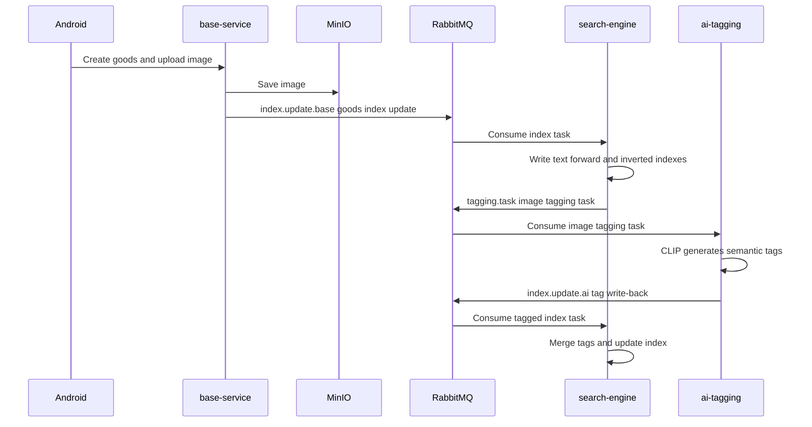


### 3.11.2 Search, translate, and segment links

The search service needs to support mixed Chinese and English queries, so the implementation not only uses Jieba Chinese word segmentation, but also adds Chinese and English translation. This strategy also solves the problem that the AI tags are all in English.

Process flow at query time:

1. Convert the input to lowercase and remove punctuation.
2. Extract English words.
3. Use Jieba search pattern for Chinese word segmentation.
4. Try to translate Chinese words into English.
5. Try to translate English words into Chinese.
6. Merge original words and translated words, and remove duplicates.
7. Query the inverted index in parallel.
8. Combine the results, calculate the score, and paginate back.

In order to reduce the call cost of the external translation API and speed up the query speed(The call time of the external translation API may be long), the translation module adopts a three-level caching strategy:

- Hot word list first.
- Local go-cache caching.
- Redis 7-day cache.
- The translation API is only called on cache misses.

This implementation improves search recall and avoids having to rely on an external service for each search.

Internally, the search query is processed as follows:

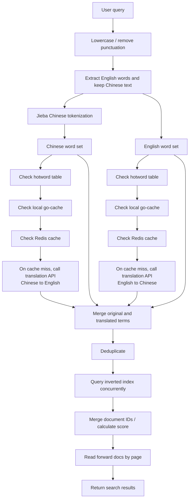


### 3.11.3 Order status flow

Order status flow involves user operations, payment callbacks, timeout cancellation and wallet settlement, which is prone to repeated operations and state inconsistency.

Here's how we handle it:

- Order status is maintained by the `trade-service`.
- Only `CREATED` orders can be cancelled or marked as paid successfully.
- Only `PAID` orders can confirm receipt and go into `SETTLED`.
- Payment timeouts are triggered via RabbitMQ delay queues.
- State changes are logged to `order_events`.
- Events that need to be notified to other services are written to `trade_outbox` before being published by the background dispatcher.

This design avoids the direct modification of the order state by the payment service or the wallet service, so that the order state machine has a single source of fact.

The order status machine is as follows (note that the refund status is not yet implemented because the interface provided by Alipay sandbox does not support refunds) :

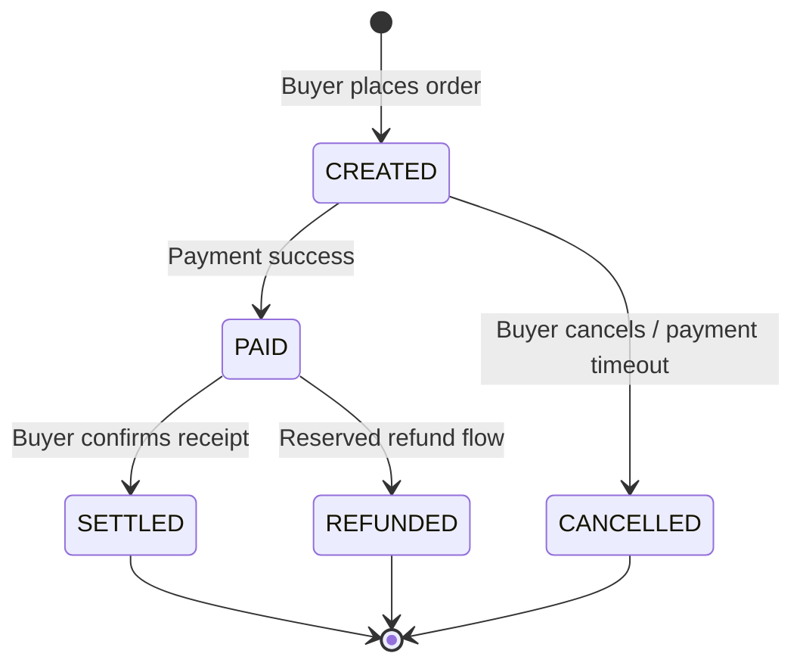


### 3.11.4 Alipay sandbox implementation

Payment is the key difficulty in the closed loop of transactions. The current project implements the payment process through `Payment-service`. Since the complete ability of Alipay merchants requires business license and approval, our project temporarily relies on Alipay sandbox interface to show that the payment function can be realized and show our program design. There is no real Alipay payment. The process of payment realized by Alipay sandbox interface is as follows:

- Users bind Alipay sandbox accounts.
- After the order is placed, the trade-service calls the payment-service to create the payment order.
- When a user initiates a payment, payment-service generates a mock `orderString`.
- pay callback into ` / app/payments/alipay/notify `.
- Callback checks amount, order number, and signature configuration.
- The payment slip changed from `WAIT_PAY` to `SUCCESS`.
- payment -service writes `payment_outbox`.
- Outbox dispatcher publishes `payment.paid`.
- Update order status after a trade-service consumption event.
- wallet-service records the hosting pipeline after the consumption event.

Our implementation is designed to run the transaction process, without direct access to the actual money transfer. The buyer payment step is simulated by Alipay sandbox, indicating that the buyer has paid the money to the platform. After the seller to the account is no longer real Alipay transfer, but by `wallet-service` through the platform wallet balance and wallet flow to simulate. This can show the complete process of "buyer payment, platform escrow, confirmation of receipt, seller's account, seller's cash withdrawal". Due to the complex problems of calling real Alipay, such as the need for real merchant qualification, real transfer, fund settlement and compliance audit, real Alipay amount circulation has not been realized for the time being.

The payment sandbox works with events for orders and wallets as follows:

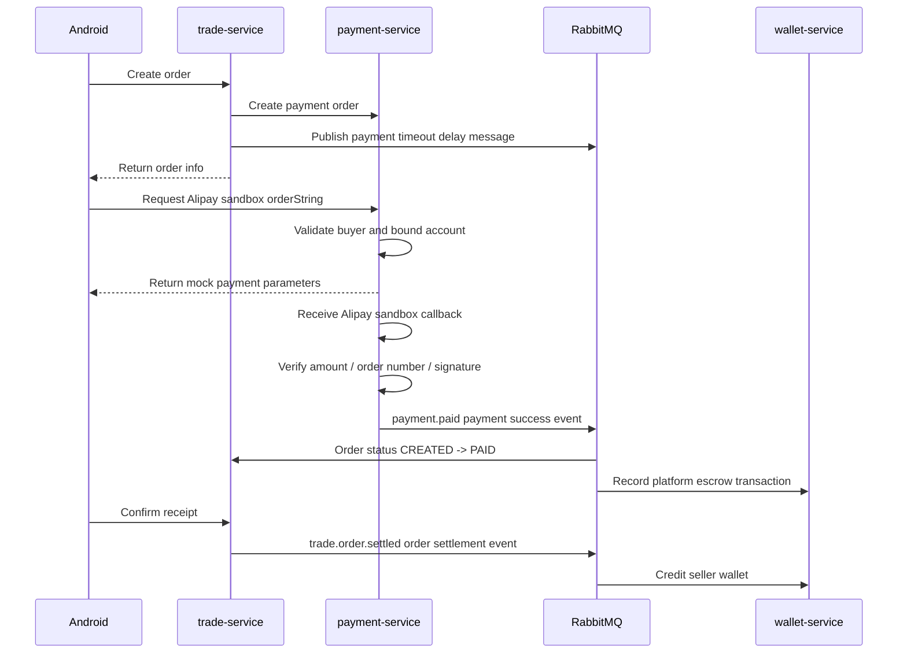


### 3.11.5 Instant messaging link and connection management

The challenges with instant messaging links are not just about establishing a WebSocket connection, but also include historical message loading, user identity validation, message persistence, live push, and multipeer connection management. Chat messaging in the project is implemented by `message-service-go`.

The complete instant messaging link is as follows:

1. Android queries the list of recent conversations in the "Recent chats" page 'MessageFragment'.
2. When the user enters the chat page with a single user, the 'ChatActivity' first fetches the message history via an HTTP call to `/app/messages/list`.
3. ` ChatActivity ` will ` base_url ` into ` ws: / / ` or ` WSS: / / `, and connect ` / ws? userId={userId}&token={token} `
4. The Gateway is responsible for forwarding WebSocket requests and pass-through user information downstream after authentication.
5. `message-service-go` validates the user ID in the connection and registers the connection with the WebSocket Hub.
6. When the user sends a Message, Android serializes the `message` object to JSON and sends it over a WebSocket.
7. After receiving the message, the message server writes it to MySQL to ensure that the chat record will not be lost.
8. The messaging service pushes messages to the online connection of the sender and receiver through the Hub.
9. If the receiving user is currently offline, the message will be loaded through the history interface the next time the user enters the chat page because the message has been saved to the database.

The connection management implementation of Hub includes:

- Each user ID corresponds to a set of connections, supporting multiple online connections for the same user.
- The new connection enters the `register` channel.
- Disconnect into the `unregister` channel.
- The delivery message goes into the `deliver` channel.
- Write coroutines periodically send pings to check for connection availability.

These channels are consumed uniformly by the Hub's `Run` loop. `Run` will continuously listen for `register`, `unregister`, and `deliver` channels: when `register` receives a new connection, the Hub will add it to the set of connections for the corresponding user ID; When `unregister` receives a lost connection, Hub removes it from the collection, cleaning up the user's connection record if the user is no longer online; When `deliver` receives a pending push message, the Hub finds all the online connections for the target user and writes the message to each connection's own `send` queue. The actual writing to the WebSocket client is not done directly in the Hub main loop. Instead, each connection's write coroutine fetches the messages from the `send` queue and sends them to the client. This avoids blocking the entire Hub if one connection gets slow to write.

This separates historical messaging and real-time push: HTTP for reliable messaging and WebSocket for real-time delivery. The database is responsible for message persistence, and the Hub is responsible for online connection distribution, so as to balance real-time and recoverability.

The instant messaging link is as follows:

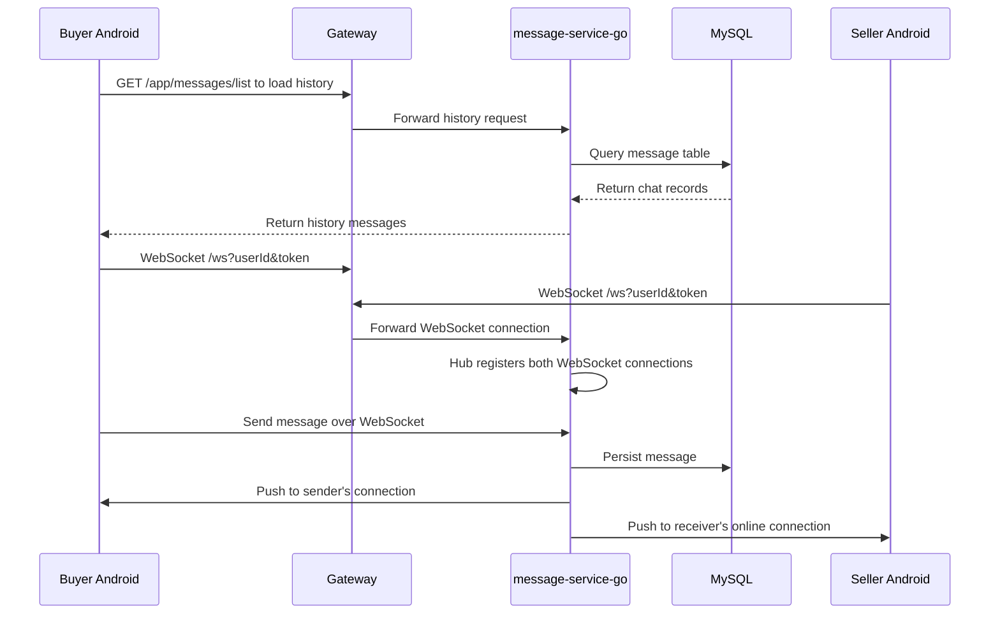


## 3.12 Design principles and pattern application

### 3.12.1 Layered architecture

Our backend services are all implemented using a similar layered architecture:

```text
Controller / Handler
  -> Service
  -> Repository / Mapper
  -> Model / Entity
```

This separation makes it clearer what each layer is responsible for. The interface layer is responsible for handling request parameters and response results, the Service layer is responsible for real business rules, the Repository or Mapper is responsible for database access, and the Model or Entity is responsible for describing data structures. In Java's `base-service`, the Controller receives HTTP requests and returns a unified `Result`, the Service handles registration, login, product publishing, image uploading and other services, and the Mapper and XML are responsible for looking up the database. In the Go Service, Handler is responsible for parameter parsing and response, Service is responsible for core logic such as order status, payment callback, wallet pipelined, and Repository is responsible for GORM transactions and table operations.

### 3.12.2 Gateway Unified authentication

The project puts the authentication logic in the Gateway, and the business service obtains the current user information through the request header. This way, each service doesn't have to write a set of token parsing logic repeatedly, and the subsequent adjustment of authentication rules is more centralized.

The Gateway's global filter will read `Authorization` or `access-token`, validate the JWT, and pass the `X-User-Id`, `X-User-Name`, and `access-token` downstream. Downstream services only need to consume the user context passed down from the gateway. Interfaces such as login, registration, public listings, search, and payment callbacks are not suitable for normal user authentication, so they are whitelist cleared.

This approach also makes the boundaries of the system clear: the mobile client only accesses the Gateway, and the backend services mainly call each other on the internal network. In the future, if you want to add throtting, blacklisting, audit logging, or unified error handling, you can also prioritize it at the Gateway layer.

### 3.12.3 Event-driven architecture

Search indexing, AI marking, payment success, order settlement, and other processes are all event-driven. In simple terms, a service does its job, sends "what happened" to RabbitMQ, and the other services move on according to their responsibilities.

The events in the project include `index.update.base`, `tagged. task`, `index.update.ai`, `payment.paid`, and `trade.order.settled`. For example, after the commodity service publishes an index update event, it does not need to wait for the search service and AI marking service to complete. After the payment service publishes a successful payment event, the order service is responsible for updating the order status, and the wallet service is responsible for recording the escrow pipeline. This reduces the amount of sync waiting between services and allows long tasks to be done in the background.

This design is also easy to scale. For example, in the future, if you want to send a notification to the user after a payment has been successful.You only need to add a new consumer to handle the payment success event, rather than changing the core process of the payment service directly.

### 3.12.4 Outbox pattern

`payment-service` and `trade-service` use Outbox tables to save events to be published. It solves a common problem: the database state has been updated, but the message fails to be sent to RabbitMQ.

In the payment service, instead of relying on sending an MQ message once the payment callback is confirmed to be successful, we write the `payment.paid` event to `payment_outbox` first. The background dispatcher will periodically scan for events to be sent and mark the outbox status as sent once they have been published successfully. The order service also writes` trade.order.settled `to` trade_outbox `after confirming the shipment, which is published by the background task.

This way, even if RabbitMQ is temporarily unavailable, the events to be sent will still be stored in the database. Once the service is restored, background tasks can continue to be delivered, and the cross-service process will not be interrupted by a single failed message delivery.

### 3.12.5 State machine

Both orders and payments control the flow with explicit status fields. The service checks the current status before performing an operation to avoid problems such as double payment, double cancellation, and double confirmation of receipt.

The current order status includes `CREATED`、`PAID`、`SETTLED` and `CANCELLED`，and the refund status belongs to the subsequent reservation capacity. Orders can only enter `PAID` from `CREATED` or `CANCELLED`, and only enter 'SETTLED' from `PAID`. The current bill state includes` WAIT_PAY `, `SUCCESS`, and `CLOSED`. These state constraints allow the business process to have clear boundaries and not jump around.


State checking can also improve idempotency. For example, when a duplicate payment success event arrives, if the order is no longer in a `CREATED` state, the service will not update the order repeatedly; Only orders that are `PAID` will be SETTLED. Orders that have already been `settled` will not be settled again.

### 3.12.6 Eventual consistency

Actions such as wallet entry, search index, and AI tag do not have to be completed at the same time as the user request, so the project is finally consistent through RabbitMQ. The foreground interface can return and the background task can continue.

For example, the product publishing interface only needs to ensure that the product data and images are saved successfully, and the search index and AI tags can be gradually generated in the background. After successful payment, the order status and wallet flow continue to advance through the event. As long as the consumer finally succeeds, the overall state of the system will gradually become consistent.

To support eventual consistency, the project uses event persistence, consumer failure retry, state checking, and unique constraints. The order service can avoid duplicate settlement by status judgment, the search service can overwrite old data by duplicate index update, and the wallet pipeline also reduces duplicate pipelines by unique constraints of order ID and pipeline type. In the future, it is necessary to continue to improve the balance idempotent processing when sellers settle repeated consumption.

# 4. Development flow

## 4.1 Development methodology

Our project uses **Waterfall Model** to develop. Due to the multi-language microservice architecture like Java/Go/Python, we decided to complete the interface design before coding to ensure that the interface between services in different languages can be properly docked to avoid problems during integration.

## 4.2 Phase division and Iteration strategy

We divided the project into six strictly sequential phases, which were completed step by step in sequence. Before each stage begins, what inputs are needed, what results are produced, and how to accept them are determined, and no further changes are made.

| Stage         | Planning cycle       | Core deliverables                    |
| ----------- | ----------- | ------------------------- |
| ① Requirement analysis     | 3/20 – 3/29 | Requirements specification, use case diagram             |
| ② System Design     | 3/30 – 4/12 | Architecture documents, database E-R diagrams, interface contracts, UI prototypes|
| ③ Implementation and Coding| 4/13 – 4/30 | Microservice source code, Android client source code     |
| ④ Deployment and Integration    | 5/1 – 5/10  | Docker Compose Orchestration, cloud deployment   |
| ⑤ System testing and user feedback | 5/11 – 5/20 | Test reports, Bug lists, user feedback logs       |
| ⑥ Acceptance and Documentation    | 5/21 – 5/31 | Final report, user manual, demo video           |


## 4.3 Milestone progress and actual adjustments

In practice, the stages take the following time:


| Stage        | Actual period      | Actual time used |
| ---------- | ----------- | ---- |
| Requirement analysis     | 3/20 – 3/27 | 8 天  |
| System Design      | 3/28 – 4/9  | 13 天 |
| Implementation and Coding    | 4/10 – 5/5  | 26 天 |
| Deployment and Integration     | 5/6 – 5/12  | 7 天  |
| System testing and user feedback  | 5/13 – 5/28 | 16 天 |
| Acceptance, optimization and documentation | 5/29 – 5/31 | 3 天  |


### 4.3.1 Requirement analysis and system design were completed ahead of schedule

- As the proposal stage has conducted an in-depth investigation of the campus scene and the user requirements are relatively focused and clear, the requirements analysis stage was completed on March 27, 2 days ahead of schedule. The requirements specification is confirmed after the review and will not be modified.
- Mature microservice architectural patterns were reused in the system design phase, and the design document was completed 3 days ahead of schedule on April 9, and the interface document was formalized. This gives a theoretical buffer of about five days for further development.

### 4.3.2 The implementation phase was extended by 5 days due to technical difficulties

However, after entering the implementation phase, we encountered a lot of technical challenges. Although the previous requirements analysis and system design were completed ahead of schedule, so that the coding work began on April 10, the implementation phase was finally almost completed on May 5, which was less than the original planned end time(April 30) extended by five days. The reasons include:

- **Alipay sandbox and payment link are complex**：The payment module needs to complete sandbox account binding, payment order creation, App payment parameter generation, payment back analysis and signature verification, idempotent update, and payment success message synchronization. The link is long and the consistency debugging of order and payment status is time-consuming.
- **The search with AI marking link is longer**：The commodity index update needs to go through the basic service publishing index task, the search service forwarding image marking task, the Python AI service downloading images and calling CLIP to generate labels, and then writing back the search index. At the same time, the local model dependency management of CLIP is complex, and the time-consuming of image marking also affects the index update performance.
- **Feature implementation code is larger than expected**：Some of the features that seemed straightforward turned out to require handling frontend interactions, backend interfaces, data validations, and exception cases at the same time, requiring more code to be written and tuned than initially estimated.
- **The cost of multi-person collaborative communication is high**：When multiple students develop at the same time, there will be differences in the understanding of some requirements and interface details, which need to be repeatedly aligned. Mobile terminal development students also need to confirm the page effect with the students in charge of UI design before implementing, which takes a long time to communicate.

### 4.3.3 The testing and user feedback cycle is significantly extended

Due to the extended implementation phase, the deployment and integration were actually adjusted to be completed from May 6 to May 12. The test phase, originally scheduled for May 11 to May 20, has been adjusted to May 13 to May 28. Reasons for extension include:

- **Compatibility of different models**：When testing, it is found that the screen size and system display effect of different Android models are not exactly the same, and some pages will have problems such as button position offset, text line abnormality or element occlusion, which need to be checked and adjusted one by one.
- **The coordination of test and repair is time-consuming**：Due to the large number of functions in the project, there are also many bugs exposed in the testing process, which requires students responsible for testing and students responsible for development to constantly communicate, reproduce, confirm and fix, and the overall cost is relatively long.
- **The user feedback iteration is slower**：After the on-campus trial, some feedback was collected about search ranking, message reminders and UI interaction, which needed to be re-verified after each modification, and the overall iteration speed was slower than expected.

## 4.4 Reflection and lessons learned

### 4.4.1 Time scheduling requires the introduction of buffering mechanisms

The core lesson learned is that **Allow enough buffer time in advance**。Although some time was saved by the requirements and design phase being completed early, it was quickly used up by difficulties encountered later, and unexpected problems in the technical implementation. In the future, when planning your schedule, you should allow a 10-15% buffer between each stage, rather than hoping that the time saved will automatically make up for the delay.

### 4.4.2 A thorough analysis of technical difficulties is required before planning

The delays encountered in the project were mainly due to unfamiliarity with many technologies and insufficient estimation of technical difficulty. At the same time, the amount of code and the time cost of multi-person collaboration and communication are also beyond expectations. In the early planning, we were optimistic about the complexity of Alipay sandbox, order and wallet status consistency, search index and AI tag writeback, mobile terminal and back-end joint adjustment, and did not fully reserve time for cross-member communication and UI confirmation. In the future, before making the schedule, the technical unfamiliar or more complex modules should first do 1-2 days of rapid prototype verification before making a detailed plan, and the joint adjustment and communication costs should also be included in the construction time estimation.

### 4.4.3 A systematic risk management mechanism must be established

In the early stage of the project, no risk register was established, and no graded emergency plan was formulated, which led to passive response when problems occurred. The following risks should be considered in future project planning:

- **Technical risk**：Some technical points may be more complicated than expected, such as CLIP image marking, calling between different language services, Alipay sandbox, Aliyun translation interface, etc.
- **Bug risk**：When microservices are split, a function often passes through multiple services and mobile pages, and problems don't necessarily occur in a single module. In the future, interface tuning and regression testing should be carried out earlier, and automated tests should be added to key interfaces and core processes to avoid changing one place and affecting other functions.
- **Emergency risk**：It is also possible to encounter cloud server problems, third-party interface restrictions, and member time conflicts during the project. The key configuration, deployment mode and core code logic should be clearly recorded in the follow-up, and more knowledge and thinking analysis should be done among team members to avoid affecting the overall progress when a student is temporarily unable to participate.

# 5. Evaluation of results

Our project basically completed the original goal set by the project: to do a campus scene oriented second-hand trading and life service entrance. The current system has included Android client, Gateway, Java basic business services, multiple Go microservices, Python AI marking services, and MySQL, RabbitMQ, Redis, Nacos, MinIO and other basic components. Overall, the system has been able to support the main processes such as user registration and login, product browsing and publishing, image uploading, notification, chat, search, AI marking, order, payment and wallet.

From the perspective of function completion, the project already has the core functions of campus second-hand trading. Users can browse and search products, publish product information with pictures, and also chat with sellers in real time. The transaction related part also realizes the basic closed loop of order generation, simulated payment, wallet escrow and seller settlement. Mobile pages can be used to chain together major business processes, and backend interfaces and service splits can support these functions.

From the perspective of architecture design, the main advantage of the system is that the service boundary is clear. Gateway is responsible for unified entry and authentication, and basic business, message, search, AI marking, order, payment and wallet are separated into independent services, which reduces the problem of too large a single service. After the product is released, the search index is updated asynchronously through RabbitMQ, and the AI marking is also processed in the background. Payment success, order status change, and wallet settlement are similarly decoupled through message queues. This will reduce strong dependencies between services, and make it easier to find the right place to access as we expand our functionality for refunds, recommendations, risk control, back-office management, and more.

The project has done some basic design work in terms of performance and scalability. Decouple search into separate services, avoiding tokenizing, indexing, and sorting logic inside the underlying business services. Redis and local caches can be used to search for translation caches, hot data caches, and gateway related capabilities; RabbitMQ enables asynchronous execution of background tasks such as search indexing, AI marking, payment notification, and settlement notification. As the number of tasks grows, we can also prioritize scaling from search services, AI marking services, and message consumers in the message queue.

From the perspective of deployment and maintainability, the project uses Docker Compose to uniformly start back-end services and infrastructure components, which facilitates local joint setup, demonstration and deployment to Alibaba Cloud ECS. Splitting your code into services and business responsibilities makes it easier to identify problems, replace a module, or add functionality later on. The system architecture, interface, communication mode and key design are also described in the document, which is convenient for subsequent maintenance.

The project still has some shortcomings. At present, the deployment mode is mainly single-node. Although online demonstration and remote access are available, multi-node disaster recovery, automatic failover and elastic scaling capabilities are not yet available. Once the server or critical middleware fails, the overall availability will be affected. At present, the identity authentication is mainly ordinary account registration and JWT login, and there is no strict access to the school email or student identity verification. The payment link is still dominated by sandbox and simulation process, which is mainly used to demonstrate the process of buyer payment, platform hosting and seller accounting. As the transfer of real Alipay merchants requires business license, merchant account authentication and fund compliance audit and other conditions, there is no access to real payment and real withdrawal ability at present, and it still needs to be improved in the future. There is also room for improvement in monitoring alarms, automated testing, back-office operations, notification management, and exception handling.

In general, our project has achieved the prototype goal of the course project level, and the core business, search, instant messaging, asynchronous tasks, payment wallet and containerized deployment have all the basic capabilities. In the future, if we want to further approach the real campus online standard, we also need to focus on strengthening the capabilities of high availability deployment, real payment and withdrawal links, identity authentication, monitoring alarms, automated testing and operation management.

# 6. Conclusions and future work

Through the development of this project, it can be seen that a campus second-hand trading system does not simply publish and view goods. It also needs to handle chat, search, image recognition, ordering, payments, and wallet settlement. In the project, we split these functions into different services, and gave the mobile terminal unified access to the backend, which made the overall structure clearer and easier to continue to expand. Tasks that do not need to be completed immediately, such as commodity indexing, AI marking, and payment result notification, are processed in the background through message queues, reducing the direct dependence between various modules. In general, the current system has been able to complete the main demonstration process, but also left a good foundation for the follow-up improvement.

The first step is to make the payment process more complete. Now the project has realized the basic functions of order, Alipay sandbox payment and wallet escrow, but it has not connected to the real online payment environment. In the future, it is necessary to replace the Alipay sandbox ability with the real Alipay payment ability, register and authenticate the Alipay merchant account, and supplement the functions of official payment, payment result verification, refund, bill check and real cash withdrawal. Real merchant transfers also involve business licenses, merchant account authentication, and fund compliance audits, which also need to be improved in the future.

Second, we can continue to improve our deployment approach. Our project uses Docker Compose, which is suitable for local debugging and classroom demonstrations. In the future, if you want your system to be more like a live environment, you can gradually migrate to Kubernetes and add health checks, automatic restarts, rolling updates, and log monitoring to each back-end service. At the same time, MySQL, RabbitMQ, Redis, MinIO and other basic components also need to do a good job of data backup and persistence to avoid data loss after service errors.

Third, AI marking services can be optimized for performance and deployment separately. Image marking relies on model inference, requires high machine configuration, and is also the longest part of the whole indexing and marking link. Subsequently, the AI marking service can be deployed to multiple high-performance computers with independent graphics cards, and multiple service instances can be started to process the marking task in parallel. This is more suitable than deploying on a regular cloud server, because many cloud servers have low performance graphics cards, and the speed and cost of running models are not ideal.

Fourth, mobile can continue to be polished. The Android client needs to better adapt to different phone screens, system versions, and network conditions. The product list, image loading, and chat pages can continue to be optimized for loading speed, paginalized display, and weak network retries. More natural loading cues and animations can also be added to post products, toggling pages, search results, and chat messages to make the user feel smoother.

Fifth, a backstage management platform can be added. This platform can be used by operations staff or campus administrators to view popular search terms, review and take down products, manage users, publish notifications, view abnormal transactions, and more. In this way, the system not only serves the second-hand transaction between students, but also helps administrators better maintain the order of the platform.

Overall, our project has gone from a requirements analysis to a working prototype. What we need to do next is to make the transaction process more complete, the deployment more stable, the AI marking processing faster, the mobile experience smoother, and complement the back-office management capabilities. As long as it continues to improve on the existing basis, this system can be closer to the actual use in the real campus scene.
