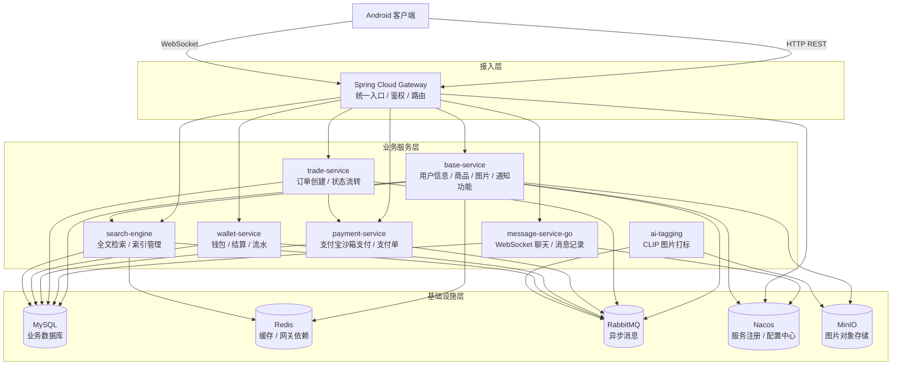
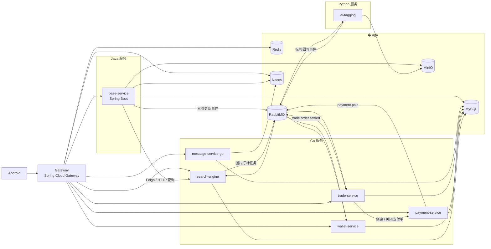
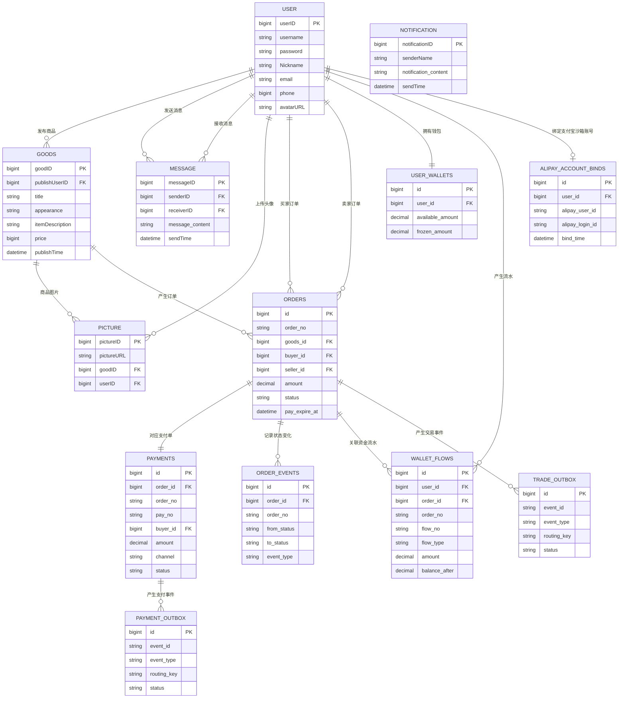
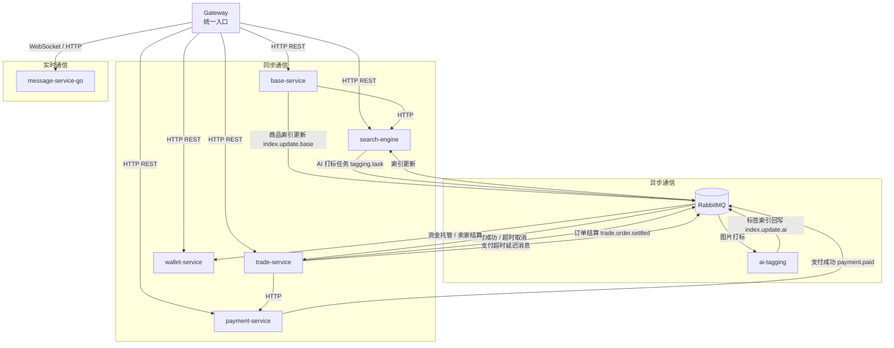

## 1. 系统设计目标

我们的软件，在系统设计上主要希望可以做到以下几点：

- 做出界面清晰、功能明确、交互友好、UI 较美观的 Android 移动端软件。
- 覆盖校园生活服务跳转、校园通知发送与接收，以及商品浏览、发布、搜索、聊天、订单、支付和钱包等主要功能。
- 按不同功能拆分后端服务，减少模块之间的耦合，方便开发协作和后续扩展。
- 在设计上考虑性能和响应速度，把搜索、AI 打标、支付通知、结算等耗时或后续任务放到后台异步处理，减少用户等待，同时要加入适当的多层缓存设计。
- 保持系统可维护、容易改进，让每个服务职责清楚，后续新增功能、替换模块或优化某个服务时影响范围更小。
- 买卖双方聊天实现实时通信，保证聊天消息可以及时送达。
- 后端服务和基础设施组件使用 Docker 容器部署，便于本地运行、联调和演示，也方便后续部署到阿里云 ECS。

## 2. 总体架构（移动端 / 服务端）

我们的系统整体分为 Android 移动端、接入层（反向代理，路由，鉴权）、业务服务层（微服务架构）和基础设施层（数据库，图片存储，异步通信服务，Redis缓存）。Android 客户端通过 Gateway 访问对应后端服务，后端服务再根据需要访问数据库、对象存储、消息队列、Nacos 注册中心等基础组件。

我们的分层设计使移动端不需要感知后端内部服务拆分，只需要访问统一入口；后端服务则可以根据功能的不同灵活的编写和改进。

## 3. 移动端和服务端通信方式

移动端主要通过两种方式与服务端通信：

- **HTTP restful api**：用于登录注册、商品浏览、商品发布、订单支付、钱包查询、通知查询等基于请求响应形式交互的功能。
- **WebSocket**：用于买家和卖家之间的实时聊天。

Android 客户端统一访问 Gateway。Gateway 负责接收请求、校验用户身份，并根据路径把请求转发到具体服务。这样可以减少客户端配置复杂度，后续后端服务有所变动只需要改Gateway的配置即可，可拓展性强。

在认证方面，用户登录后，服务端会返回一个封装了用户信息的 JWT token。后续请求客户端会携带 token 访问 Gateway，由 Gateway 统一完成鉴权，并将用户信息传递给下游服务。

## 4. 后端微服务架构总览

后端采用混合技术栈的微服务架构，这可以方便进行团队开发，同时可拓展性和可更改性较强，服务间的耦合度低，也利于部署。基础业务服务用 Java语言，消息、交易、支付、钱包和搜索等服务基于 Golang ，AI 图片打标服务由于运用了 PyTorch 框架，用Python语言编写。

该架构把同步请求、实时通信和异步任务分开处理：对用户直接等待结果，强时效性的同步请求走 HTTP，需要服务端实时推送消息给客户端的聊天走 WebSocket 协议，耗时长或需要多个服务参与（如AI打标服务，需要将图片嵌入到低维向量空间，非常耗时）的后台动作通过 RabbitMQ 异步完成。

### 4.1 数据库设计 ER 图

这是数据库表之间的关系图。当前数据库大部分关系通过字段和代码逻辑维护，不一定是靠数据库外键，因此这里画的是在实际使用中的关系。

## 5. 后端服务与组件职责

### 5.1 Gateway

- **主要功能和职责**：移动端访问后端的统一入口，负责请求转发、权限校验、登录状态校验和用户信息解析。这样移动端不需要关心后端有多少个服务，只需要访问统一入口。
- **与其他服务的关系**：Gateway 会把消息、订单、支付、钱包、搜索和基础业务请求分别转发到对应服务。它和 Nacos 配合完成服务发现。

### 5.2 base-service

- **主要功能和职责**：它负责基础业务，包括登录注册、用户信息、商品浏览、商品发布和修改、图片上传、头像上传、通知查询等。用户、商品等数据主要存在 MySQL 中，图片和头像等文件存放在 MinIO，并通过Redis缓存商品详情、收藏商品列表等高频访问数据，提高服务端性能。
- **与其他服务的关系**：商品搜索时，`base-service` 会用 OpenFeign 来同步调用 `search-engine` 获取搜索结果；商品发生变化时，它会通知 RabbitMQ 发送消息给搜索服务来更新索引。

### 5.3 message-service-go

- **主要功能和职责**：它负责聊天相关能力，包括 WebSocket 连接管理、消息收发、消息保存、聊天记录查询和最近会话查询。把消息服务单独拆出来，可以避免长连接业务影响普通 HTTP 业务。
- **与其他服务的关系**：客户端通常通过 Gateway 连接消息服务，Gateway 先完成用户校验，再把请求转给消息服务。消息服务会把聊天消息保存到 MySQL，查询最近会话时也会用到 MySQL 数据库中的用户信息和头像地址信息。

### 5.4 trade-service

- **主要功能和职责**：这个服务主要负责订单和交易状态流转，包括创建订单、查询买家和卖家订单、取消订单、处理支付超时、确认收货等。订单从待支付到已支付、已完成的状态主要由它维护。
- **与其他服务的关系**：创建订单时，`trade-service` 会通过 HTTP 同步调用 `payment-service` 创建支付单。订单取消或超时时，`trade-service` 也会通过 HTTP 调用支付服务关闭支付单。支付成功后，`payment-service` 通过 RabbitMQ 消息队列通知 `trade-service` 更新订单状态；买家确认收货后，`trade-service` 再通过 RabbitMQ 通知 `wallet-service` 给卖家结算。

### 5.5 payment-service

- **主要功能和职责**：当前项目通过支付宝沙箱模拟买家付款。这个服务主要负责支付相关能力，包括支付宝沙箱账号绑定、支付单创建、支付参数生成、支付回调处理和支付单关闭。
- **与其他服务的关系**：`trade-service` 创建订单后会请求 `payment-service` 创建支付单，订单取消或超时时也会请求它关闭支付单。支付成功后，`payment-service` 会通知 `trade-service` 更新订单状态，也会通知 `wallet-service` 记录平台钱包的金额变化。

### 5.6 wallet-service

- **主要功能和职责**：这个服务负责用户钱包、钱包流水、平台钱包入账、卖家收入结算和模拟提现。支付成功后资金先进入平台托管，买家确认收货后再结算到卖家钱包。
- **与其他服务的关系**：移动端通过 Gateway 查询钱包、流水或发起提现。`payment-service` 会在支付成功后通知它记录托管资金，`trade-service` 会在订单完成后通知它给卖家结算。

### 5.7 search-engine

- **主要功能和职责**：这个服务主要负责商品搜索能力，包括关键词检索、索引管理、分词、排序和搜索结果返回。以及调用阿里云翻译api在分词进行翻译，实现中文搜索英文商品，或者英文搜索中文商品。
- **与其他服务的关系**：`base-service` 会调用 `search-engine` 查询商品，也会在商品变化时通知它更新索引。`search-engine` 还会和 `ai-tagging` 配合，把商品图片交给 AI 打标，再把生成的标签用于搜索。

### 5.8 ai-tagging

- **主要功能和职责**：它负责商品图片的 AI 语义打标，根据图片内容生成若干标签，用来补充商品标题和描述之外的搜索信息。
- **与其他服务的关系**：`search-engine` 会把需要识别的商品图片交给 `ai-tagging`，`ai-tagging` 打标完成后再把结果返回给搜索服务用于更新索引。图片文件来自 MinIO 中存放的商品图片。

## 6. 基础设施组件

- **MySQL**：存储用户、商品、消息、订单、支付、钱包等核心业务数据。
- **RabbitMQ**：承载异步任务和跨服务事件，例如索引更新、AI 打标、支付成功和订单结算。
- **MinIO**：存储商品图片、头像等对象文件。
- **Redis**：作为缓存和网关相关基础组件，后续可扩展用于热点数据缓存和限流。
- **Nacos**：用于服务注册和服务治理，便于 Gateway 和服务之间进行发现与管理。

## 7. 后端服务通信方式

后端通信方式可以概括为三类：

- **同步通信**：对于用户操作后需要立即返回结果的场景。移动端用 HTTP 同步访问 `base-service`、`trade-service`、`payment-service`、`wallet-service`、`search-engine` 和 `message-service-go` 的 HTTP 接口，例如商品查询、订单创建、支付发起、钱包查询、搜索查询和聊天记录查询。服务之间也有通过 HTTP 进行同步调用，例如 `base-service` 通过 OpenFeign 调用 `search-engine` 查询搜索结果，`trade-service` 通过 HTTP 调用 `payment-service` 创建或关闭支付单。
- **WebSocket 通信**：用于聊天这种需要服务端实时推送消息到客户端的场景。移动端通过 Gateway 建立和 `message-service-go` 建立 WebSocket 连接，`message-service-go` 负责维护在线连接，并把新消息实时推送给发送方和接收方。
- **异步通信**：用于用户不需要一直等待的后台动作，主要通过 RabbitMQ 解耦服务。`base-service` 在商品变化后通知 `search-engine` 更新索引；`search-engine` 把需要识别的图片交给 `ai-tagging` 打标，`ai-tagging` 再把标签结果交回搜索服务；`payment-service` 在支付成功后通知 `trade-service` 更新订单状态，同时通知 `wallet-service` 记录平台钱包变化；`trade-service` 在订单完成后通知 `wallet-service` 给卖家结算，也会通过异步方式处理支付超时取消。

## 8. 关键设计思路

### 8.1 选择 Android 作为客户端

我们的项目选择 Android 作为客户端，主要是因为校园二手交易在手机上完成比较方便，而且如果使用网页端端话用户不方便使用。用户发布商品时需要选图、上传图片，聊天时也需要比较及时的交互，这些都和手机端场景比较贴合。而且原生 Android 可以直接使用系统相册、文件选择、图片压缩、网络状态、本地存储和页面跳转等能力，比较适合实现商品发布、聊天和个人中心这些功能。Android 也提供了强大的开发生态，开发难度较低，成本也较低，符合我们的现状。通过 Android Studio 和 Java 即可完成安卓软件的开发。

### 8.2 后端选择微服务架构

我们的后端选择使用微服务架构，主要是因为 CampusMart 里不同功能差别比较大。用户和商品相关的功能主要是普通业务数据处理，聊天需要用 WebSocket 协议，搜索需要索引和分词，AI 打标依赖 Python 模型生态，订单、支付和钱包又涉及交易状态和资金流转。如果全部放在一个服务里，代码会越来越混杂，调试和部署时也容易互相影响。

拆分以后，每类能力可以使用更合适的实现方式：`base-service` 负责基础业务，`message-service-go` 处理聊天长连接，`search-engine` 负责索引检索，`ai-tagging` 负责图片打标，订单、支付和钱包服务分别处理交易链路中的不同部分。这样系统结构更清楚，每个服务的职责也更明确。后续如果要优化搜索、替换 AI 模型或扩展支付能力，只需要围绕对应服务修改，不需要大范围改动其他模块。

微服务架构也有利于团队开发和分布式部署。我们负责后端的同学可以分别负责移动端、基础业务、消息、搜索、AI、订单、支付和钱包等模块，开发时相互影响较小。部署时，不同服务也可以按需要启动、扩容或迁移到不同机器上，比如可以根据任务量大时，搜索服务、AI 打标服务和消息消费者可以单独扩展，从而提高系统的可扩展性。

虽然微服务也会带来服务通信、部署和问题排查上的复杂度。通过用 Gateway 提供统一入口，用 Docker Compose 实现统一容器和依赖管理，通过 RabbitMQ 处理异步任务，并把关键订单状态集中在订单服务中维护，让整体复杂度处在一个可控的状态。

### 8.3 统一入口

系统使用 Gateway 作为统一入口，主要是为了让移动端只访问一个后端地址。路由转发和登录校验都放在 Gateway 处理，客户端不需要记录各个服务的地址，这样更新维护部署都比较方便，只需要改 GateWay 的配置就可以了。

这样做也能减少后端调整对客户端的影响。比如订单服务、支付服务、钱包服务或搜索服务的部署方式发生变化时，只要 Gateway 的路由保持一致，移动端基本不需要改动。后续如果要增加限流、日志、监控或统一错误处理，也可以优先放在 Gateway 层处理。

### 8.4 按不同功能拆分服务

我们将基础业务、消息、搜索、订单、支付、钱包和 AI 打标拆成不同服务。这样每个模块可以围绕自己的功能展开，可以让代码边界更清楚，易于编写，也能减少单个服务过大的问题。

拆分时主要按不同的功能内容来划分：用户、商品、图片和通知放在 `base-service`；聊天需要管理在线连接，所以单独放在 `message-service-go`；搜索放在 `search-engine`；AI打标需要python环境，拆分成 `ai-tagging`；订单、支付、钱包分别对应交易状态、支付过程和资金流水，因此拆成三个服务来处理。

### 8.5 同步与异步结合

对于用户需要马上看到结果的操作，我们使用同步的 HTTP 请求，例如查询商品、创建订单、生成支付参数等。对于耗时、可以稍后完成，或者失败后可以重试的动作，则使用 RabbitMQ 异步处理。

比如商品发布后，用户不需要等待 AI 图片打标完成才看到发布结果，所以索引更新和图片打标放到后台处理。支付成功、订单结算这类后续动作也通过消息通知相关服务完成，避免一个请求里连续调用太多服务。我们只在确实需要立即返回结果的场景中使用同步调用。

### 8.6 交易资金链路拆分

订单、支付和钱包分别由独立服务负责。订单服务维护交易状态，支付服务处理支付过程，钱包服务处理平台钱包、卖家结算和提现。这样资金相关逻辑不会全部挤在一个服务里，后续如果需要扩展退款、提现或账务记录，也会更清楚。

这种拆分也能让每个服务的职责更明确。订单服务负责订单取消、支付或确认收货；支付服务负责支付单和支付宝沙箱回调；钱包服务负责余额和流水。三个服务通过同步调用和消息通知配合完成完整交易流程。

### 8.7 开发搜索引擎服务

我们单独开发了搜索引擎服务，主要是为了让搜索能力更贴合校园二手交易场景。二手商品的标题和描述往往不够规范，同一类商品可能会用中文、英文、缩写或口语化表达，所以搜索服务需要支持更灵活的分词、翻译和混合搜索能力。

我们的搜索服务根据项目需要定制了翻译逻辑，可以把中文搜索词翻译成英文或把英文搜索词翻译成中文，也可以结合商品标题、描述和图片 AI 标签做混合搜索。AI 图片打标可以补充用户没有写清楚的商品信息，让搜索不只依赖文字内容。把这些能力放在独立搜索服务中，商品服务只需要处理商品数据，搜索服务负责把商品变成更容易被检索到的数据。