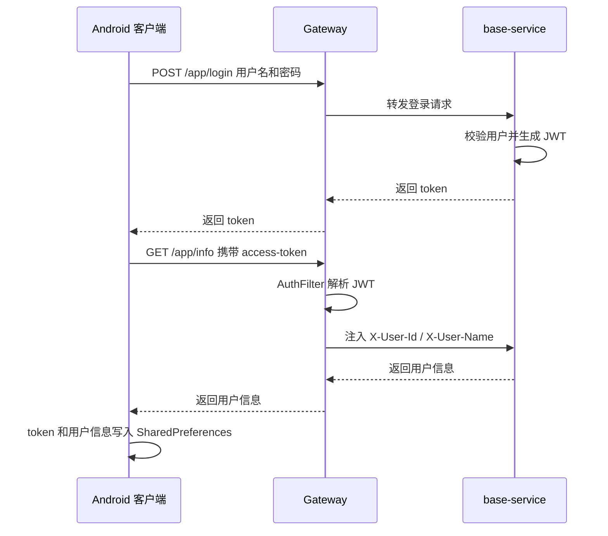
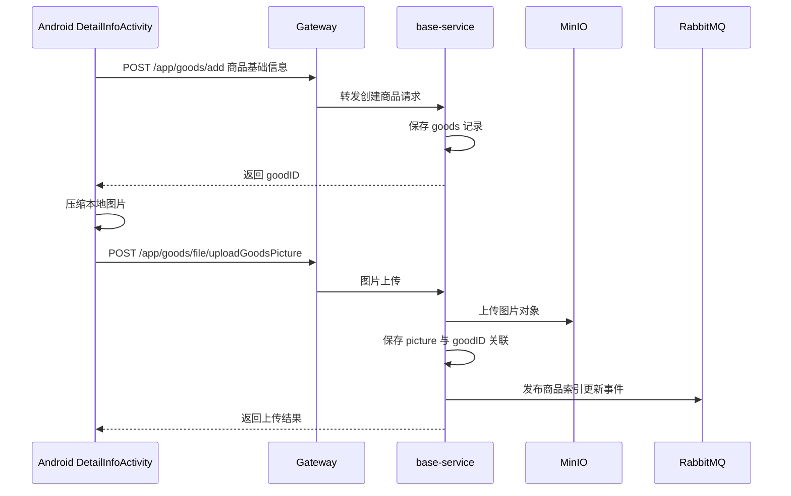
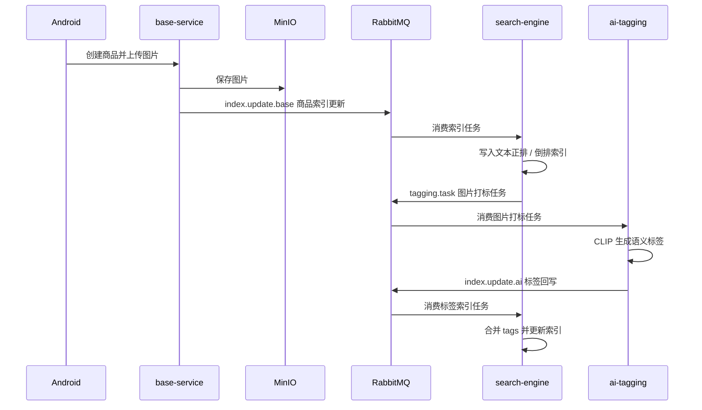
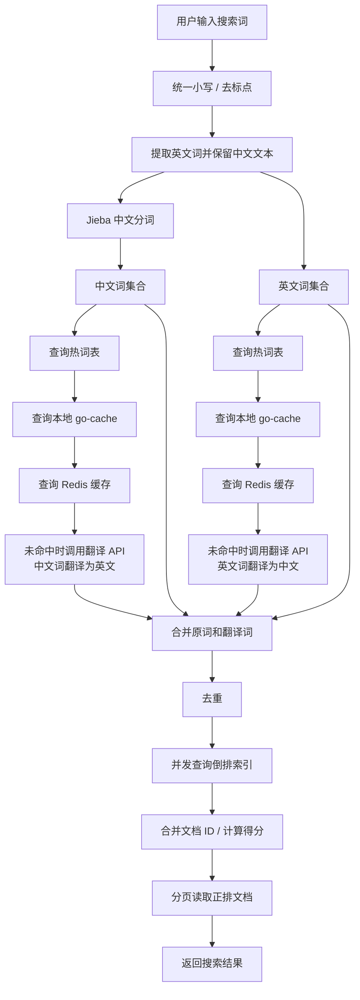
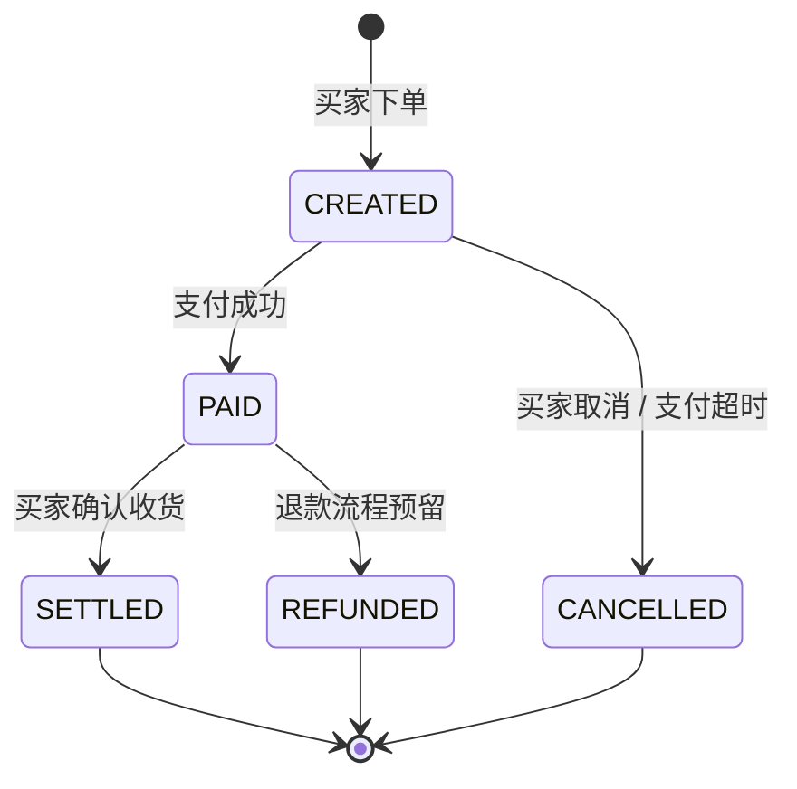
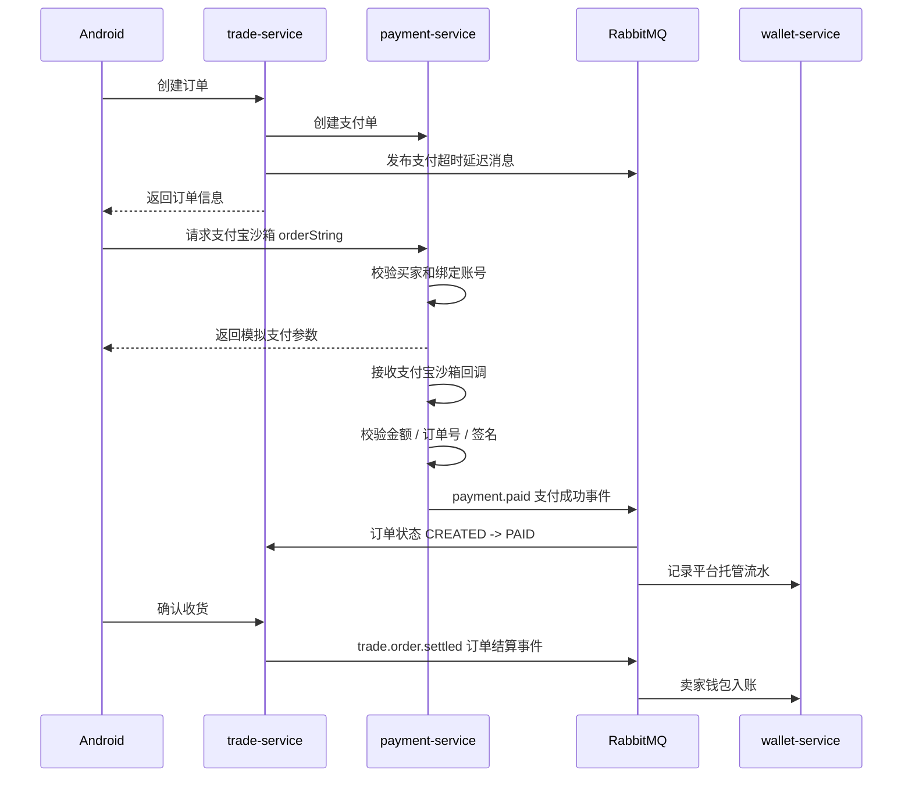
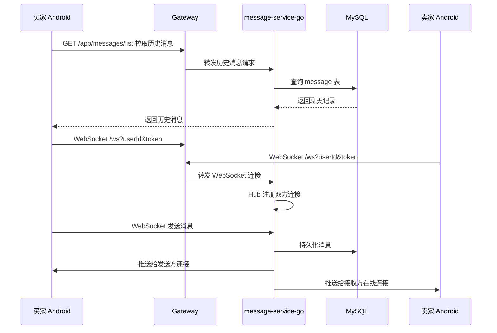

## 2. 移动端实现

### 2.1 技术栈

移动端主要使用原生 Android Java 实现，所用技术栈如下：

- 编程语言：Java
- RecyclerView / ConstraintLayout：用于展示商品列表、聊天列表等滚动内容，并组织页面布局。
- OkHttp：用于发起登录、商品、订单、支付等的 HTTP 请求。
- Gson：序列化和反序列化json。
- Picasso / Glide：用于通过url加载商品图片、头像等存储在服务端的图片。
- SharedPreferences：用于保存登录 token、用户 ID、头像等信息。
- OkHttp WebSocket：用于和消息服务建立聊天长连接。

配置文件（Android/app/src/main/res/values/config.xml）中的 `base_url` 指向服务器的 Gateway，移动端不会直接访问各个后端微服务，如果服务端的地址有所变化，只需更改 `base_url` 或者 Gateway 配置文件。

### 2.2 目录结构

移动端代码主要分为以下几类：

```text
Android/app/src/main/java/com/example/campusmart/
  Activity                页面与业务交互入口
  fragment/               首页、商品列表、消息、通知、个人中心等 Tab 页面
  adapter/                RecyclerView 的适配器
  entity/                 请求或本地业务实体
  vo/                     后端返回的对象
  result/                 统一 Result 响应封装
  common/page/            分页对象封装
```

主要页面包括：

- `LoginActivity`：登录并保存 token 与用户信息。
- `RegisterActivity`：用户注册。
- `HomeActivity`：主界面容器。
- `ProductListFragment`：商品列表、滚动分页、搜索。
- `DetailInfoActivity`：商品发布和图片上传。
- `GoodsDetailActivity`：商品详情展示。
- `MessageFragment`：最近聊天列表。
- `ChatActivity`：聊天历史加载与 WebSocket 实时消息。
- `PersonalInfoActivity`、`MyGoodsActivity`：个人信息和我的商品。

### 2.3 移动端接口调用方式

移动端、使用 OkHttp 构造请求。登录成功后，服务端返回的 token 会存入到 `SharedPreferences`，后续请求会通过 `access-token` 或 `Authorization` 请求头携带这个 token。

一些接口调用如下：


| 功能     | 移动端入口                 | 后端接口                                      |
| ------ | --------------------- | ----------------------------------------- |
| 登录     | `LoginActivity`       | `POST /app/login`                         |
| 获取用户信息 | `LoginActivity`       | `GET /app/info`                           |
| 商品分页   | `ProductListFragment` | `GET /app/goods/page`                     |
| 商品搜索   | `ProductListFragment` | `POST /api/query`                         |
| 商品发布   | `DetailInfoActivity`  | `POST /app/goods/add`                     |
| 商品图片上传 | `DetailInfoActivity`  | `POST /app/goods/file/uploadGoodsPicture` |
| 聊天记录   | `ChatActivity`        | `GET /app/messages/list`                  |
| 实时聊天   | `ChatActivity`        | `WebSocket /ws`                           |


### 2.4 一些主要功能流程的实现

#### 登录流程

`LoginActivity` 负责登录流程：

1. 用户输入用户名和密码。
2. 移动端向 `/app/login` 发送 JSON 请求。
3. 后端返回 JWT token。
4. 移动端携带 token 调用 `/app/info` 获取用户资料。
5. token 和用户信息写入 `SharedPreferences`。
6. 跳转到 `HomeActivity`。

登录与后续鉴权流程如下：




#### 商品浏览与搜索流程

商品展示页面我们使用了 `RecyclerView` + `GridLayoutManager` 展示商品卡片，并通过滚动监听实现商品列表的分页加载。商品图片通过 Picasso 或 Glide 从服务端返回的图片 URL 加载，网络请求由 OkHttp 发起，返回的 JSON 再通过 Gson 转成 `GoodsVo` 等对象。

普通商品列表调用：

```text
GET /app/goods/page?current={page}&size={size}
```

搜索时，移动端直接构造搜索请求：

```json
{
  "query": "搜索关键词",
  "page": 1,
  "limit": 10,
  "order": "desc",
  "scoreExp": ""
}
```

并调用：

```text
POST /api/query?database=campusmart
```

搜索结果会转换为 `GoodsVo`，再映射到 `ProductAdapter.Product` 用于界面展示。这样移动端只负责展示和交互，复杂的分词、翻译、索引查询和排序逻辑都交给后端搜索服务完成。

#### 商品发布流程

商品发布由 `DetailInfoActivity` 实现。我们使用了 Android 原生的文件选择能力读取本地图片，使用 OkHttp 先提交商品基础信息，再通过上传图片的接口上传图片：

1. 用户在商品发布页填写标题、成色、价格、描述等基础信息。
2. 用户从相册选择商品图片。
3. 移动端先调用 `/app/goods/add` 创建商品记录，获得 `goodID`。
4. 移动端压缩图片后，以 multipart 形式上传到 `/app/goods/file/uploadGoodsPicture`。
5. 服务端保存图片并触发搜索索引更新。

商品基础信息和图片上传分两个请求上传，先确定商品 ID，再建立图片与商品的关联。移动端只需要处理表单提交和图片上传，图片保存、对象存储和索引更新都由后端继续处理。

商品发布在移动端和服务端之间的流程如下：




#### 即时聊天流程

`ChatActivity` 同时使用 HTTP 和 WebSocket。进入聊天页面的时，先用 OkHttp 先通过 HTTP 请求拉取消息记录；然后建立 WebSocket 连接，建立连接后，OkHttp WebSocket 负责实时发送和接收消息；如果有新收到消息后更新 `RecyclerView` 展示：

1. 进入聊天页时调用 `/app/messages/list` 拉取历史消息。
2. 根据配置文件中的 `base_url` 生成 `ws://` 或 `wss://` 地址。
3. 连接 `/ws?userId={userId}&token={token}`。
4. 发送消息时将 `Message` 对象序列化为 JSON，通过 WebSocket 发送。
5. 收到服务端推送后，判断消息是否属于当前会话，再更新 RecyclerView。

## 3. Gateway 实现

### 3.1 技术栈

Gateway 位于 `server/gateway/`。

- 编程语言：Java
- Spring Boot：用于启动和管理 Gateway 应用。
- Spring Cloud Gateway：用于统一接入、路由转发和过滤器处理。
- Spring Cloud LoadBalancer：用于配合服务发现进行服务调用。
- Nacos Discovery：用于发现后端的服务发现。
- JJWT：用于解析和校验登录 token。

### 3.2 目录结构

```text
server/gateway/
  src/main/java/org/example/campusmart/gateway/
    GatewayApplication.java
    filter/
      AuthFilter.java
```

### 3.3 主要职责

Gateway 是所有后端 HTTP 和 WebSocket 请求的入口，主要实现以下功能：

- 路由转发：按请求路径，把请求转发到对应的服务。
- JWT 鉴权：读取 `Authorization` 或 `access-token`，解析 token。
- 用户上下文传递：解析 `X-User-Id`、`X-User-Name`、`access-token` 等用户信息，并注入到下游请求。
- 白名单控制：登录、注册和支付回调等接口允许跳过普通鉴权。

### 3.4 关键实现

`AuthFilter` 中实现了 Spring Cloud Gateway 的 `GlobalFilter`，所有进入网关的请求都会先经过这个过滤器。这个过滤器用 JJWT 解析 token，用 Spring Cloud Gateway 修改请求头，再把用户信息继续传给下游服务，流程如下：

1. 获取请求路径。
2. 如果是白名单 API 或者 WebSocket 连接，则直接放行。
3. 如果不是上述连接，则从请求头读取 token。
4. 使用 JWT 的 secret 解析 token。
5. 将用户 ID 和用户名写入请求头。
6. 转发给下游服务。

这样的全局过滤器可以统一实现鉴权逻辑，各个服务无需重复编写，只需要从请求头中读取用户 ID 就可以知道当前请求属于哪个用户。Gateway还通过路由配置把不同路径的请求转发到对应服务，后续如果服务实例变多，也可以结合 Nacos 和 LoadBalancer 做服务发现和转发。

## 4. base-service 实现

### 4.1 技术栈

`base-service` 位于 `server/base-service/`，是基础业务服务。

- 编程语言： Java
- Spring Boot：用于启动服务和管理依赖配置。
- Spring MVC：用于提供登录、商品、图片、通知等 HTTP 接口。
- MyBatis-Plus：用于简化实体和数据库表之间的增删改查。
- MySQL：用于存储用户、商品、图片、通知等核心数据。
- MinIO Java SDK：用于上传头像和商品图片到 MiniIO 对象存储服务。
- RabbitMQ：用于发布商品索引更新等异步任务。
- OpenFeign：用于同步调用搜索服务接口。
- Nacos Discovery：用于服务注册和发现。
- Knife4j / OpenAPI：用于接口文档展示和调试。

### 4.2 模块结构

```text
server/base-service/
  common/              通用结果、异常、JWT、MinIO 配置等
  model/               用户、商品、图片、消息、通知等实体
  web/
    controller/        REST API 控制器
    service/           业务服务接口
    service/impl/      业务服务实现
    mapper/            MyBatis Mapper
    resources/mapper/  XML SQL 映射
```

### 4.3 接口定义

基础服务主要接口如下：


| 模块  | 接口                                        | 说明           |
| --- | ----------------------------------------- | ------------ |
| 认证  | `POST /app/login`                         | 登录并返回 JWT    |
| 认证  | `POST /app/register`                      | 注册用户         |
| 认证  | `GET /app/info`                           | 获取当前登录用户信息   |
| 商品  | `GET /app/goods/page`                     | 分页查询商品       |
| 商品  | `GET /app/goods/search`                   | 商品搜索，优先走搜索服务 |
| 商品  | `GET /app/goods/selectById`               | 查询商品详情       |
| 商品  | `POST /app/goods/add`                     | 添加商品         |
| 商品  | `PUT /app/goods/update`                   | 更新商品         |
| 商品  | `PUT /app/goods/deleteById`               | 删除商品         |
| 文件  | `POST /app/goods/file/uploadGoodsPicture` | 上传商品图片       |
| 文件  | `POST /app/goods/file/uploadAvatar`       | 上传头像         |


### 4.4 主要业务实现

#### 用户注册与登录

`UserServiceImpl` 实现用户注册和登录功能。Controller 通过 Spring MVC 接收请求，Service 处理注册和登录规则，Mapper 通过 MyBatis-Plus 访问 MySQL：

- 注册时先根据用户名检查是否重复。
- 为新用户生成默认昵称（User开头+随机数）和默认签名。
- 读取默认头像文件并上传到 MinIO。
- 登录时校验用户名和密码。
- 登录成功后使用 `JwtUtil.createToken` 生成 token。

用户数据最终写入 MySQL，默认头像通过 MinIO Java SDK 上传到对象存储。登录成功后返回的 JWT 会被移动端保存，后续请求由 Gateway 校验，后续用户可以通过修改用户信息的接口更新个人信息。

#### 商品管理

`GoodsController` 提供商品的 CRUD 接口。使用 Spring MVC 处理请求参数和统一响应，数据访问层使用 MyBatis-Plus 查询 MySQL。商品分页查询会联查商品表、用户表和图片表，返回适合移动端展示的 `GoodsVo`。

商品新增和修改后，会调用 RabbitMQ 投递索引更新消息。这里使用消息队列的原因是索引更新不需要阻塞用户发布商品的请求。商品删除后，会调用搜索服务删除索引，避免搜索结果中继续出现已删除商品。

#### 图片上传

`PictureServiceImpl` 使用 MinIO Java SDK 实现图片上传。移动端上传图片文件后，Spring MVC 接收文件，服务端把图片保存到 MinIO，并关联对象名和商品或用户，流程如下：

- 检查 MinIO 中， bucket 是否存在。
- 不存在时创建 bucket，并设置公开读策略。
- 以日期目录 + UUID + 原文件名生成对象名。
- 调用 `putObject` 写入 MinIO。
- 返回文件对象名，并保存到 MySQL 数据库。

#### 搜索服务集成

base-service 中，将对搜索服务的调用的封装在 `SearchEngineService` 中。商品搜索场景需要立即返回结果，因此使用 OpenFeign 同步调用 `search-engine`；商品发布或修改后的索引更新可以稍后完成，因此使用 RabbitMQ 异步发送任务，封装的搜索能力如下：

- `searchGoods`：调用 `search-engine` 查询搜索结果。
- `buildIndexDocument`：将商品、图片、用户信息组装成索引文档。
- `publishIndexUpdate`：将索引任务发送到 RabbitMQ。
- `removeIndex`：同步调用搜索服务删除索引。

索引文档中会包含商品 ID、标题、描述、图片 URL、发布者昵称、头像等字段，这样搜索结果就可以直接展示。这样搜索服务返回结果后，移动端不需要再额外从 MySQL 中查询商品基础详情。

## 5. message-service-go 实现

### 5.1 技术栈

`message-service-go` 位于 `server/message-service-go/`。

- 编程语言：Golang
- Gin：用于提供聊天记录、最近会话等 HTTP 接口。
- Gorilla WebSocket：用于建立和维护聊天长连接。
- GORM：用于封装消息数据的数据库读写。
- MySQL：用于保存聊天消息和查询最近会话需要的数据。
- Nacos Go SDK：用于将消息服务注册到服务发现组件。

### 5.2 目录结构

```text
server/message-service-go/
  controller/       HTTP 消息接口
  model/            消息模型
  repository/       数据访问
  service/          消息业务逻辑
  websocket/        WebSocket Hub 和连接读写
  router/           路由注册
  config/           配置加载
  main.go           服务启动入口
```

### 5.3 接口定义


| 接口                         | 类型        | 说明            |
| -------------------------- | --------- | ------------- |
| `GET /app/messages/list`   | HTTP      | 查询两名用户之间的聊天记录 |
| `GET /app/messages/recent` | HTTP      | 查询最近聊天列表      |
| `GET /ws`                  | WebSocket | 建立实时聊天连接      |


### 5.4 关键实现

WebSocket Hub 是消息服务的核心。HTTP 部分用 Gin 框架实现，历史消息和最近会话功能通过 GORM 查询 MySQL；实时聊天部分由 Gorilla WebSocket 处理连接读写。Hub 内部维护一下对象或channel：

- `clients map[int64]map[*client]struct{}`：用户 ID 到连接集合的映射。
- `register`：连接注册通道。
- `unregister`：连接注销通道。
- `deliver`：服务端向某用户投递消息的通道。

客户端连接后，服务会将连接注册到对应用户 ID 下。发送消息时，服务先校验发送人和连接用户是否一致，再通过 GORM 把消息写入 MySQL，最后把消息推送给发送者和接收者在线连接。

这样设计就可以支持同一用户多个手机在线，也不需要直接在业务处理函数中操作所有连接。如果接收方暂时不在线，消息也已经保存在 MySQL 中，用户下次进入聊天页时就可以通过 HTTP 接口重新加载。

## 6. search-engine 实现

### 6.1 技术栈

`search-engine` 位于 `server/search-engine/`。

- Golang：用于实现搜索服务主体逻辑和并发查询。
- Gin：用于提供搜索查询、索引新增、索引删除等 HTTP 接口。
- LevelDB：用于保存文档数据、正排索引和倒排索引。
- Jieba 分词（`jiebago`）：用于中文分词和关键词提取。
- RabbitMQ：用于接收商品索引更新任务，并向 AI 打标服务发送图片打标任务。
- Redis：用于缓存翻译结果，减少重复调用外部翻译服务。
- go-cache：用于进程内缓存高频翻译结果。
- 阿里云机器翻译 SDK：用于做对中英文关键词的翻译，支持中英文混合搜索。

### 6.2 目录结构

```text
server/search-engine/
  internal/web/          HTTP 接口、路由、中间件
  internal/searcher/     搜索引擎核心，分词、索引、排序、分页
  internal/queue/        RabbitMQ 消费者和生产者
  internal/redis/        Redis 客户端
  internal/core/         初始化逻辑
  data/                  词典和索引数据
```

### 6.3 接口定义


| 接口                       | 说明        |
| ------------------------ | --------- |
| `POST /api/query`        | 搜索查询      |
| `POST /api/index`        | 添加或更新单条索引 |
| `POST /api/index/batch`  | 批量添加索引    |
| `POST /api/index/remove` | 删除索引      |


### 6.4 正倒排索引实现

搜索引擎核心结构是 `Engine`。Gin 负责接收基于 HTTP 协议的搜索和索引请求，检索逻辑放在 `internal/searcher/` 中。搜索引擎中索引数据使用 LevelDB 进行持久化存储，服务重启后索引也不回丢失：

- `docStorages`：保存文档原文。
- `positiveIndexStorages`：保存文档 ID 到关键词列表的映射。
- `invertedIndexStorages`：保存关键词到文档 ID 列表的映射。
- `Tokenizer`：负责文本分词。
- `Shard`：通过分片降低单个存储实例压力。

添加索引时，搜索服务会把商品文字和 AI 标签通过分词器变成可检索的关键词：

1. 读取商品标题、描述和 AI 标签。
2. 使用 Jieba 分词器对文本进行分词。
3. 标签也作为关键词加入索引。
4. 写入正排索引，用于根据文档 ID 找回文档和关键词。
5. 写入倒排索引，用于根据关键词快速找到文档 ID。

搜索时，服务会先用 Jieba 拆分中文关键词，再结合阿里云机器翻译 SDK 做中英文之间的翻译。翻译结果会优先查 go-cache 和 Redis，减少外部 API 调用。整体步骤如下：

1. 接收用户输入的查询词，可能包含中文、英文或中英文混合内容。
2. 对查询词做清洗，把所有字母转成小写并去掉无关标点。
3. 从查询词中提取英文单词，同时保留中文部分。
4. 对中文部分使用 Jieba 分词器的搜索模式进行分词，得到中文关键词。
5. 尝试将中文关键词翻译成英文，对英文关键词翻译成中文。
6. 翻译前先查询 go-cache，如果本地缓存没有，再查 Redis；两个缓存都没有命中时，才调用阿里云翻译 SDK， 调用翻译 SDK 后更新本地缓存和 Redis。
7. 将原始关键词、分词结果和翻译结果合并，并去掉重复词。
8. 根据合并后的关键词并发查询倒排索引，找到可能匹配的商品文档 ID。
9. 对多个关键词命中的结果进行合并和计分，命中次数更多、匹配更充分的商品排序更靠前。
10. 根据分页参数读取当前页对应的文档数据，并返回给调用方。

### 6.5 RabbitMQ 集成

`IndexConsumer` 通过 RabbitMQ 消费索引更新任务，并调用索引服务更新搜索数据。搜索服务如果发现索引文档中包含图片 URL ，就会通过 `TaggingProducer` 向 AI 打标服务发送图片打标任务。这样商品发布后可以先完成基础文本索引，图片标签稍后完成AI打标后再补充进索引中，由于AI打标耗时较长，这样设计可以提高响应速度。

## 7. ai-tagging 实现

### 7.1 技术栈

`ai-tagging` 位于 `server/ai-tagging/`。

- 编程语言：Python
- FastAPI：用于提供图片打标接口和健康检查接口。
- Uvicorn：用于运行 FastAPI 服务。
- Transformers：用于加载和使用 CLIP 模型及处理器。
- PyTorch / TorchVision：用于执行模型推理和张量计算。
- Pillow：用于读取和处理图片。
- aiohttp：用于根据图片 URL 异步下载图片。
- Pika：用于连接 RabbitMQ，消费打标任务并发布索引更新任务。
- CLIP 模型：用于计算图片和候选标签之间的相似度。

### 7.2 目录结构

```text
server/ai-tagging/
  internal/app/
    api/          FastAPI 路由
    models/       CLIP 模型封装
    services/     图片加载和打标逻辑
    schemas/      请求与响应模型
    config.py     配置
  internal/queue/
    consumer/     RabbitMQ 打标任务消费者
    producer/     索引更新生产者
    config.py     RabbitMQ 配置
```

### 7.3 接口定义


| 接口              | 说明            |
| --------------- | ------------- |
| `POST /api/tag` | 根据图片 URL 返回标签 |
| `GET /health`   | 健康检查，返回模型状态   |


### 7.4 关键实现

`TaggingService` 负责打标逻辑。FastAPI 启动时会初始化服务对象，Transformers 负责加载 CLIP 模型，PyTorch 负责实际推理，Pillow 和 aiohttp 负责把远程图片读取成模型可以处理的输入：

- 启动时读取存储了预设好的商品标签文件。
- 在线程池中加载 CLIP 模型。
- 根据图片 URL 下载图片。
- 编码图片和候选标签文本，将标签文本和图片都嵌入到低维向量空间中。
- 计算相似度，取 top-k 标签。

`TaggingConsumer` 负责异步打标链路。它使用 Pika 连接 RabbitMQ，收到搜索服务发来的图片任务后调用 `TaggingService` 生成标签，再把带标签的索引任务发回搜索服务，调用流程如下：

1. `TaggingConsumer` 消费 RabbitMQ 中的图片打标任务。
2. 根据任务中的 `imageURL` 调用 `TaggingService`。
3. 将生成的标签写入任务文档。
4. 通过 `IndexProducer` 将带标签的索引更新任务发回搜索服务。

## 8. trade-service 实现

### 8.1 技术栈

`trade-service` 位于 `server/trade-service/`。

- 编程语言： Golang
- Gin：用于提供创建订单、查询订单、取消订单、确认收货等 HTTP 接口。
- GORM：用于订单数据、状态事件和 outbox 的数据库操作。
- MySQL：用于保存订单、商品关联、订单事件等数据。
- RabbitMQ：用于处理支付成功、支付超时和订单结算等异步事件。
- HTTP Client：用于同步调用支付服务创建或关闭支付单。

### 8.2 目录结构

```text
server/trade-service/
  cmd/trade-service/     服务入口
  internal/config/       配置
  internal/handler/      HTTP Handler
  internal/service/      订单业务逻辑
  internal/repository/   数据访问和事务
  internal/model/        订单、事件、Outbox 模型
  internal/client/       payment-service HTTP 客户端
  internal/mq/           RabbitMQ 消费和发布
  internal/router/       路由注册
```

### 8.3 接口定义


| 接口                                           | 说明     |
| -------------------------------------------- | ------ |
| `POST /app/orders`                           | 创建订单   |
| `GET /app/orders/{orderId}`                  | 查询订单详情 |
| `GET /app/orders/buyer`                      | 查询买家订单 |
| `GET /app/orders/seller`                     | 查询卖家订单 |
| `POST /app/orders/{orderId}/cancel`          | 取消订单   |
| `POST /app/orders/{orderId}/confirm-receipt` | 确认收货   |


### 8.4 订单状态机

订单状态定义在 `model/order.go`：


| 状态          | 含义           |
| ----------- | ------------ |
| `CREATED`   | 订单已创建，等待支付   |
| `PAID`      | 买家已支付        |
| `SETTLED`   | 买家确认收货，订单已结算 |
| `CANCELLED` | 订单取消或超时关闭    |


核心状态流转：

```text
CREATED -> PAID -> SETTLED
CREATED -> CANCELLED
```

### 8.5 关键实现

`OrderService` 负责订单业务。外部请求先进入 Gin Handler，业务规则集中在 Service 层，数据库事务和状态更新由 Repository 通过 GORM 操作 MySQL：

- 创建订单时生成订单号和支付过期时间。
- 使用 repository 创建订单并校验商品关系。
- 通过 HTTP Client 调用 `payment-service` 创建支付单。
- 发布支付超时延迟消息。
- 消费支付成功事件后将订单标记为 `PAID`。
- 买家确认收货后将订单标记为 `SETTLED`，并写入 `trade_outbox`。

支付超时通过 RabbitMQ 延迟队列 + 死信交换机实现。订单创建后投递延迟消息，TTL 到期后消息进入超时队列，服务消费后尝试取消仍处于 `CREATED` 状态的订单。支付成功事件也通过 RabbitMQ 进入订单服务，订单服务只根据事件更新自己的订单状态，不直接依赖支付服务修改订单表。

## 9. payment-service 实现

### 9.1 技术栈

`payment-service` 位于 `server/payment-service/`。

- 编程语言： Golang
- Gin：用于提供支付宝绑定、创建支付单、生成支付参数和回调等 HTTP 接口。
- GORM：用于封装支付单、支付宝绑定和 outbox 的数据库操作。
- MySQL：用于保存支付单、绑定账号和待发布事件。
- RabbitMQ：用于发布支付成功事件，通知订单和钱包服务。
- HMAC-SHA256 模拟签名：用于模拟支付宝沙箱支付参数和回调验签。

### 9.2 目录结构

```text
server/payment-service/
  cmd/payment-service/   服务入口
  internal/config/       配置
  internal/handler/      支付和支付宝绑定 Handler
  internal/service/      支付业务逻辑
  internal/repository/   支付单、绑定账户、Outbox 数据访问
  internal/model/        支付单、支付宝绑定、Outbox 模型
  internal/mq/           Outbox Dispatcher
  internal/router/       路由注册
```

### 9.3 接口定义


| 接口                                        | 说明          |
| ----------------------------------------- | ----------- |
| `POST /app/alipay/bind/mock`              | 绑定支付宝沙箱账号   |
| `GET /app/alipay/bind`                    | 查询当前用户绑定信息  |
| `DELETE /app/alipay/bind`                 | 解绑银行卡沙箱账号   |
| `GET /internal/alipay/binds/{userId}`     | 内部查询绑定信息    |
| `POST /internal/payments`                 | 内部创建支付单     |
| `POST /internal/payments/{orderId}/close` | 内部关闭支付单     |
| `POST /app/orders/{orderId}/pay/alipay`   | 生成支付宝沙箱支付参数 |
| `POST /app/payments/alipay/notify`        | 支付宝沙箱回调     |


### 9.4 支付沙箱实现

当前实现不是直接接入真实支付宝转账，而是模拟支付宝沙箱支付流程。Gin Handler 负责接收移动端和订单服务请求，Service 层处理支付规则，Repository 使用 GORM 读写 MySQL：

- 支付渠道固定为 `ALIPAY_SANDBOX`。
- 用户先绑定模拟支付宝账号。
- 支付单状态包括 `WAIT_PAY`、`SUCCESS`、`CLOSED`。
- 生成 `orderString` 时包含 app id、notify url、订单号、金额、buyer 沙箱账号等参数。
- 使用 HMAC-SHA256 生成 mock 签名。
- 回调时校验交易状态、金额、支付单号和可选签名。
- 支付成功后写入 `payment_outbox`，由 dispatcher 发布 `payment.paid` 事件。

这种实现满足课程项目中的支付演示，同时避免真实支付和真实转账带来的复杂合规问题。支付成功后不是直接同步调用订单和钱包服务，而是通过 RabbitMQ 发布事件，让订单服务和钱包服务分别处理自己的状态变化。

## 10. wallet-service 实现

### 10.1 技术栈

`wallet-service` 位于 `server/wallet-service/`。

- Go：用于实现钱包服务主体逻辑。
- Gin：用于提供钱包余额、钱包流水和模拟提现等 HTTP 接口。
- GORM：用于封装钱包和流水的数据库事务。
- MySQL：用于保存用户钱包余额和资金流水。
- RabbitMQ：用于消费支付成功和订单结算事件。

### 10.2 目录结构

```text
server/wallet-service/
  cmd/wallet-service/    服务入口
  internal/config/       配置
  internal/handler/      钱包 HTTP Handler
  internal/service/      钱包业务逻辑
  internal/repository/   余额与流水事务
  internal/model/        钱包和流水模型
  internal/mq/           RabbitMQ 消费者
  internal/router/       路由注册
```

### 10.3 接口定义


| 接口                          | 说明     |
| --------------------------- | ------ |
| `GET /app/wallet`           | 查询钱包余额 |
| `GET /app/wallet/flows`     | 查询钱包流水 |
| `POST /app/wallet/withdraw` | 模拟提现   |


### 10.4 关键实现

钱包服务围绕 `user_wallets` 和 `wallet_flows` 两类数据实现。Gin 提供查询和提现接口，Service 层处理余额变化规则，Repository 使用 GORM 事务保证余额和流水同时更新：

- `user_wallets` 保存用户可用余额和冻结余额。
- `wallet_flows` 保存每笔资金变化记录。
- `ESCROW_IN` 表示买家支付后平台托管入账。
- `SELLER_INCOME` 表示确认收货后卖家入账。
- `WITHDRAW_OUT` 表示模拟提现。
- `REFUND_OUT` 预留退款流出。

钱包服务通过 RabbitMQ 消费事件完成资金变化：

- 消费 `payment.paid`：记录平台托管流水。
- 消费 `trade.order.settled`：给卖家钱包增加可用余额，并记录卖家收入流水。

模拟提现目前只在系统内部完成余额扣减和流水记录，不会真的向用户支付宝账户转账。这样设计主要是因为支付宝沙箱只能模拟买家支付，并没有直接提供完整的商家向个人账户打款能力；如果接入真实支付宝商家转账，还需要营业执照、商家账户认证、资金合规审核等条件，超出了我们的课程项目的实现范围。

金额字段使用字符串表示 decimal，避免 float 类型在金额计算中的精度问题。支付成功和订单结算都可能重复投递，所以钱包流水通过唯一约束减少重复流水；后续还需要进一步完善卖家结算重复消费时的余额幂等处理。

## 11. 中间件与部署实现

### 11.1 MySQL

MySQL 保存核心业务数据，包括用户、商品、图片、消息、订单、支付单、钱包、流水和 Outbox。数据库初始化脚本位于：

```text
database generater/campusmart-build-database.sql
```

### 11.2 RabbitMQ

RabbitMQ 支撑三类异步链路：

- 商品索引与 AI 打标链路。
- 支付成功、订单结算和钱包变更链路。
- 订单支付超时取消链路。

消息队列使耗时任务和跨服务副作用不阻塞用户请求，也使服务之间可以通过事件保持最终一致。

### 11.3 MinIO

MinIO 用于存储头像和商品图片。base-service 上传文件后保存对象名，客户端展示时通过服务端返回的 URL 加载图片。

### 11.4 Redis

Redis 主要用于缓存需要频繁访问的数据。搜索服务中，翻译结果会先查本地缓存，再查 Redis，最后才调用外部翻译 API。基础服务中，商品详情页和聊天记录等热点数据或者需要多表联查查询速度慢点数据都会缓存在 Redis 中。

### 11.5 Nacos

Nacos 用于服务注册和发现。

### 11.6 Docker Compose

统一部署配置位于：

```text
deploy/docker/docker-compose.yml
```

Docker Compose 负责编排 MySQL、Redis、RabbitMQ、Nacos、MinIO、Gateway 和各业务服务，并通过同一个 Docker network 实现容器间访问。

## 12. 重大技术挑战与实现方案

### 12.1 商品上传到 AI 打标再到正倒排索引

这是项目中较复杂的一条链路，涉及到多个服务： Android、base-service、MinIO、RabbitMQ、search-engine 和 ai-tagging。

流程如下：

1. Android 在 `DetailInfoActivity` 中先创建商品，再上传图片。
2. base-service 保存商品数据和图片记录。
3. 图片文件上传到 MinIO，数据库保存对象名。
4. base-service 构建索引文档，包含商品标题、描述、图片、发布者信息等。
5. base-service 发送索引更新任务到 RabbitMQ。
6. search-engine 消费索引任务，先写入文本索引。
7. 如果文档包含 `imageURL`，search-engine 投递 AI 打标任务。
8. ai-tagging 消费任务，下载图片并使用 CLIP 生成标签。
9. ai-tagging 将标签写回索引更新任务。
10. search-engine 再次消费带标签的任务，将标签并入关键词集合，更新正排和倒排索引。

这个链路的最大的技术挑战是：商品发布不能被 AI 推理阻塞（AI推理可能需要几百毫秒），但搜索索引又需要最终包含图片语义。我们最终设计了这样的链路，通过 RabbitMQ 将文本索引和 AI 标签补充拆开，实现了“先可搜索、后增强”的索引更新策略。

该异步链路的示意图如下：




### 12.2 搜索、翻译与分词链路

搜索服务要支持中英文混合查询，因此实现中不仅使用 Jieba 中文分词，还加入了中英文翻译。这个策略同时解决了AI打标的标签全部是英文的问题。

查询时的处理流程：

1. 将输入统一转小写并去除标点。
2. 提取英文单词。
3. 对中文部分使用 Jieba 搜索模式分词。
4. 中文词尝试翻译成英文。
5. 英文词尝试翻译成中文。
6. 合并原词和翻译词，并去重。
7. 并发查询倒排索引。
8. 合并结果、计算得分、分页返回。

为了降低外部翻译 API 的调用成本，同时加快查询速度（外部翻译 API 的调用时间可能较长），翻译模块采用三级缓存策略：

- 热词表优先。
- 本地 go-cache 缓存。
- Redis 7 天缓存。
- 缓存未命中时才调用翻译 API。

这个实现提高了搜索召回率，也避免每次搜索都依赖外部服务。

搜索查询内部处理流程如下：




### 12.3 订单状态流转

订单状态流转涉及用户操作、支付回调、超时取消和钱包结算，容易出现重复操作和状态不一致问题。

我们的的处理方式是：

- 订单状态由 `trade-service` 统一维护。
- 只有 `CREATED` 订单可以取消或被标记为支付成功。
- 只有 `PAID` 订单可以确认收货并进入 `SETTLED`。
- 支付超时通过 RabbitMQ 延迟队列触发。
- 状态变更记录到 `order_events`。
- 需要通知其他服务的事件先写入 `trade_outbox`，再由后台 dispatcher 发布。

这种设计避免支付服务或钱包服务直接修改订单状态，使订单状态机有单一事实来源。

订单状态机如下（注意，由于支付宝沙箱提供的接口不支持退款，所以退款状态暂未实现）：




### 12.4 支付宝沙箱实现

支付是交易闭环中的关键难点。当前项目通过 `payment-service` 实现支付流程，由于完整的支付宝商家能力需要营业执照以及审批，我们的项目暂时依赖支付宝沙箱接口来展示支付的功能可以实现，以及展示我们的程序设计。并未实现真实的支付宝支付。用支付宝沙箱接口实现的支付的流程如下：

- 用户绑定支付宝沙箱账号。
- 下单后由 trade-service 调用 payment-service 创建支付单。
- 用户发起支付时，payment-service 生成模拟 `orderString`。
- 支付回调进入 `/app/payments/alipay/notify`。
- 回调校验金额、订单号和签名配置。
- 支付单从 `WAIT_PAY` 变为 `SUCCESS`。
- payment-service 写入 `payment_outbox`。
- Outbox dispatcher 发布 `payment.paid`。
- trade-service 消费事件后更新订单状态。
- wallet-service 消费事件后记录托管流水。

我们设计的实现主要把交易流程跑通，而没有直接接入真实资金转账。买家付款这一步使用支付宝沙箱来模拟，表示买家已经把钱付到平台；后面的卖家到账不再走真实支付宝转账，而是由 `wallet-service` 通过平台钱包余额和钱包流水来模拟。这样可以展示“买家付款、平台托管、确认收货、卖家入账、卖家提现”的完整流程。由于调用真实的支付宝能力存在需要真实商户资质、真实转账、资金清算和合规审核等复杂问题，暂时未实现真实的支付宝金额流转。

支付沙箱与订单、钱包的事件协作如下：




### 12.5 即时通讯链路与连接管理

即时通讯链路的挑战不只是在建立 WebSocket 连接，还包括历史消息加载、用户身份校验、消息持久化、在线推送和多端连接管理等问题。项目中的聊天消息由 `message-service-go` 实现。

即时通讯的完整链路如下：

1. Android 端在“最近的聊天”页面 `MessageFragment` 中查询最近会话列表。
2. 用户进入与单个用户的聊天页后，`ChatActivity` 先通过 HTTP 调用 `/app/messages/list` 拉取历史消息。
3. `ChatActivity` 将 `base_url` 转换为 `ws://` 或 `wss://`，并连接 `/ws?userId={userId}&token={token}`。
4. Gateway 负责转发 WebSocket 请求，并在鉴权后向下游透传用户信息。
5. `message-service-go` 校验连接中的用户 ID，并将连接注册到 WebSocket Hub。
6. 用户发送消息时，Android 将 `Message` 对象序列化为 JSON 后通过 WebSocket 发送。
7. 消息服务接收消息后先写入 MySQL，保证聊天记录不会丢失。
8. 消息服务通过 Hub 将消息推送给发送方和接收方的在线连接。
9. 如果接收的用户当前离线，由于消息已保存到数据库，用户下次进入聊天页时会通过历史消息接口加载。

Hub 的连接管理实现包括：

- 每个用户 ID 对应一个连接集合，支持同一用户多端在线。
- 新连接进入 `register` 通道。
- 断开连接进入 `unregister` 通道。
- 投递消息进入 `deliver` 通道。
- 写协程定期发送 ping，检测连接可用性。

这些通道由 Hub 的 `Run` 循环统一消费。`Run` 会持续监听 `register`、`unregister` 和 `deliver` 三个通道：当 `register` 收到新连接时，Hub 会把该连接加入对应用户 ID 的连接集合；当 `unregister` 收到断开的连接时，Hub 会从集合中删除它，如果该用户已经没有在线连接，就清理掉这个用户的连接记录；当 `deliver` 收到待推送消息时，Hub 会找到目标用户的所有在线连接，并把消息写入每个连接自己的 `send` 队列。真正向 WebSocket 客户端写数据的动作不在 Hub 主循环里直接完成，而是由每个连接的写协程从 `send` 队列中取出消息后发送给客户端。这样可以避免某个连接写入变慢时阻塞整个 Hub。

这种实现将“历史消息查询”和“实时消息推送”分开处理：HTTP 负责可靠查询，WebSocket 负责实时触达；数据库负责消息持久化，Hub 负责在线连接分发，从而兼顾实时性和可恢复性。

即时通讯链路如下：




## 13. 设计原则与模式应用

### 13.1 分层架构

我们的后端服务都采用类似的分层架构实现：

```text
Controller / Handler
  -> Service
  -> Repository / Mapper
  -> Model / Entity
```

这样拆分可以让每一层负责的事情更清楚。接口层负责处理请求参数和响应结果，Service 层负责真正的业务规则，Repository 或 Mapper 负责数据库访问，Model 或 Entity 负责描述数据结构。在 Java 的 `base-service` 中，Controller 接收 HTTP 请求并返回统一 `Result`，Service 处理注册、登录、商品发布、图片上传等业务，Mapper 和 XML 负责查数据库。在 Go 服务中，Handler 负责参数解析和响应，Service 负责订单状态、支付回调、钱包流水等核心逻辑，Repository 负责 GORM 事务和表操作。

### 13.2 Gateway 统一鉴权

项目把认证逻辑放在 Gateway 中统一处理，业务服务通过请求头获取当前用户信息。这样每个服务不用重复写一套 token 解析逻辑，后续调整鉴权规则时也更集中。

具体实现中，Gateway 的全局过滤器会读取 `Authorization` 或 `access-token`，校验 JWT 后把 `X-User-Id`、`X-User-Name` 和 `access-token` 继续传给下游服务。下游服务只需要使用网关传下来的用户上下文。登录、注册、公开商品列表、搜索和支付回调这类接口不适合走普通用户鉴权，所以通过白名单放行。

这种方式也让系统边界更清楚：移动端只访问 Gateway，后端服务主要在内部网络中互相调用。以后如果要加入限流、黑名单、审计日志或统一错误处理，也可以优先放在 Gateway 层做。

### 13.3 事件驱动

搜索索引、AI 打标、支付成功、订单结算等流程都使用事件驱动。简单来说，就是一个服务完成自己的事情后，把“发生了什么”发到 RabbitMQ，其他服务再根据自己的职责继续处理。

项目中的事件包括 `index.update.base`、`tagging.task`、`index.update.ai`、`payment.paid` 和 `trade.order.settled`。例如商品服务发布索引更新事件后，不需要一直等搜索服务和 AI 打标服务全部完成；支付服务发布支付成功事件后，订单服务负责更新订单状态，钱包服务负责记录托管流水。这样可以减少服务之间的同步等待，也能让耗时任务放到后台慢慢处理。

这种设计也方便扩展。比如以后希望支付成功后给用户发送通知，只需要新增一个消费者处理支付成功事件，不需要直接改支付服务的核心流程。

### 13.4 Outbox 模式

`payment-service` 和 `trade-service` 使用 Outbox 表保存待发布事件。它解决的是一个常见问题：数据库状态已经更新了，但消息发送到 RabbitMQ 时失败了。

在支付服务中，支付回调确认成功后，不是只依赖当场发送一次 MQ 消息，而是先把 `payment.paid` 事件写入 `payment_outbox`。后台 dispatcher 会定期扫描待发送事件，发布成功后再把 outbox 状态标记为已发送。订单服务确认收货后也会把 `trade.order.settled` 写入 `trade_outbox`，再由后台任务发布。

这样即使 RabbitMQ 临时不可用，待发送事件仍然保存在数据库中。等服务恢复后，后台任务可以继续投递，跨服务流程不会因为一次消息发送失败就中断。

### 13.5 状态机

订单和支付都用明确的状态字段控制流程。服务在执行操作前会先检查当前状态，避免重复支付、重复取消、重复确认收货等问题。

当前订单状态包括 `CREATED`、`PAID`、`SETTLED` 和 `CANCELLED`，退款状态属于后续预留能力。订单只能从 `CREATED` 进入 `PAID` 或 `CANCELLED`，只能从 `PAID` 进入 `SETTLED`。当前支付单状态包括 `WAIT_PAY`、`SUCCESS` 和 `CLOSED`。这些状态限制让业务流程有明确边界，不会随意跳转。

状态检查也能提升幂等能力。例如重复的支付成功事件到达时，如果订单已经不是 `CREATED` 状态，服务就不会重复更新；重复确认收货时，只有 `PAID` 状态的订单才能结算，已经 `SETTLED` 的订单不会再次进入结算流程。

### 13.6 最终一致性

钱包入账、搜索索引、AI 标签这些动作，不一定要和用户请求同时完成，所以项目通过 RabbitMQ 做最终一致。前台接口可以先返回，后台任务再继续处理。

例如商品发布接口只需要保证商品数据和图片保存成功，搜索索引和 AI 标签可以在后台逐步生成；支付成功后，订单状态和钱包流水通过事件继续推进。只要消费者最终处理成功，系统整体状态就会逐步变一致。

为了配合最终一致性，项目使用了事件持久化、消费者失败重试、状态检查和唯一约束等方式。订单服务通过状态判断避免重复结算，搜索服务可以通过重复索引更新覆盖旧数据，钱包流水也通过订单 ID 和流水类型的唯一约束减少重复流水。后续还需要继续完善卖家结算重复消费时的余额幂等处理。

